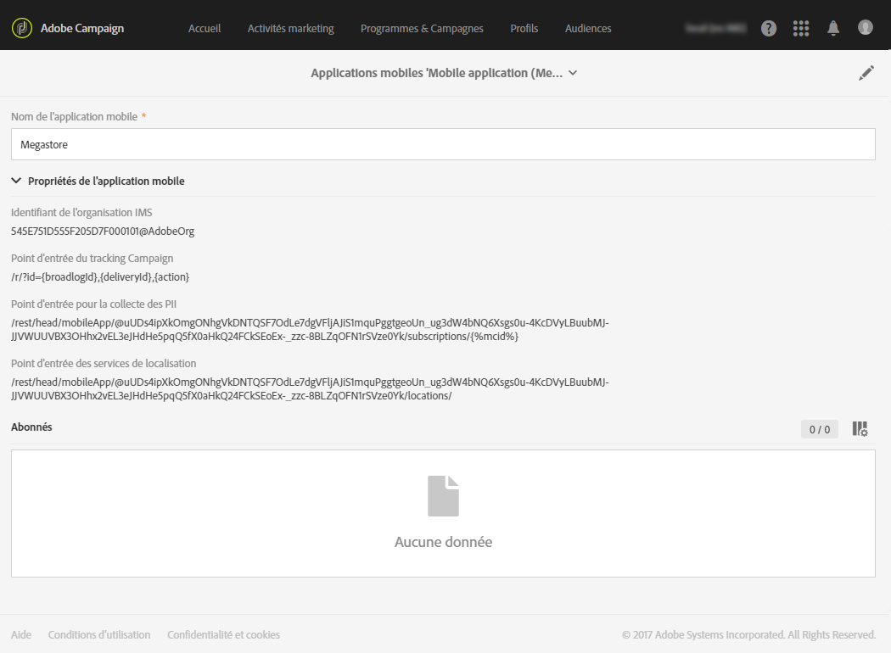
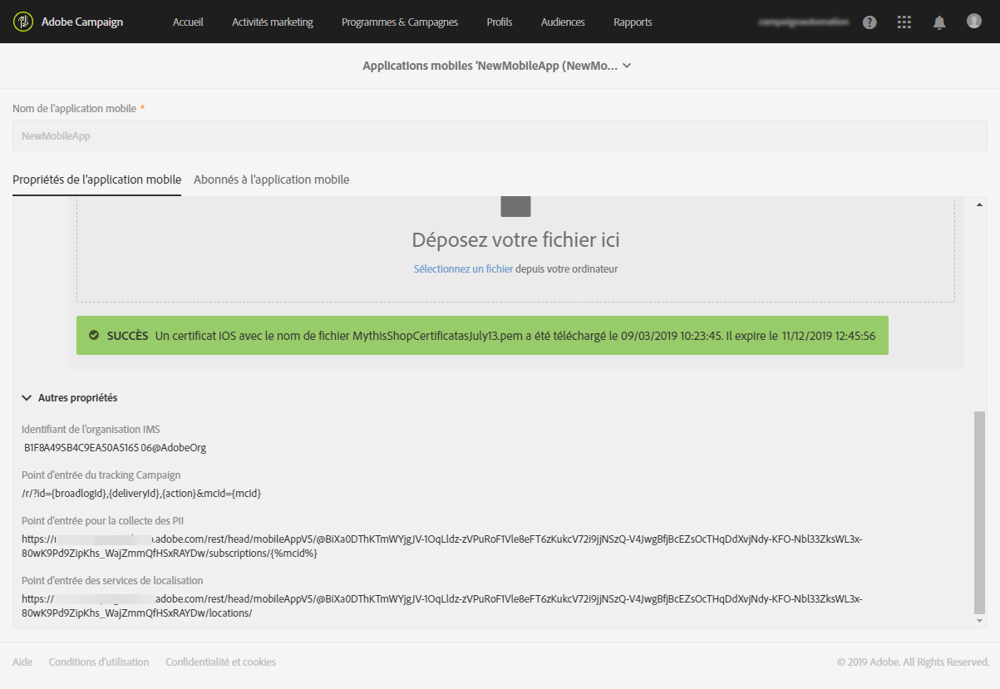
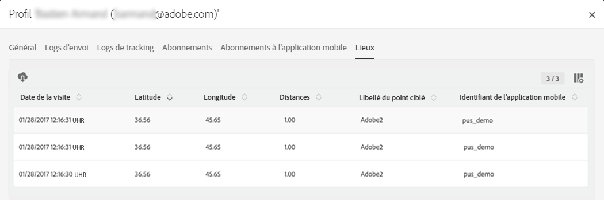

# Configurer l'intégration Campaign-Données de points ciblés{#configuring-campaign-points-of-interest-data-integration}

## Configuring Campaign-Points of Interest data integration using SDK V4 {#configuring-campaign-poi-sdkv4}

Les applications mobiles utilisées pour collecter les données de localisation doivent être configurées par un **administrateur** dans l'interface d'Adobe Campaign.

Pour utiliser la fonctionnalité de données Point ciblé avec des applications mobiles configurées avec le SDK V 4, vous devez :

1. Pouvoir accéder à Adobe Analytics pour Mobile. Vérifier votre contrat de licence ou contacter votre chargé de compte Adobe pour plus d'informations.
1. Configurer votre application mobile dans Adobe Campaign. Voir [Configurer une application mobile dans Campaign](../../integrating/using/configuring-campaign-points-of-interest-data-integration.md#setting-up-a-mobile-app-in-campaign).
1. Configurer votre application mobile dans l'interface Adobe Mobile Services. Vous pouvez ainsi vous assurer que les données collectées par Adobe Mobile Services sont envoyées à Adobe Campaign. Voir [Configurer une application mobile dans Adobe Mobile Services](../../integrating/using/configuring-campaign-points-of-interest-data-integration.md#configuring-a-mobile-app-in-adobe-mobile-services).
1. Effectuer la configuration spécifique de l'application mobile :

   * Intégrez le fichier de configuration téléchargé à partir de l'interface Adobe Mobile Services avec l'application mobile.
   * Intégrez le SDK d'Experience Cloud Mobile dans votre application mobile. Voir [Intégrer le SDK dans une application mobile](../../integrating/using/configuring-campaign-points-of-interest-data-integration.md#integrating-the-sdk-into-a-mobile-application).

1. Définir les points ciblés dans l'interface Adobe Mobile Services. Voir [Définir les points ciblés dans Adobe Mobile Services](../../integrating/using/configuring-campaign-points-of-interest-data-integration.md#defining-points-of-interest-in-adobe-mobile-services).
1. Définir les données à collecter auprès des abonnés de votre application mobile. Voir [Collecter les données de points ciblés auprès des abonnés](../../integrating/using/configuring-campaign-points-of-interest-data-integration.md#collecting-subscribers--points-of-interest-data).
1. Vérifier que vous avez accès à l'application mobile et aux données de localisation collectées dans Adobe Campaign. Voir [Accéder aux applications mobiles utilisées pour collecter les données de localisation](../../integrating/using/configuring-campaign-points-of-interest-data-integration.md#accessing-mobile-apps-used-to-collect-location-data) et [Accéder aux données de localisation collectées](../../integrating/using/configuring-campaign-points-of-interest-data-integration.md#accessing-collected-location-data).

### Setting up a mobile app in Adobe Campaign using SDK V4 {#setting-up-a-mobile-app-in-campaign}

Pour pouvoir collecter des données de points ciblés avec Adobe Campaign, vous devez configurer l'application mobile à partir de laquelle Adobe Campaign recevra les données.

1. Click the **[!UICONTROL Adobe Campaign]** logo, in the top left corner, then select **[!UICONTROL Administration]** &gt; **[!UICONTROL Channels]** &gt; **[!UICONTROL Mobile app]**.
1. Cliquez sur **[!UICONTROL Créer]pour configurer une application.**
1. Saisissez un nom dans le champ **[!UICONTROL Nom de l'application]** et cliquez sur **[!UICONTROL Créer]**.

   Ne remplissez pas la section **[!UICONTROL Paramètres spécifiques à l'appareil],** qui concerne uniquement le paramétrage des applications destinées à recevoir des notifications push.

In the **[!UICONTROL Mobile application properties]** section, two URLs are listed: **[!UICONTROL Collect PII endpoint]** and **[!UICONTROL Location Services endpoint]**. Elles seront utilisées dans l'interface Adobe Mobile Services. Voir [Configurer une application mobile dans Adobe Mobile Services](../../integrating/using/configuring-campaign-points-of-interest-data-integration.md#configuring-a-mobile-app-in-adobe-mobile-services).

* L'URL **[!UICONTROL Point d'entrée pour la collecte des PII]sert à collecter les jetons d'enregistrement et les identifiants Experience Cloud des utilisateurs à partir de l'application mobile lors de son lancement.** Lorsqu'un utilisateur se connecte à l'application à l'aide d'identifiants comme l'adresse électronique, le prénom et le nom, ces données sont également utilisées pour réconcilier le jeton d'enregistrement de l'utilisateur avec un profil Adobe Campaign.
* L'URL **[!UICONTROL Point d'entrée des services de localisation]sert à collecter les données de localisation telles que la latitude, la longitude et le rayon d'un point ciblé d'un utilisateur.**

Vous pouvez maintenant utiliser ces valeurs dans Adobe Mobile Services pour terminer la configuration, comme expliqué dans la section [Configurer une application mobile dans Adobe Mobile Services](../../integrating/using/configuring-campaign-points-of-interest-data-integration.md#configuring-a-mobile-app-in-adobe-mobile-services).



### Configuring a V4 mobile app in Adobe Mobile Services {#configuring-a-mobile-app-in-adobe-mobile-services}

Pour envoyer les données collectées par Adobe Mobile Services vers Adobe Campaign, vous devez configurer des postbacks dans l'interface Mobile Services.

Vous aurez besoin d'informations spécifiques accessibles dans les paramètres de l'application mobile définis dans Adobe Campaign (voir [Configurer une application mobile dans Campaign](../../integrating/using/configuring-campaign-points-of-interest-data-integration.md#setting-up-a-mobile-app-in-campaign)) :

* **[!UICONTROL Identifiant IMS de l'organisation]**
* **[!UICONTROL Point d'entrée pour la collecte des PII]**
* **[!UICONTROL Point d'entrée des services de localisation]**

Vous devez avoir accès à Adobe Analytics pour effectuer la configuration ci-après. Si vous n'êtes pas un utilisateur d'Adobe Analytics, contactez votre administrateur Adobe Campaign.

1. Connectez-vous à [mobilemarketing.adobe.com](http://mobilemarketing.adobe.com/).
1. Créez l'application ou sélectionnez une application existante.
1. Accédez à la page **[!UICONTROL Gérer les paramètres d'application].**
1. In the **Visitor ID Service ** section, check **Enable** and select your organization from the drop-down list. Cliquez sur **Enregistrer**.

   >[!CAUTION]
   >
   >Cette organisation doit être la même que celle utilisée sur l'instance Adobe Campaign.

1. Cliquez sur **[!UICONTROL Gérer les postbacks]**.
1. Créez un postback.

   * Sélectionnez **[!UICONTROL PII]** comme **[!UICONTROL Type de postback]**.
   * Dans le champ **[!UICONTROL URL]**, copiez l'URL **Point d'entrée pour la collecte des PII]à partir de l'application mobile que vous avez configurée dans l'interface Adobe Campaign, précédée du nom du serveur.[!UICONTROL ** Voir [Configurer une application mobile dans Campaign](../../integrating/using/configuring-campaign-points-of-interest-data-integration.md#setting-up-a-mobile-app-in-campaign).
   * Renseignez le champ **[!UICONTROL Corps de publication]comme suit :**

      Pour iOS :

      ```
      {
      "userKey": "{userKey}",
      "pushPlatform":"apns",
      "marketingCloudId":"",
      "cusEmail":"{email}",
      "cusFirstName":"{firstName}",
      "cusLastName":"{lastName}"
      }
      ```

      Pour Android :

      ```
      {
      "userKey": "{userKey}",
      "pushPlatform":"gcm",
      "marketingCloudId":"",
      "cusEmail":"{email}",
      "cusFirstName":"{firstName}",
      "cusLastName":"{lastName}"
      }
      ```

   * Définissez **Type de contenu** sur **[!UICONTROL application/json]**.
   * Dans la section **Quelles balises de données déclenchent le postback ?**, sélectionnez n'importe quel événement, généralement **[!UICONTROL Lancé]** et **[!UICONTROL existe]**.
   * Cliquez sur **[!UICONTROL Enregistrer et activer]**.

1. Créez un deuxième postback.

   * Sélectionnez **[!UICONTROL Postback]** comme **[!UICONTROL Type de postback]**.
   * Dans le champ **[!UICONTROL URL]**, copiez l'URL **Point d'entrée des services de localisation]à partir de l'application mobile que vous avez configurée dans l'interface Adobe Campaign, précédée du nom du serveur.[!UICONTROL ** Voir [Configurer une application mobile dans Campaign](../../integrating/using/configuring-campaign-points-of-interest-data-integration.md#setting-up-a-mobile-app-in-campaign).
   * Renseignez le champ **[!UICONTROL Corps de publication]comme suit :**

      ```
      {
      "locationData":{
      "distances":"{a.loc.dist}",
      "poiLabel":"{a.loc.poi}",
      "latitude.a":"{a.loc.lat.a}",
      "latitude.b":"{a.loc.lat.b}",
      "latitude.c":"{a.loc.lat.c}",
      "longitude.a":"{a.loc.lon.a}",
      "longitude.b":"{a.loc.lon.b}",
      "longitude.c":"{a.loc.lon.c}",
      "appId":"{a.appid}",
      "marketingCloudId":"{mid}"
      }
      }
      ```

   * Définissez **Type de contenu** sur **[!UICONTROL application/json]**.
   * Dans la section **Quelles balises de données déclenchent le postback ?**, sélectionnez **[!UICONTROL campaign.test]** et **[!UICONTROL existe]**.
   * Cliquez sur **[!UICONTROL Enregistrer et activer]**.

>[!NOTE]
>
>Pour des informations détaillées sur la configurations des postbacks, voir la [Documentation Adobe Mobile Services](https://marketing.adobe.com/resources/help/en_US/mobile/signals_.html).

### Intégrer le SDK dans une application mobile {#integrating-the-sdk-into-a-mobile-application}

Le kit de développement logiciel (SDK) de Mobile Services facilite l'intégration d'une application mobile dans Adobe Campaign.

Cette étape est décrite dans cette [page](https://helpx.adobe.com/campaign/kb/configuring-app-sdkv4.html).

### Définir les points ciblés dans Adobe Mobile Services {#defining-points-of-interest-in-adobe-mobile-services}

Pour définir les points ciblés servant à collecter les données de localisation :

1. Connectez-vous à l'interface Adobe Mobile Services.
1. Ajoutez votre application.

   Pour plus d'informations sur la gestion des applications dans Mobile Services, voir la [Documentation Adobe Mobile Services](https://marketing.adobe.com/resources/help/en_US/mobile/t_new_app.html).

1. Définissez les points ciblés.

   Pour plus d'informations sur la gestion des points ciblés, voir la [Documentation Adobe Mobile Services](https://marketing.adobe.com/resources/help/en_US/mobile/t_manage_points.html).

### Collecter les données de points ciblés auprès des abonnés {#collecting-subscribers--points-of-interest-data}

Une ressource personnalisée spécifique vous permet de définir les données à collecter auprès des abonnés de vos applications.

Cette étape est présentée dans la page [Configuration d'une application mobile à l'aide du SDK V4](https://helpx.adobe.com/campaign/kb/configuring-app-sdkv4.html).

## Configuring Campaign-Points of Interest data integration with Adobe Experience Platform SDKs {#configuring-campaign-poi-aep-sdk}

>[!NOTE]
>
>Votre application mobile doit déjà être configurée dans Adobe Campaign Standard à l'aide du SDK Adobe Experience Platform. For the detailed steps, refer to this [page](https://helpx.adobe.com/campaign/kb/configuring-app-sdk.html).

Les applications mobiles utilisées pour collecter les données de localisation doivent être configurées par un **administrateur** dans l'interface d'Adobe Campaign.

Pour pouvoir utiliser les services de localisation Adobe Experience Platform avec des applications mobiles configurées avec le SDK Adobe Experience Platform, vous devez :

1. Add the **[!UICONTROL Places]** and **[!UICONTROL Places Monitor]** extensions to your mobile app configuration in Adobe Experience Platform Launch. Configurer votre application mobile dans Adobe Campaign. See [Install the Places extension in Adobe Experience Platform Launch](https://placesdocs.com/places-services-by-adobe-documentation/configure-places-in-the-sdk/places-extension#install-the-places-extension-in-adobe-experience-platform-launch) and [Install the Places Monitor extension in Experience Platform Launch](https://placesdocs.com/places-services-by-adobe-documentation/configure-places-in-the-sdk/places-monitor-extension/using-the-places-monitor-extension).

1. Once your extensions are set up, create data elements within **[!UICONTROL Adobe Experience Platform Launch]** to retrieve data from these extensions.

1. Then, in **[!UICONTROL Adobe Experience Platform Launch]**, you need to create rules to support mobile use cases between Point of Interests and Adobe Campaign.\
   This rule will be triggered when a user enters a geo-fenced **[!UICONTROL Point of Interest]**. Refer to this [page](https://helpx.adobe.com/campaign/kb/configuring-app-sdk.html#Locationpostback) to create your rule.

1. Définition de vos points ciblés dans les lieux. See [Create a Point of Interest](https://placesdocs.com/places-services-by-adobe-documentation/places-database-management-1/managing-pois-in-the-places-ui#create-a-poi).

1. Vérifier que vous avez accès à l'application mobile et aux données de localisation collectées dans Adobe Campaign. Voir [Accéder aux applications mobiles utilisées pour collecter les données de localisation](../../integrating/using/configuring-campaign-points-of-interest-data-integration.md#accessing-mobile-apps-used-to-collect-location-data) et [Accéder aux données de localisation collectées](../../integrating/using/configuring-campaign-points-of-interest-data-integration.md#accessing-collected-location-data).

## Accéder aux applications mobiles utilisées pour collecter les données de localisation {#accessing-mobile-apps-used-to-collect-location-data}

Pour accéder aux applications créées dans Adobe Campaign :

1. Cliquez sur le logo **[!UICONTROL Adobe Campaign], en haut à gauche.**
1. Select **[!UICONTROL Administration]** &gt; **[!UICONTROL Channels]** &gt; **[!UICONTROL Mobile app (SDK v4)]** or **[!UICONTROL Mobile app (AEP SDK)]** depending on the SDK.
1. Dans la liste, sélectionnez une application mobile pour afficher ses propriétés.

   

La liste des abonnés de l'application s'affiche également. Les abonnés correspondent à tous les utilisateurs qui ont installé l'application sur leur appareil mobile. Les profils de la base de données Adobe Campaign sont identifiés par un jeton d'enregistrement.

## Accéder aux données de localisation collectées {#accessing-collected-location-data}

Une fois la configuration terminée, les données de points ciblés collectées sont répertoriées dans l'onglet **[!UICONTROL Lieux]de chaque profil.** Pour accéder à la liste :

1. Sélectionnez un profil.
1. Cliquez sur le bouton **[!UICONTROL Editer les propriétés du profil]à droite.**
1. Sélectionnez l'onglet **[!UICONTROL Lieux].**

   

La liste des données de points ciblés collectées pour le profil en cours s'affiche. Les informations de localisation sont conservées dans la base de données Adobe Campaign pendant six mois.

Pour plus d'informations sur l'accès aux profils et leur édition, voir la section [Profils](../../audiences/using/about-profiles.md).
