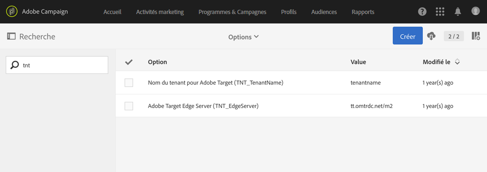

# Configurer l'intégration Campaign-Target{#configuring-the-campaign-target-integration}

L'intégration entre Adobe Campaign et Adobe Target vous permet d'insérer du contenu dynamique dans votre diffusion.

Dans Adobe Campaign, une configuration est d'abord nécessaire pour utiliser les fonctionnalités d'intégration avec Adobe Target. Celle-ci doit être gérée par l'administrateur fonctionnel.

Les éléments suivants sont nécessaires pour cette procédure :

* un Tenant Adobe Experience Cloud
* un tenant Adobe Target
* un rawbox Adobe Target dédié à Adobe Campaign.

1. From the advanced menu, via the Adobe Campaign logo in the top left corner, select **[!UICONTROL Administration]** &gt; **[!UICONTROL Application settings]** &gt; **[!UICONTROL Options]**.
1. Pour configurer les options de tenant et de serveur pour Adobe Target, renseignez les champs suivants :

   * **[!UICONTROL TNT_TenantName]** : nom du tenant Adobe Target. Cette valeur correspond au nom du **[!UICONTROL Client Adobe Target]**.
   * **[!UICONTROL TNT_EdgeServer : serveur Adobe Target utilisé pour l'intégration.]** Cette option est déjà renseignée par défaut. Cette valeur correspond au **[!UICONTROL Server Domain]** Adobe Target, suivie de la valeur **/m2.** Par exemple : **tt.omtrdc.net/m2**.
   

Vos utilisateurs peuvent désormais ajouter des images dynamiques dans une diffusion avec Adobe Target.
