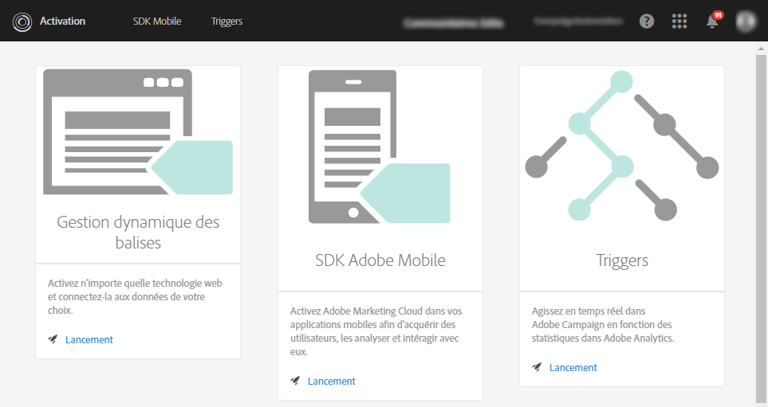
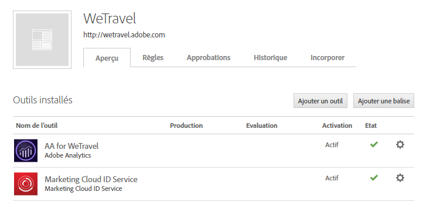
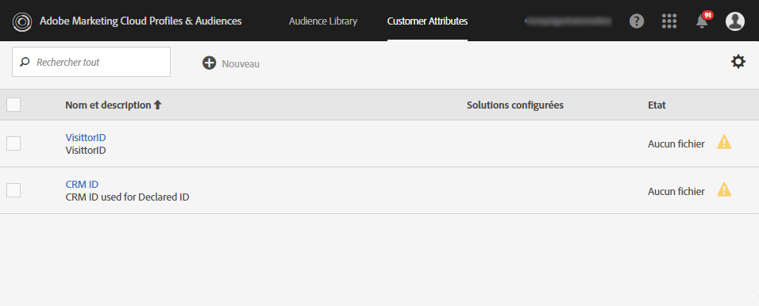
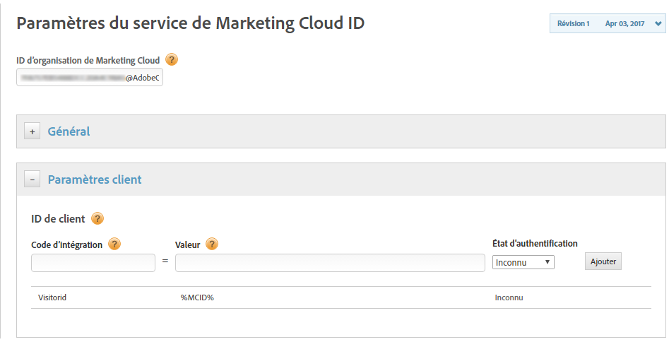
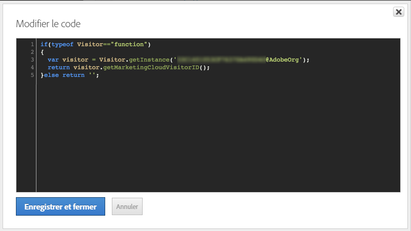
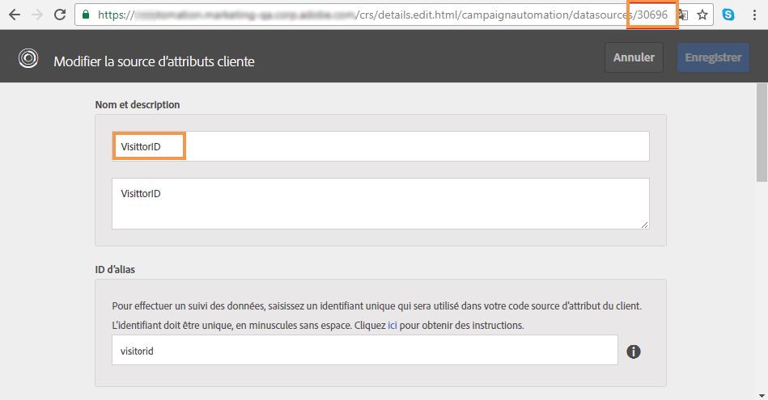
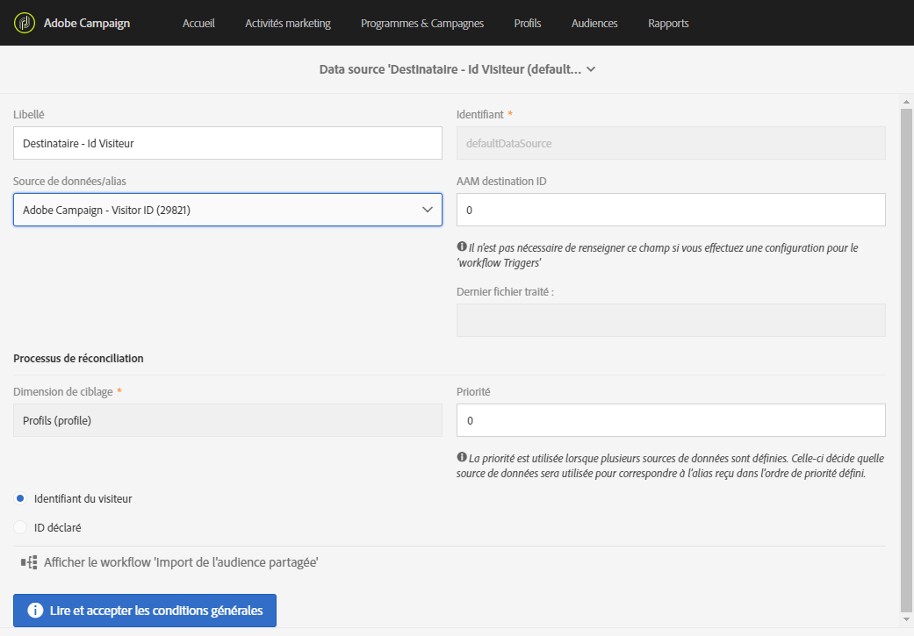

# Configuration des triggers dans Experience Cloud{#configuring-triggers-in-experience-cloud}

## Activation de la fonctionnalité {#activating-the-functionality}

Cette fonctionnalité doit être activée dans Adobe Campaign par Adobe. Contactez votre chargé de compte Adobe ou votre partenaire de services professionnels.

L'équipe Adobe aura besoin des informations suivantes pour activer les triggers :

* Nom de la société Marketing Cloud
* ID de l'organisation IMS
* Identifiant de société Analytics (peut être identique au nom de la société Marketing Cloud)

## Configuration des solutions et services {#configuring-solutions-and-services}

Afin de pouvoir utiliser cette fonction, vous devez avoir accès aux solutions/core services suivants :

* Adobe Campaign
* Adobe Analytics Ultimate, Premium, Foundation, OD, Select, Prime, Mobile Apps, Select ou Standard.
* Core Service Triggers Experience Cloud

   

* Core Service DTM Experience Cloud

   

* Identifiant du visiteur Experience Cloud et Core Service People Experience Cloud

   

Il vous faudra également un site web opérationnel.

>[!CAUTION]
>
>La délégation de sous-domaine est également un élément clé de la délivrabilité. Assurez-vous que les emails Adobe Campaign sont envoyés à partir du même domaine que celui utilisé par le site web.

Pour suivre ces cas pratiques, vous devez configurer [Experience Cloud DTM Core Service](../../integrating/using/configuring-triggers-in-experience-cloud.md#configuring-experience-cloud-dtm-core-service), [Experience Cloud People Core Service](../../integrating/using/configuring-triggers-in-experience-cloud.md#configuring-experience-cloud-people-core-service) et [Campaign](../../integrating/using/configuring-triggers-in-experience-cloud.md#configuring-triggers-and-aliases-in-campaign).

### Configurer Experience Cloud DTM Core Service {#configuring-experience-cloud-dtm-core-service}

1. Dans le DTM (Dynamic Tag Management) Core Service DTM Experience Cloud, activez l'Identifiant Experience Cloud et Adobe Analytics pour les pages de votre site web.

   

1. La réconciliation des identifiants entre le site Web, Adobe Analytics et Adobe Campaign requiert l'utilisation d'alias. Créez un alias « visitorid », par exemple.

   

### Configurer Experience Cloud People Core Service {#configuring-experience-cloud-people-core-service}

L'alias référencé précédemment dans DTM doit être créé dans le Core Service People Experience Cloud via un Attribut Client. Veillez à en créer un nouveau et à référencer le même alias DTM dans le code d'intégration (« visitorid », par exemple).

>[!NOTE]
>
>Cet Attribut client sera utilisé dans la Data source dans Adobe Campaign (étape suivante).

### Configurer les triggers et les alias dans Campaign {#configuring-triggers-and-aliases-in-campaign}

1. Vérifiez que les **[!UICONTROL Triggers Experience Cloud]sont visibles sur votre instance Adobe Campaign Standard.** Si ce n’est pas le cas, contactez les administrateurs Adobe Campaign.

   

1. Les alias permettent la réconciliation d'un contact d'Analytics avec un profil de Campaign. Vous devez faire correspondre les alias définis dans le service Experience Cloud ID avec une source de données partagée de Campaign. You need to configure the aliases resolution in Adobe Campaign via a Data source ( **[!UICONTROL Administration]** &gt; **[!UICONTROL Application Settings]** &gt; **[!UICONTROL Shared Data Sources]** ). Veillez à sélectionner la bonne source de données dans le menu déroulant **[!UICONTROL Source de données/alias], qui est mappée avec la même source de données Attribut client créée à l’étape précédente.**

   

   >[!NOTE]
   >
   >Vous pouvez réconcilier vos triggers pour les utilisateurs anonymes et enregistrés. Pour les utilisateurs anonymes, le profil doit exister dans Adobe Campaign et un email a déjà été envoyé à l'utilisateur. Pour cela, la configuration d'identifiant de visiteur suffit. Toutefois, si vous souhaitez réconcilier des triggers pour les utilisateurs enregistrés, vous devez paramétrer la source de données ID déclaré. Pour en savoir plus, consultez [Configuration de la source de données](../../integrating/using/provisioning-and-configuring-integration-with-audience-manager-or-people-core-service.md#step-2--configure-the-data-sources).

## Création d'un trigger dans l'interface d'Experience Cloud {#creating-a-trigger-in-the-experience-cloud-interface}

Un trigger Adobe Experience Cloud doit être créé pour pouvoir l'utiliser dans Campaign.

Créez un trigger dans Experience Cloud et assurez-vous de sélectionner la suite de rapports utilisée sur votre site Web. Veillez à choisir les bonnes dimensions pour que le trigger se déclenche.

Consultez la [documentation Adobe Experience Cloud](https://marketing.adobe.com/resources/help/en_US/mcloud/triggers.html) et regardez cette [vidéo](https://helpx.adobe.com/marketing-cloud/how-to/email-marketing.html#step-two).

## Bonnes pratiques et limites de triggers {#triggers-best-practices-and-limitations}

Voici la liste des bonnes pratiques et des limites qui s'appliquent à l'utilisation de l'intégration des triggers Campaign :

* Si vous disposez de plusieurs instances de Campaign Standard, toutes ces instances peuvent recevoir des triggers tant qu'elles sont sur le même ID de l'organisation IMS. Analytics doit lui aussi être sur le même ID de l'organisation IMS.
* Vous ne pouvez pas créer de trigger dans le Trigger Core Service à l'aide d'événements provenant de deux suites de rapports différentes.
* Les triggers se basent sur les messages transactionnels. Les messages transactionnels sont utilisés dès que vous devez envoyer un message très rapidement. Vous ne pouvez pas mettre en liste d'attente des messages transactionnels et les faire s'exécuter en boucle dans un lot.
* Les triggers ne sont par nature pas déterministes. Lorsqu'un trigger est généré, il envoie tous les alias associés au cookie. Par conséquent, en cas de navigateurs partagés comme dans les bornes de magasins, les bibliothèques, les cybercafés, ou sur les appareils partagés au domicile (mari et femme se connectant sur un même appareil), il n'est pas possible de se mapper au bon ID. Tous les ID utilisés pour se connecter au navigateur sont envoyés à Campaign, qui transmet un message en fonction de la première réconciliation. S'il existe plusieurs « ID d'emails » éligibles pour la réconciliation, Campaign n'envoie pas d'email. Campaign n'a aucun moyen de déterminer le bon ID d'email, sauf s'il est récupéré et communiqué par Analytics.
* Vous ne pouvez pas stocker de contenu de la payload dans Campaign. Les triggers ne peuvent pas être utilisés pour mettre à jour les données d'un profil.
* Les attributs du client ne sont pas pris en charge dans Triggers (ce qui signifie que seules les données d'une suite de rapports peuvent être utilisées pour définir les règles métier Triggers).
* Les collections de collections ne sont pas prises en charge dans Campaign.

>[!CAUTION]
>
>Votre site Web doit s'exécuter sur le même domaine que le serveur Adobe Campaign. Dans le cas contraire, vous ne pouvez pas utiliser d'ID de visiteur pour réconcilier et joindre les utilisateurs visitant le site Web anonymement.

