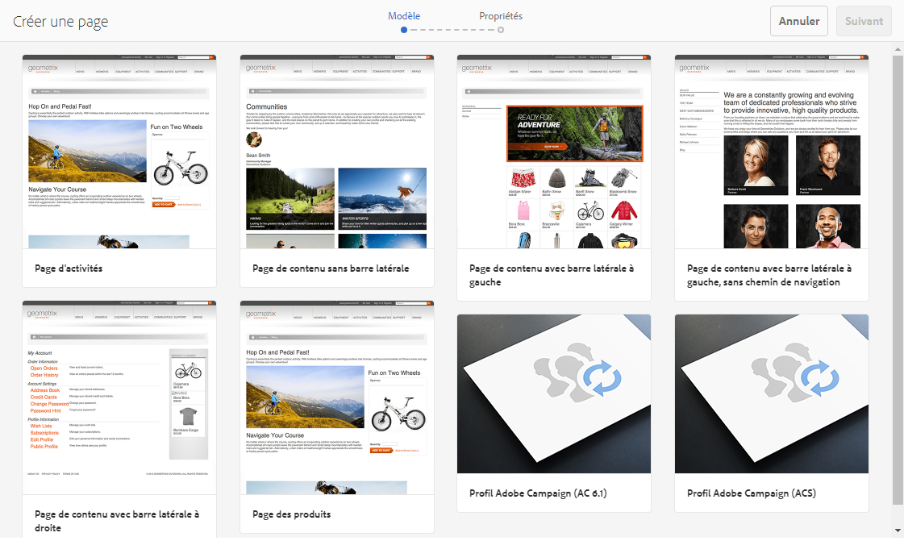
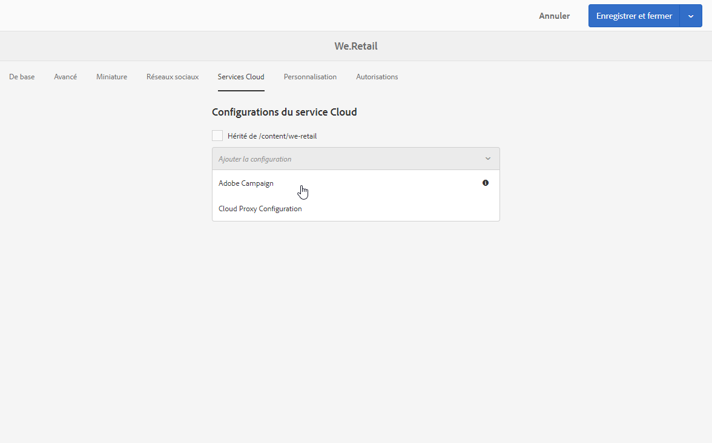

# Création d'un formulaire Campaign dans Experience Manager {#creating-a-campaign-form-in-experience-manager}

Vous pouvez créer des pages de type « formulaire » sur vos sites AEM et mapper les champs de ces formulaires aux champs de la base de données Adobe Campaign, afin de créer et mettre à jour des profils ou de gérer les abonnements d'un service.

Pour créer un formulaire Adobe Campaign sur votre site AEM :

1. Dans votre site AEM, créez une page basée sur le modèle **Profil Adobe Campaign**.

   

1. Dans les propriétés de la page, sélectionnez le **[!UICONTROL Cloud Service]** correspondant à votre instance Adobe Campaign.

   

1. Sélectionnez le type de formulaire à partir du composant **[!UICONTROL Début du formulaire]** :

   * **Adobe Campaign : enregistrer le profil**
   * **Adobe Campaign : s'abonner aux services**
   * **Adobe Campaign : se désabonner des services**

1. Editez le contenu du formulaire en ajoutant différents champs et composants que vous pouvez mapper aux champs de la base Adobe Campaign.
1. Testez et publier le formulaire afin de le rendre accessible sur votre site AEM.

Pour plus d'informations, consultez la [documentation détaillée](https://helpx.adobe.com/fr/experience-manager/6-2/sites/authoring/using/adobe-campaign-forms.html).
