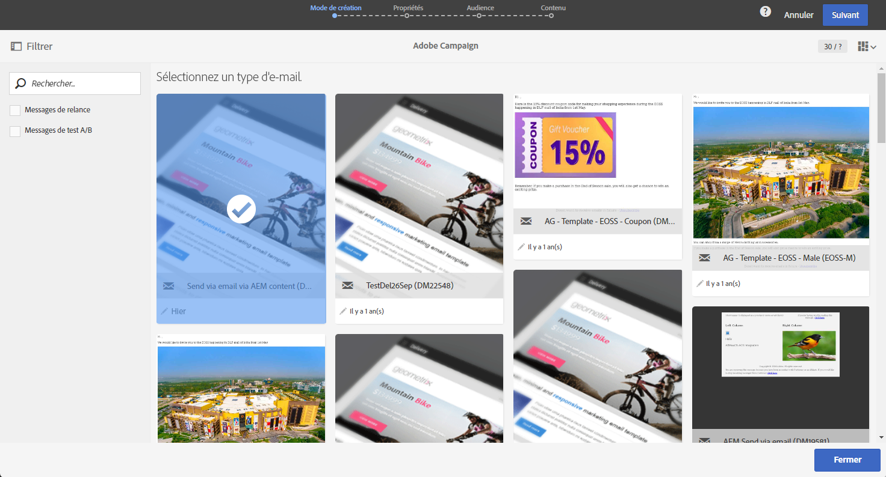

# Import d’un contenu Adobe Experience Manager dans un email Adobe Campaign {#creating-email-aem}

A travers ce document, vous apprendrez à créer et gérer des contenus d&#39;email dans Adobe Experience Manager, puis à les utiliser pour vos campagnes marketing en les important dans vos emails Adobe Campaign Standard.

Les prérequis sont :

* Avoir accès à une instance AEM configurée pour l&#39;intégration.
* Avoir accès à une instance Adobe Campaign configurée pour l&#39;intégration.
* Un modèle d&#39;email Adobe Campaign paramétré pour recevoir du contenu AEM.

## Accès aux emails dans Adobe Experience Manager {#email-content-aem}

Connectez-vous à votre instance Adobe Experience Manager de création et parcourez votre site pour accéder au dossier contenant les contenus d&#39;emails.

>[!VIDEO](https://video.tv.adobe.com/v/29996)

## Création d&#39;un contenu d&#39;email dans Adobe Experience Manager {#creating-email-content-aem}

Plusieurs modèles spécifiques à Adobe Campaign sont disponibles. Vous devez utiliser l’un de ces modèles car ils contiennent des composants prédéfinis pris en charge par Adobe Campaign.

Par défaut, deux modèles prédéfinis permettent de créer des contenus d&#39;email pour Adobe Campaign.

* **[!UICONTROL Adobe Campaign Email]** : ce modèle contient du contenu standard que vous pouvez personnaliser. Vous pouvez choisir entre Adobe Campaign Email (AC6.1) et Adobe Campaign Email (ACS).
* **[!UICONTROL Page d&#39;importateur]** : ce modèle permet d&#39;importer un fichier ZIP comportant un fichier HTML dont vous pourrez personnaliser le contenu.

1. Dans Adobe Experience Manager, créez une **[!UICONTROL page]**.

1. Sélectionnez le modèle **[!UICONTROL Adobe Campaign Email]**. Regardez la vidéo ci-après pour connaître les étapes détaillées.

   >[!VIDEO](https://video.tv.adobe.com/v/29997)

1. Ouvrez votre nouveau contenu d’email.

1. Dans les **[!UICONTROL Propriétés de la page]**, définissez **[!UICONTROL Adobe Campaign]** comme **[!UICONTROL Configuration du service Cloud]**. Cela permet la communication entre votre contenu et votre instance Adobe Campaign.

   Pour en savoir plus, visionnez la vidéo suivante :

   >[!VIDEO](https://video.tv.adobe.com/v/29999)

## Modification et envoi d’un email {#editing-email-aem}

Vous pouvez modifier le contenu de l’email en ajoutant des composants et des ressources. Les champs de personnalisation peuvent être utilisés pour diffuser un message plus pertinent en fonction des données des destinataires dans Adobe Campaign.

Pour créer un contenu d&#39;email dans Adobe Experience Manager :

1. Modifiez l’objet ainsi que la version **[!UICONTROL text brut]** de votre email en accédant à l’onglet **[!UICONTROL Propriétés de la page]**> **[!UICONTROL Email]**.

1. Ajoutez des **[!UICONTROL champs de personnalisation]** via le composant **[!UICONTROL Texte et personnalisation]**. Chaque composant correspond à une utilisation spécifique : insertion d’images, ajout de personnalisation, etc.

   Pour en savoir plus, visionnez la vidéo suivante :

   >[!VIDEO](https://video.tv.adobe.com/v/29998)

1. Dans l’onglet **[!UICONTROL Processus]**, sélectionnez le workflow de validation **[!UICONTROL Approuver pour Adobe Campaign]**. Vous ne pouvez pas envoyer d&#39;email dans Adobe Campaign si son contenu n&#39;a pas été validé.

Pour envoyer votre e-mail dans Adobe Campaign Standard :

1. Une fois le contenu et les paramètres d’envoi définis, créez un e-mail à partir d’un modèle d’e-mail AEM spécifique dans Adobe Campaign Standard.

   +++ En savoir plus sur le modèle AEM spécifique.

   1. Dans le menu avancé, sélectionnez **[!UICONTROL Ressources]** `>` **[!UICONTROL Modèles]** `>` **[!UICONTROL Modèles de diffusion]**.

      

   1. Dupliquez ou sélectionnez un des modèles de diffusion.

   1. Dans les **[!UICONTROL Propriétés]** de votre modèle, dans le menu déroulant **[!UICONTROL Contenu]**, sélectionnez **[!UICONTROL Adobe Experience Manager en mode Contenu]** puis votre compte Adobe Experience Manager.

      

   +++

   

1. Renseignez les propriétés de votre e-mail et cliquez sur **[!UICONTROL Créer]** pour sélectionner votre contenu AEM.

1. Accédez au bloc de **[!UICONTROL contenu]**.

   

1. Dans le menu **[!UICONTROL Utiliser le contenu Adobe Experience Manager]**, cliquez sur **[!UICONTROL Lier du contenu AEM]**.

   Sélectionnez ensuite le contenu que vous souhaitez utiliser dans votre e-mail.

   

1. Personnalisez davantage votre e-mail en spécifiant via le tableau de bord des paramètres supplémentaires tels que les audiences cibles et le planning d’exécution. Une fois la configuration terminée, vous pouvez envoyer la diffusion e-mail. [En savoir plus](../../sending/using/confirming-the-send.md)

