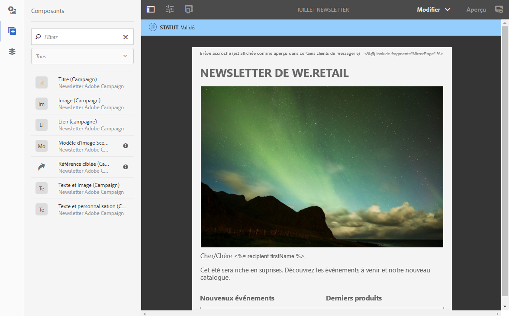

# Creating an email content in Adobe Experience Manager {#creating-email-aem}

Cette intégration entre Adobe Campaign Standard et Experience Manager vous permet d&#39;utiliser du contenu créé dans Adobe Experience Manager dans vos emails Adobe Campaign.

Ce cas d’utilisation vous montre comment créer un contenu de courrier électronique dans Adobe Experience Manager.

## Prérequis {#prerequisites}

Vous devez au préalable posséder les éléments suivants :

* Une instance Adobe Experience Manager de création (également appelée **authoring**).
* Une instance Adobe Experience Manager de publication (également appelée **publishing**).
* Une instance Adobe Campaign

## Configuration {#configuration}

Afin de pouvoir utiliser conjointement ces deux solutions, vous devez les paramétrer pour les connecter l&#39;une à l&#39;autre.

1. Paramétrez Adobe Campaign. Pour cela :

   * Configurez un compte externe de type Adobe Experience Manager.
   * Configurez l&#39;option **[!UICONTROL AEMResourceTypeFilter]**, permettant de reconnaître les type de contenus créé pour Adobe Campaign dans Adobe Experience Manager.
   * Créez un modèle d&#39;email spécifiant que le contenu est de type Adobe Experience Manager et associez à ce modèle le compte externe créé précédemment.

1. Paramétrez Adobe Experience Manager. Pour cela :

   * Configurez la réplication entre les instances Adobe Experience Manager de création et de publication.
   * Connectez Adobe Experience Manager à Adobe Campaign en configurant un **[!UICONTROL Cloud Service dédié]**.

## Creating an email content in Adobe Experience Manager {#use-case}

Pour créer un contenu d&#39;email dans Adobe Experience Manager :

1. Créez un contenu email à partir d&#39;un des modèles spécifiquement conçus pour Adobe Campaign
1. Dans les propriétés du contenu, sélectionnez le **[!UICONTROL Cloud Service]**correspondant à votre instance Adobe Campaign.
1. Editez le contenu en y insérant du texte, des images, de la personnalisation, etc.
1. Validez le contenu.

Pour plus d&#39;informations, consultez la [documentation détaillée](https://docs.adobe.com/content/help/en/experience-manager-65/authoring/aem-adobe-campaign/campaign.html).

Pour récupérer le contenu dans Adobe Campaign :

1. Créez un email basé sur un modèle dont le type de contenu est Adobe Experience Manager.
1. Liez un contenu créé avec Adobe Experience Manager via l&#39;écran de définition du contenu de l&#39;email Adobe Campaign.

