# Création d’un email multilingue avec l’intégration d’Adobe Experience Manager {#creating-multilingual-email-aem}

Grâce à ce document, vous allez découvrir comment créer un email multilingue à l&#39;aide d&#39;Adobe Experience Manager et des copies de langue.

Les prérequis sont :

* Avoir accès à une instance AEM configurée pour l&#39;intégration.
* Avoir accès à une instance Adobe Campaign configurée pour l&#39;intégration.
* Un modèle d&#39;email multilingue Adobe Campaign paramétré pour recevoir du contenu AEM.

## Création d’un contenu d’email dans Adobe Experience Manager {#creating-email-content-aem}

1. Sur la page d&#39;accueil d’Adobe Experience Manager, sélectionnez **[!UICONTROL Site]**.

   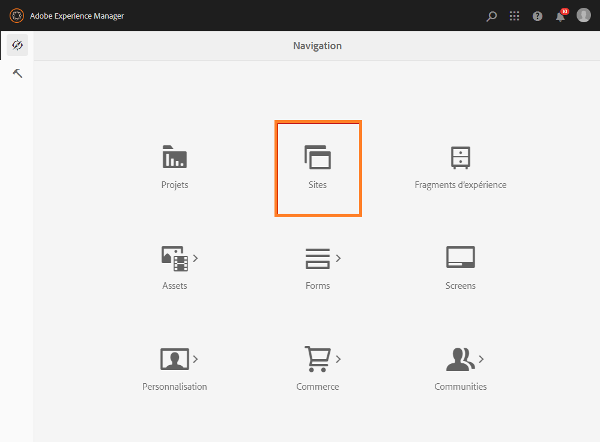

1. Sélectionnez le dossier dans lequel vous souhaitez créer votre page, puis cliquez sur **[!UICONTROL Créer]** et **[!UICONTROL Page]**. Nous créons ici notre page dans le dossier en_us qui sera notre langue par défaut.

   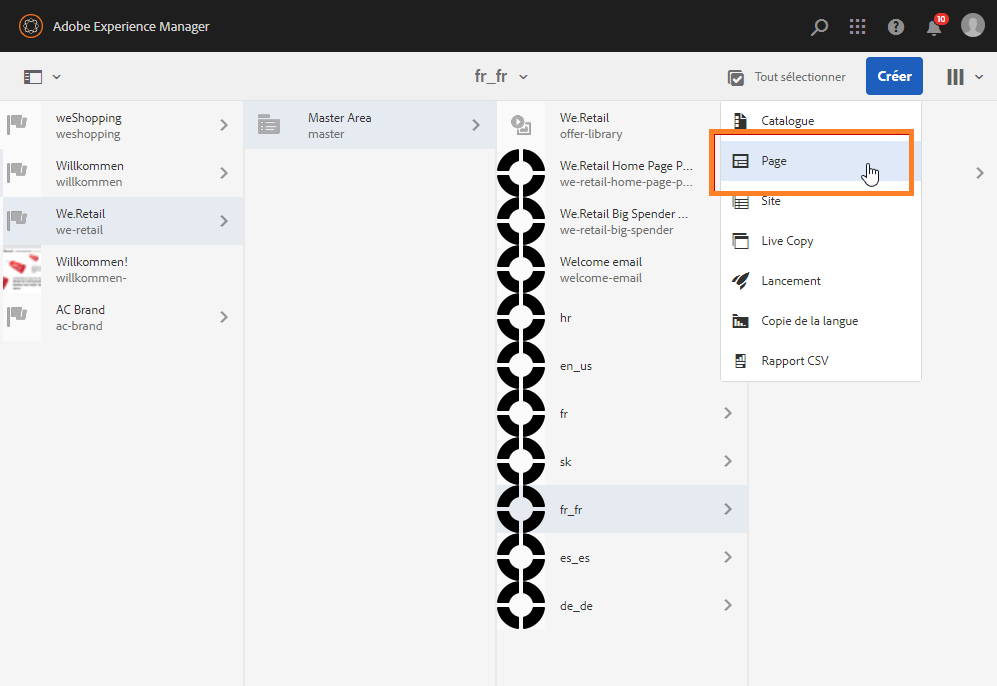

1. Sélectionnez le modèle **[!UICONTROL Email Adobe Campaign (ACS)]**.

1. Renseignez les propriétés de votre email et cliquez sur **[!UICONTROL Créer]**.

   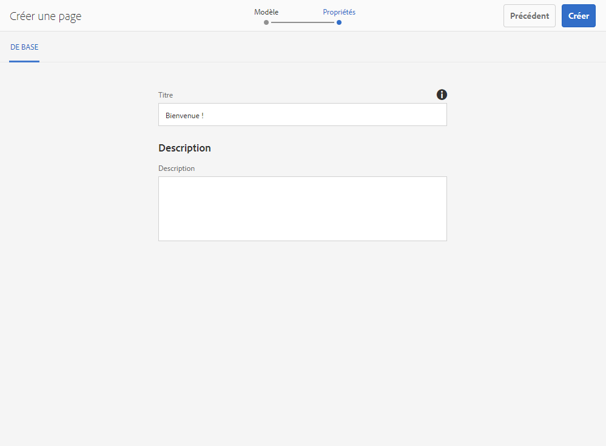

1. Ouvrez votre nouveau contenu d’email et personnalisez-le selon vos besoins. Pour plus d’informations à ce sujet, consultez cette [page](../../integrating/using/creating-email-experience-manager.md#editing-email-aem).

   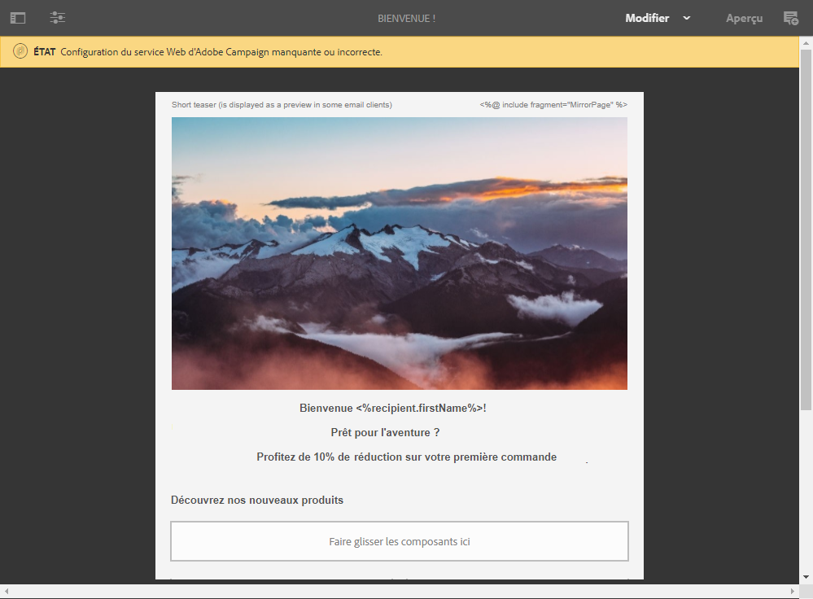

1. Dans l’onglet **[!UICONTROL Processus]**, sélectionnez le workflow de validation **[!UICONTROL Approuver pour Adobe Campaign]**. Vous ne pouvez pas envoyer d’email dans Adobe Campaign s’il utilise un contenu qui n’a pas été validé.

   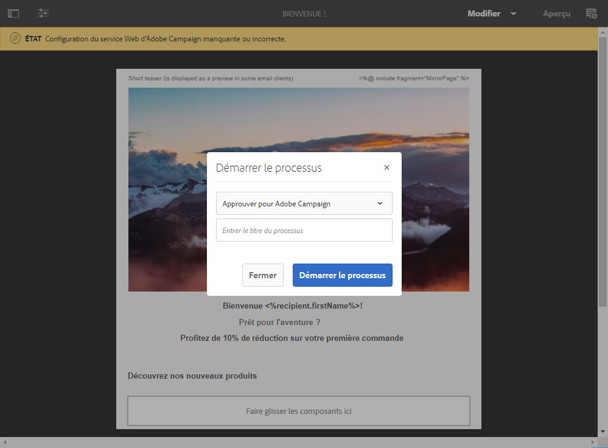

1. Cliquez sur **[!UICONTROL Terminer]**, puis sur **[!UICONTROL Révision de la newsletter]** dans la fenêtre **[!UICONTROL Terminer l&#39;élément de travail]**.

1. Cliquez sur **[!UICONTROL Terminer]**, puis sur **[!UICONTROL Approbation de la newsletter]**. Une fois que le contenu et les paramètres d’envoi sont définis, vous pouvez passer à la validation, à la préparation et à l’envoi de l’email dans Adobe Campaign Standard.

   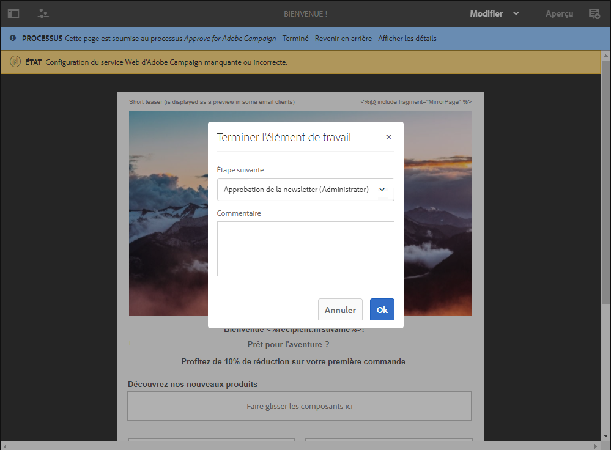

## Création de copies de langue {#creating-language-copies}

Après avoir conçu le contenu de votre email, vous devez à présent créer des copies de langue qui seront synchronisées avec Adobe Campaign Standard en tant que variantes.

1. Sélectionnez la page que vous avez créée précédemment, cliquez sur **[!UICONTROL Créer]**, puis sur **[!UICONTROL Copie de langue]**.

   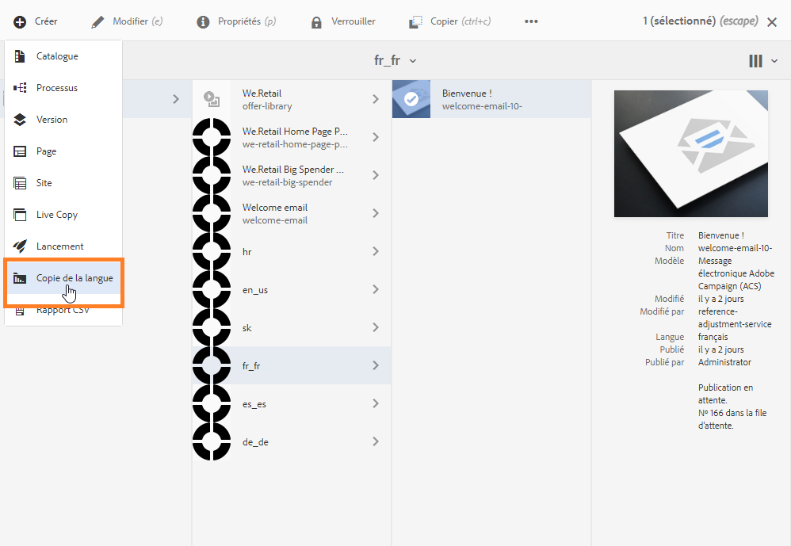

1. Sélectionnez le contenu de votre email créé précédemment qui sera traduit dans les langues choisies, puis cliquez sur **[!UICONTROL Suivant]**.

   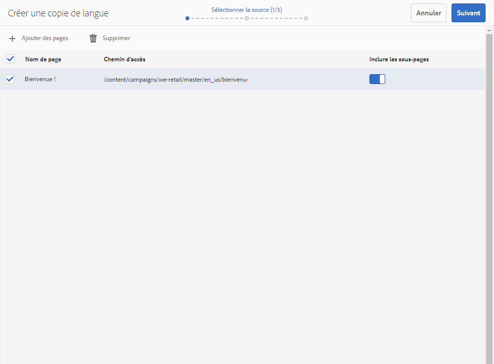

1. Dans la liste déroulante **[!UICONTROL Langue(s) cible]**, sélectionnez la langue dans laquelle votre contenu sera traduit, puis cliquez sur **[!UICONTROL Suivant]**.

   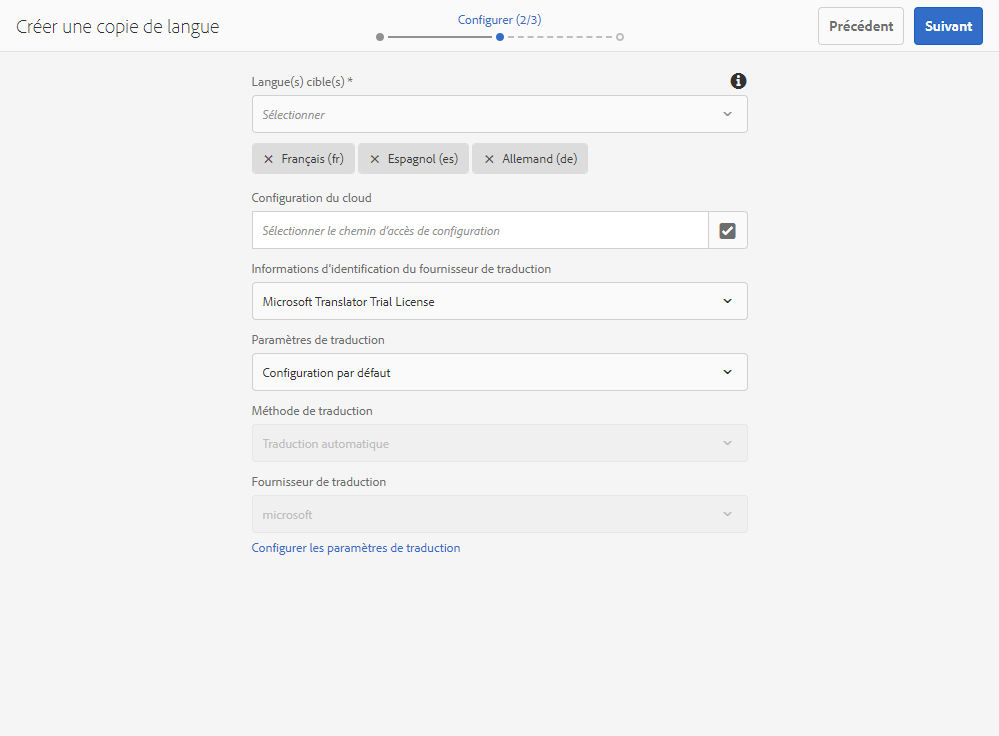

1. Cliquez sur **[!UICONTROL Créer]**.

Vos copies de langue sont désormais créées. Vous pouvez désormais modifier votre contenu en fonction de la langue choisie.

>[!CAUTION]
>
>Chaque copie de langue doit être approuvée via le workflow de validation **[!UICONTROL Approuver pour Adobe Campaign]**. Vous ne pouvez pas envoyer d’email dans Adobe Campaign s’il utilise un contenu qui n’a pas été validé.

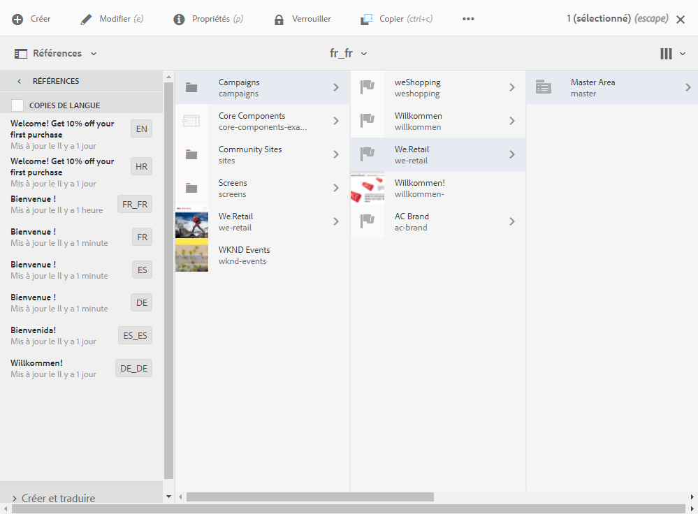

## Création de contenu multilingue dans Adobe Campaign Standard {#multilingual-acs}

1. Dans la page d&#39;accueil Adobe Campaign Standard, cliquez sur **[!UICONTROL Créer un email]**.

   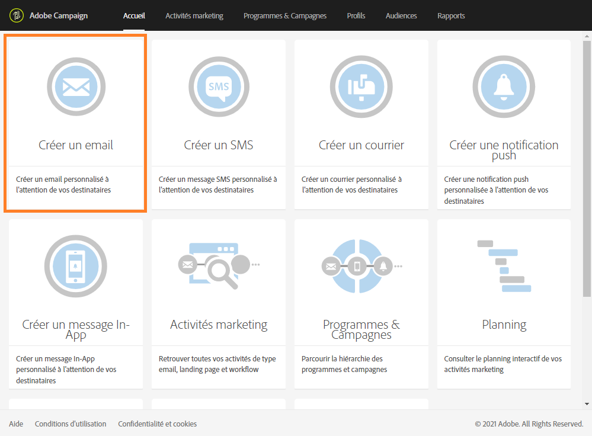

1. Sélectionnez votre modèle d&#39;email multilingue Adobe Campaign configuré pour recevoir le contenu Adobe Experience Manager. Pour en savoir plus sur la création d’un modèle lié à votre instance Adobe Experience Manager, consultez cette [page](../../integrating/using/configure-experience-manager.md#config-acs).

   >[!NOTE]
   >
   >Dans ce cas, vous devrez dupliquer le modèle intégré **[!UICONTROL Email multilingue (mailMultiLang)]** pour pouvoir envoyer votre email multilingue.

   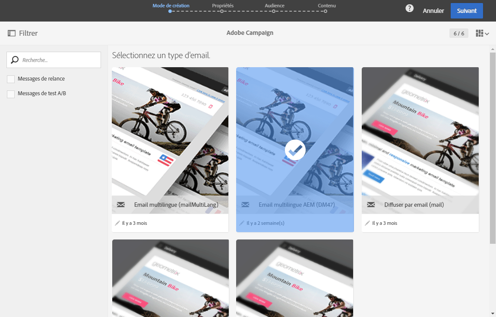

1. Renseignez les champs **[!UICONTROL Propriétés]** et **[!UICONTROL Audience]** de votre email, puis cliquez sur **[!UICONTROL Créer]**.

1. Dans la liste déroulante **[!UICONTROL Éditer les propriétés]**, assurez-vous que votre compte Adobe Experience Manager est correctement défini dans la liste déroulante **[!UICONTROL Contenu]**.

   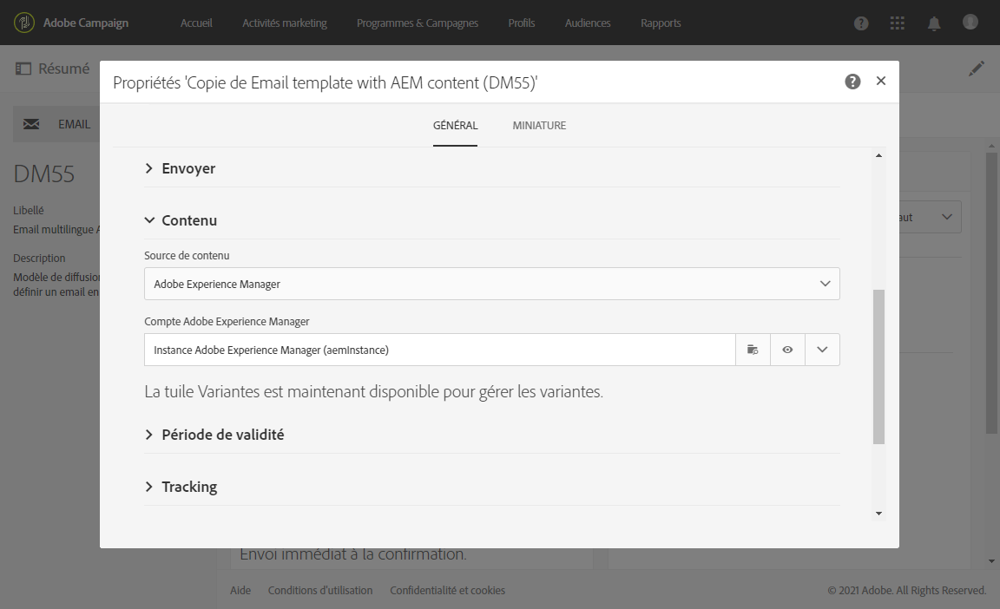

1. Cliquez sur **[!UICONTROL Création de la copie de la langue]**.

   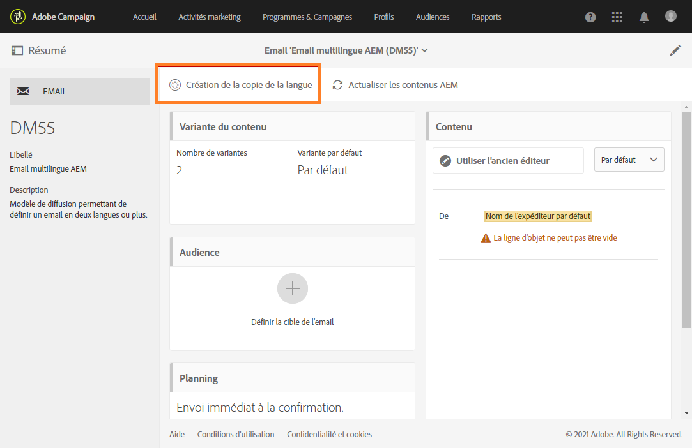

1. Sélectionnez le contenu Adobe Experience Manager que vous avez créé précédemment et cliquez sur **[!UICONTROL Confirmer]**. Le contenu Adobe Experience Manager affiché ici n&#39;est que du contenu validé et peut être filtré sur son **[!UICONTROL Libellé]** et **[!UICONTROL Chemin]**.

   >[!NOTE]
   >
   >La copie de la langue choisie sera définie par défaut, vous pourrez la modifier ultérieurement dans le bloc **[!UICONTROL Variante du contenu]**.

   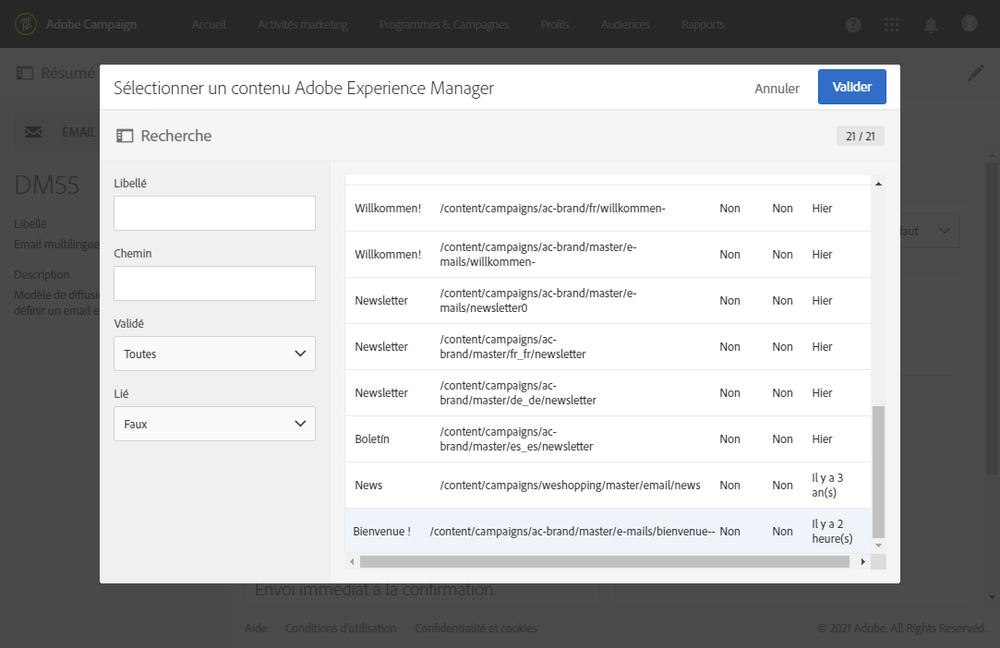

1. Cliquez sur **[!UICONTROL Créer des variantes]** pour lier votre contenu multilingue. Adobe Campaign Standard reliera alors automatiquement les autres copies de langue à ce contenu. Les variantes créées auront le même libellé et la même langue de code que celles choisies dans Adobe Experience Manager.

   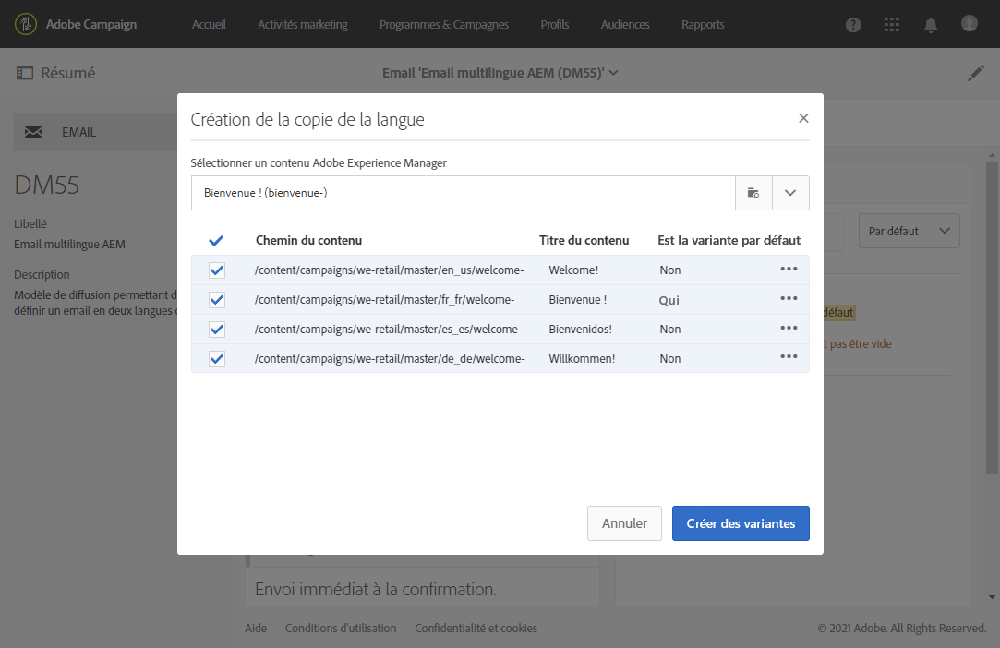

1. Cliquez sur le bloc **[!UICONTROL Variante du contenu]** pour modifier votre variante par défaut si nécessaire et cliquez sur **[!UICONTROL Confirmer]**.

   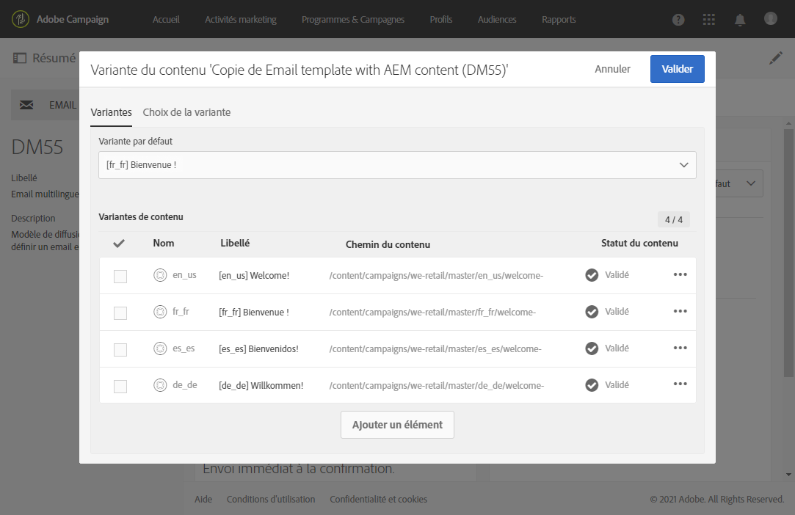

1. Si votre contenu ou vos variantes sont mis à jour dans Adobe Experience Manager, vous pouvez directement les synchroniser dans Adobe Campaign Standard avec le bouton **[!UICONTROL Actualiser les contenus AEM]**.

1. Votre email est désormais prêt à être envoyé. Pour plus d’informations à ce propos, consultez cette [page](../../sending/using/get-started-sending-messages.md).

Votre audience recevra votre email selon les **[!UICONTROL Préférences linguistiques]** définies dans leurs **[!UICONTROL Profils]**. Pour en savoir plus sur la modification des profils et des préférences linguistiques, consultez cette [page](../../audiences/using/editing-profiles.md).
