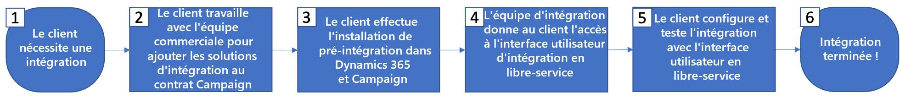

# Prise en main de l’intégration de Microsoft Dynamics 365

Activez vos données CRM lors d’une communication cross-canal : découvrez comment transférer des contacts de Microsoft Dynamics 365 à Adobe Campaign et partager les données de performances de la campagne (envois, ouvertures, clics et bounces) d’Adobe Campaign vers Microsoft Dynamics 365.

Cette intégration requiert les versions de logiciels suivantes :

* Microsoft Dynamics 365 pour Sales Online uniquement, dernière version

* Adobe Campaign Standard, dernière version

>[!CAUTION]
>
>Cette fonctionnalité ne fait pas partie des paramètres d’usine du produit. La mise en œuvre nécessite l’implication d’Adobe Consulting. Veuillez contacter votre représentant Adobe pour en savoir plus.

## Principes

L’intégration Adobe Campaign Standard et Microsoft Dynamics 365 permet la synchronisation de toutes les données de contact disponibles dans le système CRM, rendant ainsi toutes celles appropriées disponibles pour les activités de campagne.

Inversement, comme les profils au sein d’Adobe Campaign Standard interagissent avec les messages, ces données (p. ex. : envois, ouvertures, clics et bounces) se déplacent automatiquement vers Microsoft Dynamics 365 pour conserver les enregistrements Contact complets avec les activités de marketing.

L&#39;intégration prend également en charge les [entités personnalisées](../../integrating/using/d365-acs-self-service-app-settings.md) dans Dynamics 365 pour qu&#39;elles soient synchronisées avec les **ressources personnalisées** correspondantes dans Campaign.

Cette intégration est conçue pour prendre en charge quatre principaux cas pratiques :

1. Synchronisation des contacts de Dynamics 365 vers Campaign afin qu’ils puissent être ciblés dans les campagnes marketing
1. Synchronisation des entités personnalisées de Dynamics 365 vers Campaign afin qu’elles puissent être utilisées pour la segmentation et la personnalisation
1. Envoi d’événements de marketing par email (envois, ouvertures, clics, bounces) de Campaign vers Dynamics 365 pour s’afficher dans le référentiel de ventes dans l’interface de Dynamics 365
1. Synchronisation des statuts d&#39;opt-out (par exemple, ne pas envoyer d&#39;email) entre Dynamics 365 et Campaign afin de conserver les préférences de confidentialité des clients.

Les principaux avantages sont les suivants :

* Messages cohérents entre les ventes et le marketing : l&#39;intégration d&#39;Adobe Campaign Standard avec Microsoft Dynamics 365 donne aux deux systèmes un accès aux informations du client et à l&#39;historique du marketing email, ce qui permet à toutes les communications adressées au client de partager le même message cohérent.

* Vue holistique de toutes les données de prospect et de client : en intégrant Adobe Campaign Standard avec Dynamics 365, il est possible de partager et d&#39;accéder à l&#39;historique du marketing email de chaque contact depuis le système CRM.

* Activation des données Dynamics 365 sur n&#39;importe quel canal : les données de contact étant synchronisées avec Adobe Campaign, les communications peuvent être envoyées sur n’importe quel canal en ligne ou hors ligne avec Campaign, y compris des notifications push mobiles, In-App, des emails ou du courrier. Campaign « vous couvre » quel que soit le canal préféré de chaque contact.

>[!CAUTION]
>
>Cette intégration considère Dynamics 365 comme source de vérité pour la synchronisation des contacts et des entités personnalisées.  Toute modification des attributs synchronisés doit être effectuée dans Dynamics 365, et non dans Adobe Campaign Standard.  Si des modifications sont effectuées dans Campaign, elles peuvent être éventuellement écrasées lors de la synchronisation.

## Étapes clés de la mise en œuvre de l&#39;intégration de Microsoft Dynamics 365{#request-and-implement-this-integration}

Pour configurer cette intégration, vous devez suivre les étapes ci-dessous.

Veuillez suivre l’organigramme et ses détails ci-dessous pour demander et configurer l’intégration.

Détails de l’organigramme (mise en correspondance avec les étapes ci-dessus) :

* **Étape 1** - Il est supposé que vous disposez déjà, ou êtes en cours d’achat, d’une licence pour Microsoft Dynamics 365 for Sales et pour Adobe Campaign Standard.
* **Étape 2** - L’offre d’intégration standard est gratuite pour tous les clients, toutefois, des coûts supplémentaires peuvent s’appliquer en fonction de vos besoins. En savoir plus sur [les bonnes pratiques et limitations](../../integrating/using/d365-acs-notices-and-recommendations.md). Une nouvelle commande client (SO) devra être signée afin de tirer parti de l&#39;intégration si elle n&#39;était pas incluse dans la commande client d&#39;origine.
* **Étape 3** - Exécuter les étapes préalables à l’intégration pour Dynamics 365 et Campaign. Voir [Configurer cette intégration](#configure-this-integration).
* **Étape 4** - L’équipe chargée de l&#39;intégration d&#39;Adobe vous donnera accès à l&#39;interface utilisateur (IU) de l&#39;application d&#39;intégration.
* **Étape 5** - Vous pourrez configurer les mappings de données, les remplacements, les filtres, etc. Vous pourrez aussi tester votre intégration depuis l&#39;interface utilisateur de l&#39;application d&#39;intégration.

   >[!IMPORTANT]
   >
   > Si vous avez besoin de la configuration d&#39;opt-out bidirectionnelle ou de Campaign vers Dynamics 365, vous devrez en effectuer la demande auprès de votre contact technique Adobe pour que les workflows d&#39;opt-out soient configurés sur votre instance Campaign. [En savoir plus](../../integrating/using/d365-acs-notices-and-recommendations.md#opt-out).

### Configurer cette intégration {#configure-this-integration}

Trois systèmes doivent être approvisionnés et configurés pour cette intégration :

* **Dans Adobe Campaign Standard** : vous devez configurer l&#39;accès à l&#39;API et une nouvelle intégration pour l&#39;outil d&#39;intégration. Pour ce faire, reportez-vous à [cet article](../../integrating/using/d365-acs-configure-adobe-io.md).
* **Dans Microsoft 365** : vous devez créer une nouvelle inscription d&#39;application et permettre à un utilisateur d&#39;utiliser l&#39;intégration.  Pour configurer Microsoft Dynamics 365 pour cette intégration, reportez-vous à [cet article](../../integrating/using/d365-acs-configure-d365.md).
* **Application en libre-service d&#39;intégration d&#39;Adobe Campaign Standard avec Microsoft Dynamics 365** : vous devrez suivre les étapes contenues dans [cet article](../../integrating/using/d365-acs-self-service-app-control-access.md).

>[!IMPORTANT]
>
>Pour chaque système, ces étapes doivent être exécutées par un **administrateur**.
>
>Les étapes de cette documentation vous guideront tout au long de la création des intégrations/inscriptions impliquant l&#39;attribution de permissions et/ou d&#39;accès administrateur.  Vous êtes tenu de vous assurer que ces étapes sont conformes aux politiques de votre entreprise avant de les exécuter, et de les exécuter avec précaution.

### Demande d’assistance

Des demandes d&#39;assistance peuvent être enregistrées auprès du service clientèle d&#39;Adobe.

Pour tout problème lié aux flux de données d’intégration, veillez à inclure les informations suivantes :

* **Propriétaire du processus** : architectes d’ingénierie
* **Identifiant du processus ES** : fourni pendant le processus d’intégration
* **Titre du processus** : intégration Microsoft Dynamics 365 / Adobe Campaign Standard
* **Description du problème** : description du problème

La couverture d&#39;assistance pour l&#39;intégration est actuellement de 24h/24, 5j/7 (disponible du lundi au vendredi, à l’exception des jours fériés et des temps de pause).
