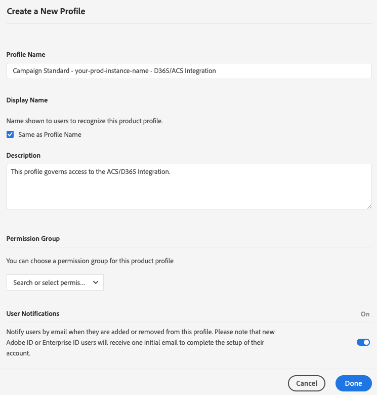

# Accéder à l&#39;intégration Adobe Campaign Standard avec l&#39;application en libre-service Microsoft Dynamics 365

Cette configuration nécessite que vous collaboriez avec un administrateur Experience Cloud (EC) pour votre entreprise. Il s’agit des étapes initiales nécessaires pour vous donner accès à l’interface de l’application d’intégration en libre-service. Une fois que vous avez accès à l&#39;outil, vous allez configurer des connexions à vos données et le flux de données entre Adobe Campaign et Microsoft Dynamics 365.

>[!NOTE]
>
>Vous devez contacter votre représentant Adobe et fournir les noms d&#39;instance et d&#39;organisation Adobe Campaign Standard. Une demande sera enregistrée pour que l’application d’intégration soit activée pour votre organisation.

## Ajouter un profil de produit

Dans cette section, vous allez découvrir comment accorder l&#39;accès à l&#39;intégration d’Adobe Campaign Standard avec l&#39;application en libre-service Microsoft Dynamics 365. Les utilisateurs ayant accès à votre organisation dans Adobe Experience Cloud n’auront pas accès à l’application en libre-service d’intégration, sauf si vous suivez les étapes ci-dessous pour le leur accorder.

>[!IMPORTANT]
>
> Ces étapes nécessitent un rôle **Administrateur** dans la version Experience Cloud de votre organisation.

1. Accédez à https://experience.adobe.com/ et connectez-vous à Adobe Experience Cloud.
1. Accédez à l&#39;**Admin Console**.

   

1. Cliquez sur **[!UICONTROL Produits]** pour accéder à vos solutions Experience Cloud.

   

   >[!IMPORTANT]
   >
   >Les étapes restantes de cette section seront effectuées pour chacune de vos instances Campaign (développement, test, production).

1. Cliquez sur la première instance à configurer.

   

   La page d’instance doit se présenter comme suit :

   

1. Cliquez sur le bouton **[!UICONTROL Nouveau Profil]** et ajoutez une nouvelle entrée nommée : **Campaign Standard - votre-nom-instance-prod - Intégration D365/ACS**

   * Si cette entrée figure dans la liste, vous n&#39;avez pas besoin de continuer. Cliquez sur **Adobe Campaign Standard** dans le menu de gauche et vérifiez les autres instances Campaign.

   * Veillez à remplacer « votre-nom-instance-prod » par le nom réel de votre instance.

1. Vous pouvez laisser la liste déroulante **[!UICONTROL Groupe d’autorisations]** avec la valeur par défaut.

1. Si vos entrées se présentent comme suit, cliquez sur le bouton **[!UICONTROL Terminé]**.

   

   Le nouveau profil de produit a été ajouté.

   

## Accorder l&#39;accès aux utilisateurs {#add-users-to-profile}

Dans la page **[!UICONTROL Produits]**, sélectionnez votre instance Campaign et procédez comme suit :

1. Cliquez sur le nouveau profil que vous avez créé précédemment :  **Campaign Standard - votre-nom-instance-prod - Intégration D365/ACS**

   

1. Cliquez sur l’onglet **[!UICONTROL Développeurs]**.

   

1. Cliquez sur le bouton **[!UICONTROL Ajouter un développeur]**.

1. Entrez le nom ou l&#39;email de l&#39;utilisateur que vous voulez ajouter. Sélectionnez le résultat correspondant à l’utilisateur.

   Si c’est la première fois que l’utilisateur est ajouté à l’organisation, saisissez des détails.

1. Cliquez sur **[!UICONTROL Enregistrer]** pour valider.
