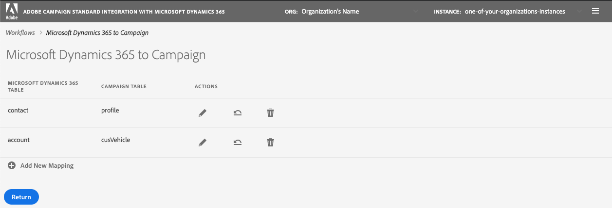

# Synchroniser les données

Vous pouvez synchroniser des tableaux de Microsoft Dynamics 365 vers Campaign et les mesures marketing Campaign vers Microsoft Dynamics 365. La synchronisation est exécutée par trois workflows techniques dédiés : **[!UICONTROL Microsoft Dynamics 365 to Campaign]**, **[!UICONTROL Campaign to Microsoft Dynamics 365]**, **[!UICONTROL Opt-In/Out]**. Reportez-vous à cette section pour [en savoir plus](../../integrating/using/d365-acs-self-service-app-workflows.md).

>[!IMPORTANT]
>Vous devez arrêter/début le flux de travail **[!UICONTROL Microsoft Dynamics 365 à Campaign]** pour que vos modifications soient prises en compte. [En savoir plus](../../integrating/using/d365-acs-self-service-app-workflows.md)

## Mappage de tables de Microsoft Dynamics 365 à Campaign

La page **[!UICONTROL Microsoft Dynamics 365 to Campaign]** affiche une liste d&#39;entités dans Microsoft Dynamics 365 et les ressources personnalisées dans Adobe Campaign avec lesquelles elles seront synchronisées. Vous pouvez ajouter de nouveaux mappages, modifier ou supprimer des mappages existants.

Voici une description de chacune des colonnes du tableau :

* **[!UICONTROL TABLEAU]** MICROSOFT DYNAMICS 365 : cette colonne identifie l&#39;entité dans Microsoft Dynamics 365 qui sera la source de données pour le mappage.

* **[!UICONTROL TABLEAU]** Campaign : cette colonne identifie quelle ressource en Adobe Campaign sera la destination des données pour le mappage.

* **[!UICONTROL ACTIONS]** : les actions possibles sont énumérées ci-dessous :

   * Cliquez sur l&#39;icône **[!UICONTROL Modifier]** pour modifier ce mappage.

   * Utilisez l&#39;icône **[!UICONTROL Supprimer]** pour supprimer un mappage de table.

   * Cliquez sur l&#39;icône **[!UICONTROL Réexécuter les données]** pour resynchroniser toutes les données du tableau Microsoft Dynamics 365. Normalement, l&#39;application d&#39;intégration ne synchronise que les données dans Microsoft Dynamics 365 qui ont récemment été modifiées.  Cependant, dans certains cas (par exemple, vous avez fait une modification ou commis une erreur), vous pouvez souhaiter que toutes les données soient resynchronisées.  Dans ces cas, vous cliquez sur ce bouton et, la prochaine fois que vous arrêterez/début le flux de travail **[!UICONTROL Microsoft Dynamics 365 à Campaign]**, vos données s&#39;début à se synchroniser.

      Si vous cliquez sur le bouton **[!UICONTROL Réexécuter les données]** et que les vérifications aboutissent, l&#39;icône devient désactivée : il indique que les données de cette paire de mappages de tables seront resynchronisées avec la prochaine exécution du flux de travaux **[!UICONTROL Microsoft Dynamics 365 à Campaign]**.

      Vous ne pouvez pas sélectionner de relecture des données lorsque les conditions suivantes sont vérifiées :

      * S&#39;il existe 2 000 000 éléments (ou plus) dans la mesure Arrière-plan associée au flux de travail **[!UICONTROL Microsoft Dynamics 365 à Campaign]** (affiché dans la **[!UICONTROL page Workflows]**)
      * S&#39;il y a 2 000 000 enregistrements ou plus dans la table Microsoft Dynamics 365

      Le nombre d’enregistrements à resynchroniser varie. Si vous disposez d’un grand nombre d’enregistrements, la synchronisation peut prendre un certain temps. Reportez-vous à la mesure **[!UICONTROL Backlog]** de la page **[!UICONTROL Workflows]** au fur et à mesure que l’application d’intégration effectue le processus de synchronisation.

      >[!IMPORTANT]
      >
      > Il est vivement recommandé d&#39;arrêter le processus d&#39;intégration lors de la publication de modifications dans Adobe Campaign Standard ou Microsoft Dynamics 365. Les modifications applicables sont les suivantes : mises à jour des ressources/entités (et de leurs champs associés), des liens, des colonnes d&#39;identifiants, etc. qui sont actuellement utilisés par l&#39;intégration.

## Créer un mapping {#add-a-new-mapping}

Pour créer un mappage, procédez comme suit :

1. dans la page **[!UICONTROL Microsoft Dynamics 365 to Campaign]**, cliquez sur le bouton **[!UICONTROL Ajouter un nouveau mappage]**.

1. Utilisez les listes déroulantes pour sélectionner les tables Microsoft Dynamics 365 et Campaign à mapper.
La plupart des autres entrées de la page dépendent des tables que vous choisissez.

   

   >[!NOTE]
   >Vous ne pouvez pas mapper chaque tableau plusieurs fois. Par conséquent, vous remarquerez que les sélections déroulantes n’incluront pas les tables qui ont déjà été mises en correspondance.

1. Cliquez sur **[!UICONTROL OK]** pour confirmer : l&#39;application aura besoin d&#39;un bref moment pour lire les informations de champ associées aux tableaux sélectionnés.

Vous pouvez ensuite procéder à la configuration du mappage. [En savoir plus](#new-mapping-settings)

>[!IMPORTANT]
>
>Vous ne pouvez choisir les tables de cette page que lorsque vous ajoutez le mappage pour la première fois. Assurez-vous d’avoir sélectionné les tables appropriées avant de cliquer sur le bouton **[!UICONTROL Enregistrer]** : une fois enregistrés, les champs de sélection de la table sont **en lecture seule**.

### Modification d’un mappage existant

Si vous modifiez un mappage existant, vous verrez que les sélections de table ne sont pas modifiables.

Il s’agit d’une opération par conception, car les entrées situées plus bas dans la page sont basées sur les champs associés à ces tableaux. La modification des tables rendrait tous les champs associés à ces tables non valides.  Si vous souhaitez modifier la table à mapper, vous devez revenir à la page précédente, supprimer le mappage à modifier et ajouter un nouveau mappage.

### Configurer un mappage de table individuel {#new-mapping-settings}

Dans cette section, vous apprendrez comment configurer un mappage **unique** d&#39;une table Microsoft Dynamics 365 à une table Adobe Campaign.

Vous pouvez définir les paramètres suivants :

* **[!UICONTROL Tableaux]** : cette section liste le nom de la table Microsoft Dynamics 365 et de la table Campaign à laquelle elle sera mappée.
* **[!UICONTROL Correspondances]** de champs : en savoir plus dans  [cette section](#field-mappings)
* **[!UICONTROL Remplacements]** des champs : en savoir plus dans  [cette section](#field-replacements)
* **[!UICONTROL Filtres]** : en savoir plus dans  [cette section](#filters)
* **[!UICONTROL Paramètres]** avancés : en savoir plus dans  [cette section](#advanced-settings)

### Correspondances de champs {#field-mappings}

#### Clés Principal

Lors de l&#39;ajout d&#39;un nouveau mappage de table Microsoft Dynamics 365 à Campaign, vous devez identifier le champ ID.

La clé Principale Microsoft Dynamics 365 est en lecture seule, car l&#39;application la détectera.

Pour Campaign, vous devez sélectionner le champ qui sera la clé unique. Il doit être configuré en tant que ressource personnalisée [CRM ID](../../developing/using/uc-calling-resource-id-key.md) et ne doit pas avoir de duplicata.

>[!NOTE]
>
>Vous ne pourrez choisir le champ ID de la table que lorsque vous aurez sélectionné **[!UICONTROL Ajouter un nouveau mappage]**. Si vous cliquez sur le bouton Modifier pour modifier un mappage de table existant, le champ ID est en lecture seule.

Les clés Principales seront toujours les premiers noms de champ répertoriés dans la section **[!UICONTROL Mappages de champ]**. Pour rappel, l’icône suivante est répertoriée à droite pour vous rappeler que ce sont les Principales touches.

#### Ajouter d’autres mappages de champs

La section **[!UICONTROL Mappages de champs]** vous permet d’ajouter des mappages de champs autres que les clés Principal. Pour ajouter un nouveau mappage d&#39;un champ de Microsoft Dynamics 365 à Adobe Campaign, cliquez sur le bouton **[!UICONTROL Ajouter un nouveau mappage de champ]**.

Sélectionnez les champs Microsoft Dynamics 365 et Campaign dans les listes :

Ces listes contiennent les noms des champs associés aux tables Microsoft Dynamics 365 et Campaign que vous avez sélectionnées en haut de la page.

Le commutateur **[!UICONTROL Appliquer les mises à jour]** vous permet de contrôler si les mises à jour de ce champ seront propagées de Microsoft Dynamics 365 à Campaign :
* Si elle est activée sur , les mises à jour des valeurs dans Microsoft Dynamics 365 seront propagées à Adobe Campaign au fur et à mesure que les mises à jour se produiront.

* Si vous avez désactivé , la valeur sera propagée lorsque les données seront initialement chargées (ou relues), mais les mises à jour incrémentielles du champ dans Microsoft Dynamics 365 ne seront pas propagées.

>[!NOTE]
>
>Cliquez sur l&#39;en-tête de colonne **[!UICONTROL Appliquer les mises à jour]** pour mettre à jour **tous** les commutateurs à activer ou à désactiver.

Lorsque vous sélectionnez des valeurs de champ, le type de données s’affiche sous les menus déroulants.   Il est important de garder à l’esprit ce point lors du mappage des valeurs d’un champ à l’autre.

>[!NOTE]
>
> Vous ne pouvez pas mapper plusieurs champs Microsoft Dynamics 365 à un seul champ Campaign.

### Remplacements de champs {#field-replacements}

Utilisez le bouton **[!UICONTROL Ajouter un nouveau remplacement de champ]** pour définir un nouveau remplacement de champ.

Les remplacements de champs vous permettent d’identifier :

* un nom de champ Microsoft Dynamics 365 (qui a été ajouté ci-dessus dans la section mappages de champs),
* une valeur existante (qui existe dans Microsoft Dynamics 365), et
* une nouvelle valeur à écrire à Adobe Campaign

Une liste déroulante sera fournie pour les valeurs de liste de sélection, de énumération et de booléen. Une zone de texte sera utilisée pour d’autres types de chaîne et de nombres.

### Filtres {#filters}

Utilisez le bouton **[!UICONTROL Ajouter un nouveau filtre]** pour sélectionner les enregistrements Microsoft Dynamics 365 à propager à Campaign. Vous pouvez choisir n’importe quel champ associé à un enregistrement à ajouter aux filtres (le nom du champ n’a pas besoin d’être ajouté aux mappages de champs).

Vous spécifiez un filtre en renseignant les informations suivantes :

* Nom du champ Microsoft Dynamics 365
* une valeur de comparaison, et
* une valeur (de Microsoft Dynamics 365)
Si le nom du champ, la comparaison et la valeur sont vrais pour un enregistrement donné, l’enregistrement est propagé à Adobe Campaign.

Vous pouvez choisir comment ces filtres sont évalués en définissant l’entrée **[!UICONTROL Sélectionnez l’opérateur de comparaison de filtre]**.  Si vous choisissez **Et**, tous les filtres doivent être vrais pour qu’un enregistrement soit propagé à Campaign. Si vous sélectionnez **Ou**, l’enregistrement est propagé si l’un d’eux a la valeur true.

L&#39;option **[!UICONTROL Voulez-vous supprimer les enregistrements en Adobe Campaign Standard qui seront filtrés à partir de Microsoft Dynamics 365 ?]** contrôle si vous souhaitez que les enregistrements qui ont été filtrés soient supprimés de Campaign. Si vous sélectionnez **Non**, les enregistrements resteront en Adobe Campaign. Sélectionnez **Oui** pour les faire supprimer par la logique d’intégration.

>[!NOTE]
>
> Si aucun filtres n&#39;est ajouté, tous les enregistrements qui ont été modifiés seront propagés à Adobe Campaign.

### Paramètres avancés {#advanced-settings}

Vous pouvez configurer les options supplémentaires suivantes lors de la configuration d’un mappage :

* Définir les **[!UICONTROL Appliquer les suppressions dans Microsoft Dynamics 365 à Campaign ?]** sur  **Oui**, si vous souhaitez propager les suppressions survenant dans Microsoft Dynamics 365 vers le champ correspondant en Adobe Campaign (en fonction du mappage des noms de champ). Sélectionnez **Non** pour ignorer les suppressions dans Microsoft Dynamics 365.

* Définir les **[!UICONTROL valeurs techniques à utiliser dans les listes de sélection Microsoft Dynamics 365 ?]** pour  **** Ne pas propager à Campaign la valeur d&#39;affichage associée à une liste de sélection Microsoft Dynamics 365. Sélectionnez **Oui** pour propager la valeur technique.

## Synchronisation des événements marketing Campaign avec Microsoft Dynamics 365

La page **[!UICONTROL Campaign to Microsoft Dynamics 365]** vous permet d&#39;identifier les événements de marketing par courriel qui seront mappés de Adobe Campaign à Microsoft Dynamics 365.

Les quatre mesures que vous pouvez contrôler sont les suivantes : **Envoie**, **Clics**, **Ouvre** et **Rebonds**.

Sélectionnez **Oui** pour confirmer que vous souhaitez que les événements de ce type enchaînent vers Microsoft Dynamics 365.

Cliquez [ici](../../integrating/using/d365-acs-self-service-app-workflows.md) pour plus d&#39;informations sur ces flux de événements électroniques.

## Processus Opt-in/sortie {#opt-in-out-wf}

Le workflow **Opt-In/Out** vous permet d&#39;identifier le flux d&#39;informations opt-in/out entre Microsoft Dynamics 365 et Adobe Campaign. Cela suppose que les données sont associées à l&#39;entité Microsoft Dynamics 365 &quot;contact&quot; et à la ressource Adobe Campaign &quot;profil&quot;.

Pour en savoir plus sur la gestion des exclusions, consultez [cette section](../../integrating/using/d365-acs-notices-and-recommendations.md#opt-out).

N&#39;oubliez pas que vous devez cliquer sur &quot;Enregistrer&quot; pour enregistrer vos sélections. N&#39;oubliez pas non plus que vous devez arrêter le flux de travail **Campaign to Microsoft Dynamics 365**, puis cliquer sur play pour l&#39;intégration afin d&#39;incorporer vos modifications.

### Direction de la synchronisation Opt-in/sortie

Vous trouverez ci-dessous la liste des options de synchronisation des données disponibles :

* **[!UICONTROL Désactivé]** : lorsque cette option est sélectionnée, aucune information opt-in/out ne se déplace entre Adobe Campaign et Microsoft Dynamics 365.

* **[!UICONTROL Unidirectionnel (Microsoft Dynamics 365 à Campaign)]** : cette option est utilisée pour enchaîner l&#39;inclusion/exclusion de Microsoft Dynamics 365 à Adobe Campaign uniquement. L’application d’intégration ne vous permet pas de configurer le flux dans cet écran ; cliquez sur le bouton **[!UICONTROL Enregistrer]** et accédez au flux de travaux **[!UICONTROL Microsoft Dynamics 365 à Campaign]**. Dans ce flux de travaux, vous pouvez modifier le mappage des contacts/tables de profil afin d’identifier comment mapper vos champs d’inclusion/d’exclusion.

* **[!UICONTROL Unidirectionnel (Campaign vers Microsoft Dynamics 365)]** : cette option rendra visible la section  **** Mappages. Ces entrées vous permettent de définir quels champs Adobe Campaign vont mapper les données aux champs de Microsoft Dynamics 365. Cela signifie que si vous mettez manuellement à jour une valeur dans Microsoft Dynamics 365, sa valeur sera remplacée par la valeur Adobe Campaign si elle change.

* **[!UICONTROL Bidirectionnel]** : cette option rendra visible la section  **** Mappages. Ces paires identifieront les champs de Microsoft Dynamics 365 et Adobe Campaign qui seront mappés les uns aux autres. [En savoir plus](../../integrating/using/d365-acs-notices-and-recommendations.md).

### Mappages

Cette section s&#39;applique uniquement lorsque le champ de direction de synchronisation d&#39;inclusion/exclusion est défini sur **[!UICONTROL Unidirectionnel (Campaign à Microsoft Dynamics 365)]** ou **[!UICONTROL Bidirectionnel]**. Vous pouvez définir quels champs de Microsoft Dynamics 365 correspondent aux entrées dans Adobe Campaign.

Les noms de champ Microsoft Dynamics 365 incluent tous ceux de type **booléen**.

Les noms des champs Adobe Campaign sont un ensemble fixe de valeurs spécifiques à l’inclusion/exclusion. Les noms des champs Adobe Campaign sont un ensemble fixe de valeurs spécifiques à l’inclusion/exclusion. **L&#39;ensemble de valeurs de cette liste ne peut pas être modifié**.
