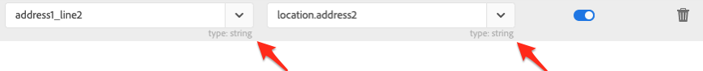

# Synchroniser les données

Vous pouvez synchroniser des tables de Microsoft Dynamics 365 vers Campaign et des mesures marketing Campaign vers Microsoft Dynamics 365. La synchronisation est exécutée par trois workflows techniques dédiés : **[!UICONTROL Microsoft Dynamics 365 vers Campaign]**, **[!UICONTROL Campaign vers Microsoft Dynamics 365]**, **[!UICONTROL Opt-in/Opt-out]**. Consultez cette section pour [en savoir plus](../../integrating/using/d365-acs-self-service-app-workflows.md).

>[!IMPORTANT]
>Vous devez arrêter/démarrer le workflow **[!UICONTROL Microsoft Dynamics 365 vers Campaign]** pour que vos modifications soient prises en compte. [En savoir plus](../../integrating/using/d365-acs-self-service-app-workflows.md)

## Mapping des tables de Microsoft Dynamics 365 vers Campaign

La page **[!UICONTROL Microsoft Dynamics 365 vers Campaign]** affiche une liste d&#39;entités dans Microsoft Dynamics 365 et les ressources personnalisées dans Adobe Campaign avec lesquelles elles seront synchronisées. Vous pouvez ajouter de nouveaux mappings et modifier ou supprimer des mappings existants.

Voici une description de chacune des colonnes de la table :

* **[!UICONTROL TABLE MICROSOFT DYNAMICS 365]** : cette colonne identifie l&#39;entité dans Microsoft Dynamics 365 qui sera la source de données pour le mapping.

* **[!UICONTROL TABLE CAMPAIGN]** : cette colonne identifie quelle ressource dans Adobe Campaign sera la destination des données pour le mapping.

* **[!UICONTROL ACTIONS]** : les actions possibles sont énumérées ci-dessous :

   * Cliquez sur l&#39;icône **[!UICONTROL Modifier]** pour modifier ce mapping.

   * Utilisez l&#39;icône **[!UICONTROL Supprimer]** pour supprimer un mapping de table.

   * Cliquez sur l&#39;icône **[!UICONTROL Relire les données]** pour resynchroniser toutes les données de la table Microsoft Dynamics 365. Normalement, l&#39;application d&#39;intégration ne synchronise que les données dans Microsoft Dynamics 365 qui ont récemment été modifiées. Cependant, dans certains cas (vous avez apporté une modification ou commis une erreur, par exemple), vous pouvez souhaiter que toutes les données soient resynchronisées. Dans ces cas, vous cliquez sur ce bouton et, la prochaine fois que vous arrêtez/démarrez le workflow **[!UICONTROL Microsoft Dynamics 365 vers Campaign]**, vos données commencent à se synchroniser.

      Si vous cliquez sur le bouton **[!UICONTROL Relire les données]** et que les vérifications réussissent, l&#39;icône devient désactivée : les données de cette paire de mapping de table seront resynchronisées avec la prochaine exécution du workflow **[!UICONTROL Microsoft Dynamics 365 vers Campaign]**.

      Vous ne pouvez pas choisir de relire les données lorsque les conditions suivantes sont remplies :

      * il existe 2 000 000 d&#39;éléments (ou plus) dans la mesure Backlog associée au workflow **[!UICONTROL Microsoft Dynamics 365 vers Campaign]** (affiché dans la **[!UICONTROL page Workflows]**) ;
      * la table Microsoft Dynamics 365 comporte 2 000 000 d&#39;enregistrements ou plus.

      Le nombre d’enregistrements à resynchroniser varie. Si vous disposez d’un grand nombre d’enregistrements, la synchronisation peut prendre du temps. Reportez-vous à la mesure **[!UICONTROL Backlog]** de la page **[!UICONTROL Workflows]** au fur et à mesure que l’application d’intégration effectue le processus de synchronisation.

      >[!IMPORTANT]
      >
      > Il est vivement recommandé d&#39;arrêter le workflow d&#39;intégration lors de la publication de modifications dans Adobe Campaign Standard ou Microsoft Dynamics 365. Les modifications applicables sont les suivantes : mises à jour des ressources/entités (et de leurs champs associés), des liens, des colonnes d&#39;identifiants, etc. qui sont actuellement utilisés par l&#39;intégration.

## Créer un mapping {#add-a-new-mapping}

Pour créer un mapping, procédez comme suit :

1. dans la page **[!UICONTROL Microsoft Dynamics 365 vers Campaign]**, cliquez sur le bouton **[!UICONTROL Ajouter un nouveau mapping]**.

1. Utilisez les listes déroulantes pour sélectionner les tables Microsoft Dynamics 365 et Campaign à mapper.
La plupart des autres entrées de la page dépendent des tables que vous choisissez.

   

   >[!NOTE]
   >Vous ne pouvez pas mapper plusieurs fois chaque table. Vous remarquerez donc que les sélections déroulantes n’incluent pas les tables qui ont déjà été mappées.

1. Cliquez sur **[!UICONTROL OK]** pour valider l’opération : l&#39;application prendra quelques instants pour lire les informations de champ associées aux tables sélectionnées.

Vous pouvez ensuite procéder à la configuration du mapping. [En savoir plus](#new-mapping-settings)

>[!IMPORTANT]
>
>Vous ne pouvez choisir les tables de cette page que lorsque vous ajoutez le mapping pour la première fois. Assurez-vous d’avoir sélectionné les tables adéquates avant de cliquer sur le bouton **[!UICONTROL Enregistrer]** : une fois enregistrés, les champs de sélection de table sont **en lecture seule**.

### Modifier un mapping existant

Si vous modifiez un mapping existant, vous verrez que les sélections de table ne sont pas modifiables.

Ce comportement est lié à la conception, car les entrées situées plus bas dans la page reposent sur les champs associés à ces tables. La modification des tables rendrait tous les champs associés non valides. Si vous souhaitez modifier la table à mapper, vous devez revenir à la page précédente, supprimer le mapping à modifier et ajouter un nouveau mapping.

### Configurer un mappage de table distinct {#new-mapping-settings}

Dans cette section, vous allez découvrir comment configurer un mapping **simple** d&#39;une table Microsoft Dynamics 365 vers une table Adobe Campaign.

Vous pouvez définir les paramètres suivants :

* **[!UICONTROL Tables]** : cette section répertorie le nom de la table Microsoft Dynamics 365 et la table Campaign vers laquelle elle sera mappée.
* **[!UICONTROL Mappings de champs]** : en savoir plus dans [cette section](#field-mappings)
* **[!UICONTROL Remplacements de champs]** : en savoir plus dans [cette section](#field-replacements)
* **[!UICONTROL Filtres]** : en savoir plus dans [cette section](#filters)
* **[!UICONTROL Paramètres avancés]** : en savoir plus dans [cette section](#advanced-settings)

### Mappings de champs {#field-mappings}

#### Clés primaires

Lors de l&#39;ajout d&#39;un nouveau mapping de table Microsoft Dynamics 365 vers Campaign, vous devez identifier l&#39;identifiant de champ.

La clé primaire Microsoft Dynamics 365 est en lecture seule, car l&#39;application la détecte.

Pour Campaign, vous devez sélectionner le champ qui sera la clé unique. Il doit être configuré en tant que [ressource personnalisée d’identifiant CRM](../../developing/using/uc-calling-resource-id-key.md) et ne doit pas avoir de doublons.

>[!NOTE]
>
>Vous ne pourrez choisir le champ d’identifiant sur la table que lorsque vous aurez sélectionné **[!UICONTROL Ajouter un nouveau mapping]**. Si vous cliquez sur le bouton Modifier pour modifier un mapping de table existant, le champ d’identifiant est en lecture seule.

Les clés primaires sont toujours les premiers noms de champ répertoriés dans la section **[!UICONTROL Mappings de champs]**. Pour rappel, l’icône ci-après est située à droite pour vous rappeler qu&#39;il s&#39;agit des clés primaires.

#### Ajouter d’autres mappings de champs

La section **[!UICONTROL Mappings de champs]** vous permet d’ajouter des mappings de champs autres que les clés primaires. Pour ajouter un mapping d&#39;un champ de Microsoft Dynamics 365 vers Adobe Campaign, cliquez sur le bouton **[!UICONTROL Ajouter un nouveau mapping de champs]**.

Sélectionnez les champs Microsoft Dynamics 365 et Campaign dans les listes :

Ces listes contiennent les noms des champs associés aux tables Microsoft Dynamics 365 et Campaign que vous avez sélectionnées en haut de la page.

Le commutateur **[!UICONTROL Appliquer les mises à jour]** vous permet de contrôler si les mises à jour de ce champ seront propagées de Microsoft Dynamics 365 vers Campaign :
* S’il se trouve sur , les mises à jour de la ou des valeurs dans Microsoft Dynamics 365 seront propagées à Adobe Campaign au fur et à mesure que les mises à jour s’effectueront.

* Si vous avez désactivé , la valeur sera propagée lorsque les données seront initialement chargées (ou relues), mais les mises à jour incrémentales du champ dans Microsoft Dynamics 365 ne seront pas propagées.

>[!NOTE]
>
>Cliquez sur l&#39;en-tête de colonne **[!UICONTROL Appliquer les mises à jour]** pour mettre à jour **tous** les commutateurs à activer ou à désactiver.

Lorsque vous sélectionnez des valeurs de champ, le type de données s’affiche sous les menus déroulants.  Souvenez-nous de ce point lors du mapping des valeurs d’un champ à l’autre.

>[!NOTE]
>
> Vous ne pouvez pas mapper plusieurs champs Microsoft Dynamics 365 vers un seul champ Campaign.

### Remplacements de champs {#field-replacements}

Utilisez le bouton **[!UICONTROL Ajouter un nouveau remplacement de champ]** pour définir un nouveau remplacement de champ.

Les remplacements de champs vous permettent d’identifier :

* un nom de champ Microsoft Dynamics 365 (qui a été ajouté au-dessus dans la section des mappings de champs) ;
* une valeur existante (qui existe dans Microsoft Dynamics 365) ; et
* une nouvelle valeur à écrire vers Adobe Campaign.

Une liste déroulante sera fournie pour les valeurs de liste de sélection, d&#39;énumération et boléennes. Une zone de texte sera utilisée pour d’autres types numériques et de chaîne.

### Filtres {#filters}

Utilisez le bouton **[!UICONTROL Ajouter un nouveau filtre]** pour sélectionner les enregistrements Microsoft Dynamics 365 à propager vers Campaign. Vous pouvez choisir n’importe quel champ associé à un enregistrement à ajouter aux filtres (le nom du champ n’a pas besoin d’être ajouté aux mappings de champs).

Vous spécifiez un filtre en renseignant les informations suivantes :

* nom du champ Microsoft Dynamics 365 ;
* valeur de comparaison ; et
* valeur (de Microsoft Dynamics 365).
Si le nom du champ, la comparaison et la valeur sont vrais pour un enregistrement donné, l’enregistrement est propagé vers Adobe Campaign.

Vous pouvez choisir comment ces filtres sont évalués en définissant l’entrée libellée **[!UICONTROL Sélectionner l’opérateur de comparaison de filtre]**. Si vous choisissez **Et**, tous les filtres doivent être vrais pour qu’un enregistrement soit propagé vers Campaign. Si vous sélectionnez **Ou**, l’enregistrement est propagé si l’un d’eux est évalué comme vrai.

L&#39;option **[!UICONTROL Voulez-vous supprimer les enregistrements dans Adobe Campaign Standard qui seront filtrés à partir de Microsoft Dynamics 365 ?]** contrôle si vous souhaitez que les enregistrements qui ont été filtrés soient supprimés de Campaign. Si vous sélectionnez **Non**, les enregistrements resteront dans Adobe Campaign. Sélectionnez **Oui** pour qu’ils soient supprimés par la logique d’intégration.

>[!NOTE]
>
> Si aucun filtre n&#39;est ajouté, tous les enregistrements qui ont été modifiés seront propagés vers Adobe Campaign.

### Paramètres avancés {#advanced-settings}

Vous pouvez configurer les options supplémentaires suivantes lors de la configuration d’un mapping :

* Définissez l&#39;option **[!UICONTROL Appliquer les suppressions dans Microsoft Dynamics 365 vers Campaign ?]** sur **Oui**, si vous souhaitez propager les suppressions effectuées dans Microsoft Dynamics 365 vers le champ correspondant dans Adobe Campaign (en fonction du mapping du nom de champ). Sélectionnez **Non** pour ignorer les suppressions dans Microsoft Dynamics 365.

* Définissez l&#39;option **[!UICONTROL Utiliser les valeurs techniques dans les listes de sélection Microsoft Dynamics 365 ?]** sur **Non** si vous souhaitez propager vers Campaign la valeur d&#39;affichage associée à une liste de sélections Microsoft Dynamics 365. Sélectionnez **Oui** pour propager la valeur technique.

## Synchroniser les événements marketing Campaign vers Microsoft Dynamics 365

La page **[!UICONTROL Campaign vers Microsoft Dynamics 365]** vous permet d&#39;identifier les événements de marketing par email qui seront mappés d’Adobe Campaign vers Microsoft Dynamics 365.

Les quatre mesures que vous pouvez contrôler sont les suivantes : **Envois**, **Clics**, **Ouvertures** et **Bounces**.

Sélectionnez **Oui** pour confirmer que vous souhaitez que les événements de ce type soient acheminés vers Microsoft Dynamics 365.

Cliquez [ici](../../integrating/using/d365-acs-self-service-app-workflows.md) pour plus d&#39;informations sur ces flux d&#39;événements email.

## Workflow d’opt-in/opt-out {#opt-in-out-wf}

Le workflow d’**opt-in/opt-out** permet d&#39;identifier le flux d&#39;informations d&#39;opt-in/opt-out entre Microsoft Dynamics 365 et Adobe Campaign. Cela suppose que les données sont associées à l&#39;entité Microsoft Dynamics 365 « contact » et à la ressource Adobe Campaign « profil ».

En savoir plus sur la gestion des opt-outs dans [cette section](../../integrating/using/d365-acs-notices-and-recommendations.md#opt-out).

N&#39;oubliez pas que vous devez cliquer sur « Enregistrer » pour enregistrer vos sélections. N&#39;oubliez pas non plus que vous devez arrêter le workflow **Campaign vers Microsoft Dynamics 365**, puis cliquer sur Lire pour que l&#39;intégration incorpore vos modifications.

### Sens de la synchronisation d’opt-in/opt-out

Vous trouverez ci-dessous la liste des options de synchronisation des données disponibles :

* **[!UICONTROL Désactivé]** : lorsque cette option est sélectionnée, aucune information d&#39;opt-in/opt-out ne se déplace entre Adobe Campaign et Microsoft Dynamics 365.

* **[!UICONTROL Unidirectionnelle (Microsoft Dynamics 365 vers Campaign)]** : cette option est utilisée pour acheminer les informations d’opt-in/opt-out de Microsoft Dynamics 365 vers Adobe Campaign uniquement. L’application d’intégration ne vous permet pas de configurer le flux dans cet écran ; cliquez sur le bouton **[!UICONTROL Enregistrer]** et accédez au workflow **[!UICONTROL Microsoft Dynamics 365 vers Campaign]**. Dans ce workflow, vous pouvez modifier le mapping des tables de contacts/profils afin d’identifier comment mapper vos champs d’opt-in/opt-out.

* **[!UICONTROL Unidirectionnelle (Campaign vers Microsoft Dynamics 365)]** : cette option rendra la section **Mappings** visible. Ces entrées vous permettent de définir quels champs Adobe Campaign vont mapper les données sur les champs de Microsoft Dynamics 365. Cela signifie que si vous mettez manuellement à jour une valeur dans Microsoft Dynamics 365, sa valeur sera remplacée par celle d’Adobe Campaign si elle change.

* **[!UICONTROL Bidirectionnelle]** : cette option rendra la section **Mappings** visible. Ces paires identifieront les champs de Microsoft Dynamics 365 et Adobe Campaign qui seront mappés les uns aux autres. [En savoir plus](../../integrating/using/d365-acs-notices-and-recommendations.md).

### Mappings

Cette section s&#39;applique uniquement lorsque le champ du sens de la synchronisation des informations d&#39;opt-in/opt-out est défini sur **[!UICONTROL Unidirectionnelle (Campaign vers Microsoft Dynamics 365)]** ou **[!UICONTROL Bidirectionnelle]**. Vous pouvez définir quels champs de Microsoft Dynamics 365 correspondent à quelles entrées dans Adobe Campaign.

Les noms de champ Microsoft Dynamics 365 incluent tous ceux de type **booléen**.

Les noms de champ Adobe Campaign sont un ensemble fixe de valeurs spécifiques à l’opt-in/opt-out. Les noms de champ Adobe Campaign sont un ensemble fixe de valeurs spécifiques aux informations d’opt-in/opt-out. **L&#39;ensemble des valeurs de cette liste ne peut pas être modifié**.
