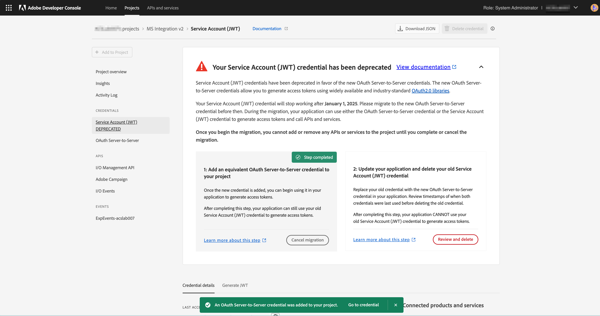

# Migration des informations d’identification de JWT vers OAuth serveur à serveur

Les informations d’identification du compte de service (JWT) ont été abandonnées au profit des nouvelles informations d’identification OAuth serveur à serveur. Les nouvelles informations d’identification vous permettent de gérer plus facilement les applications Adobe. Elles suppriment également la nécessité d’opérer une rotation régulière entre les certificats et fonctionnent de manière prête à l’emploi à l’aide de bibliothèques OAuth2 standard.

Bien que les informations d’identification du compte de service (JWT) aient été marquées comme obsolètes, elles continueront à fonctionner jusqu’au 1er janvier 2025. Par conséquent, vous devez migrer votre intégration pour utiliser les nouvelles informations d’identification OAuth serveur à serveur avant le 1er janvier 2025. Veuillez vérifier le [journal des obsolescences](https://developer.adobe.com/developer-console/docs/guides/authentication/ServerToServerAuthentication/migration/#deperecation-timelines) pour plus d’informations.

## Procédure de migration des informations d’identification de JWT vers OAuth serveur à serveur

La migration vers les informations d’identification OAuth serveur à serveur est un processus simple qui permet une migration sans interruption pour votre application. Pour migrer les informations d’identification, procédez comme suit.

1. Connectez-vous à [Adobe Developer Console](https://developer.adobe.com/console)
2. Dans le menu de filtrage sur le côté gauche, sélectionnez l’option Comporte des informations d’identification de compte de service (JWT). Cette méthode affiche tous les projets disposant d’informations d’identification de compte de service (JWT). Dans la liste des projets, cliquez sur le projet que vous avez l’intention de migrer.

   

3. Ouvrez l’onglet Informations d’identification du compte de service (JWT) dans le volet de navigation de gauche et affichez la carte de migration. Sur la carte de migration, cliquez sur le bouton **Ajouter des nouvelles informations d’identification** pour ajouter des informations d’identification OAuth serveur à serveur équivalentes. L’ajout d’informations d’identification OAuth serveur à serveur à votre projet déclenche la migration.
   
4. Les nouvelles informations d’identification **OAuth serveur à serveur** sont ajoutées au volet de navigation de gauche.
   * Cliquez sur Annuler la migration pour annuler la migration.
   * Ne cliquez pas sur le bouton Vérifier et supprimer tant que vous n’avez pas vérifié si les nouvelles informations d’identification OAuth serveur à serveur fonctionnent.
     

5. Mettez à jour des informations d’identification dans l’application Microsoft Dynamics 365 vers Adobe Campaign Standard
   * Connectez-vous à l’application d’intégration et accédez à la page Paramètres.
   * Sélectionnez OAuth comme type d’authentification.
   * Comme les nouvelles informations d’identification OAuth serveur à serveur utilisent les mêmes informations d’identification que l’ancien compte de service (JWT), la plupart des champs sont déjà renseignés.
   * Saisissez l’identifiant du client ou de la cliente et le secret client. Ces informations sont disponibles dans le projet d’Adobe Developer Console.
   * Cliquez sur Enregistrer pour enregistrer les paramètres.
     

6. Vérifier si les nouvelles informations d’identification fonctionnent
   * Connectez-vous à l’application d’intégration et accédez à la page Workflows.
   * Arrêtez les workflows actifs. Attendez que les workflows soient arrêtés.
   * Démarrez les workflows. Patientez jusqu’à ce que les workflows soient à l’état EN COURS.
   * Surveillez les workflows pendant quelques minutes pour vous assurer qu’ils fonctionnent correctement. Vous pouvez également vérifier les données dans Adobe Campaign Standard et Microsoft Dynamics 365 pour vous assurer qu’elles sont correctement synchronisées.

7. Supprimer les informations d’identification JWT pour terminer la migration
   * Connectez-vous à [Adobe Developer Console](https://developer.adobe.com/console).
   * Cliquez sur les projets et sélectionnez le projet que vous avez migré.
   * Cliquez sur l’onglet Informations d’identification du compte de service (JWT) dans le volet de navigation de gauche.
   * Cliquez sur le bouton Vérifier et supprimer.
     
   * Vérifiez la date et l’heure du menu de dernier accès ou de dernière utilisation afin de vérifier si l’application d’intégration génère des jetons d’accès à l’aide des nouvelles informations d’identification OAuth ou en utilisant toujours les anciennes informations d’identification JWT.
     
   * Une fois qu’il a été vérifié que l’application d’intégration utilise les nouvelles informations d’identification OAuth et qu’elle n’utilise plus les informations d’identification JWT, supprimez les anciennes informations d’identification en cliquant sur le bouton **Confirmer et continuer** pour effectuer la migration.
     
