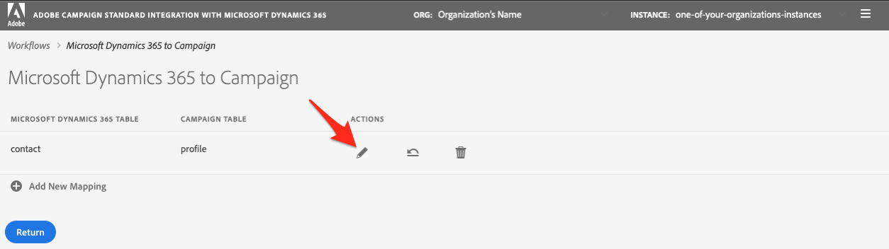

# Prise en main de l’application d’intégration en libre-service {#gs-self-service-app}

L&#39;intégration d’Adobe Campaign Standard avec l&#39;application d&#39;intégration en libre-service Microsoft Dynamics 365 vous permet de configurer des flux de données, de contrôler s&#39;ils sont en cours d&#39;exécution ou non et dans quel environnement. Vous devez toutefois remplir certaines conditions préalables avant de commencer à utiliser l’application d’intégration en libre-service.

## Concepts et restrictions {#concepts-and-restrictions}

Avant de commencer à utiliser l’outil d’intégration, vous devez comprendre les concepts et les barrières de sécurité associés à l’intégration et effectuer quelques étapes initiales pour y accéder.

En savoir plus dans ces sections :

* [Prise en main de l’intégration de Microsoft Dynamics 365](../../integrating/using/d365-acs-get-started.md)
* [Bonnes pratiques et limites de l&#39;intégration](../../integrating/using/d365-acs-notices-and-recommendations.md)
* [Découvrir les étapes clés d’implémentation de cette intégration](../../integrating/using/d365-acs-get-started.md#request-and-implement-this-integration)
* [Utilisation de l’intégration de Microsoft Dynamics 365](../../integrating/using/d365-acs-using-the-integration.md)

## Prérequis {#self-service-app-prerequisites}

Vous devez configurer Microsoft Dynamics 365 et Adobe Campaign Standard pour que l&#39;application d&#39;intégration ait accès à vos données. Cette configuration prendra du temps dans Dynamics 365, Adobe Campaign Standard et Adobe I/O ; toutefois, une fois ces applications configurées, vous pourrez contrôler l&#39;intégration par le biais de l&#39;interface utilisateur de l&#39;application d&#39;intégration en libre-service.

En savoir plus dans ces sections :

* [Configuration de Microsoft Dynamics 365 pour l’intégration Campaign](../../integrating/using/d365-acs-configure-d365.md)
* [Configurer Adobe I/O](../../integrating/using/d365-acs-configure-adobe-io.md)
* [Mapper des ressources personnalisées de Campaign et des entités personnalisées de Microsoft Dynamics 365](../../integrating/using/d365-acs-notices-and-recommendations.md)

## Étapes clés de configuration de l’application d’intégration en libre-service {#self-service-app-configuration-steps}

Vous pouvez ensuite commencer à utiliser l’outil d’intégration. Suivez ces étapes :

1. [Obtenir l&#39;accès à l’application d’intégration](../../integrating/using/d365-acs-self-service-app-control-access.md)
1. [Configurer l’application d’intégration en fonction de votre utilisation](../../integrating/using/d365-acs-self-service-app-settings.md)
1. [Implémenter la synchronisation des données](../../integrating/using/d365-acs-self-service-app-data-sync.md)
1. [Configurer des workflows de synchronisation](../../integrating/using/d365-acs-self-service-app-workflows.md)

## Lien vers l’application d’intégration {#self-service-app-link}

Ouvrez un navigateur et accédez au connecteur associé à votre zone géographique :

* [Asie-Pacifique](http://d365-acs-ap.ea.adobe.com/)
* [Europe, Moyen-Orient ou Afrique (EMEA)](http://d365-acs-em.ea.adobe.com/)
* [Amériques](http://d365-acs-na.ea.adobe.com/)

## Reconnaissance des modalités des demandes d&#39;accès à des informations personnelles {#self-service-app-acknowledgement}

Lorsque vous accédez pour la première fois à l’interface utilisateur en libre-service, une reconnaissance des modalités des demandes d&#39;accès à des informations personnelles s’affiche. Vous devez reconnaître que vous avez compris votre rôle dans l&#39;exécution des demandes d&#39;accès à des informations personnelles dans Campaign et Microsoft Dynamics 365 séparément avant de pouvoir continuer.
Pour en savoir plus sur vos responsabilités en matière de confidentialité et sur la façon de gérer les demandes d&#39;accès à des informations personnelles, consultez [cette section](../../integrating/using/d365-acs-notices-and-recommendations.md#acs-msdyn-manage-privacy).

## Configuration de vos informations d&#39;identification {#self-service-app-credentials}

Lorsque vous accédez pour la première fois à l’interface utilisateur, une page s’affiche avec un en-tête qui ressemble à celui-ci :

>[!NOTE]
>
> Il est normal de recevoir des alertes indiquant qu&#39;il est « impossible de se connecter » à Adobe Campaign Standard ou Microsoft Dynamics 365 si les paramètres de l&#39;application n&#39;ont pas encore été configurés.

Vérifiez que les sélections &quot;ORG&quot; et &quot;INSTANCE&quot; sont celles que vous prévoyez de configurer. Dans le cas contraire, cliquez sur la liste déroulante et sélectionnez l’organisation et l’instance appropriées.

>[!IMPORTANT]
>
> Si vous configurez le connecteur pour la première fois et/ou si vous découvrez ce processus, nous vous invitons **fortement** à sélectionner l’instance &quot;stage&quot; ou &quot;dev&quot;. Vous devez vérifier que votre configuration fonctionne correctement avant de l’effectuer en production.

Si vous avez l&#39;organisation et l&#39;instance appropriées, cliquez sur le menu « hamburger » pour afficher un menu déroulant. Cliquez ensuite sur **[!UICONTROL Paramètres...]** dans le menu déroulant pour accéder à la page où vous saisissez vos informations d&#39;identification pour Microsoft Dynamics 365 et Campaign (voir ci-dessous).

Dans la page **[!UICONTROL Paramètres]**, renseignez les sections suivantes :

* Informations d&#39;identification Microsoft Dynamics 365
* Informations d’identification Adobe

Cliquez [ici](../../integrating/using/d365-acs-self-service-app-settings.md) pour trouver des informations plus détaillées sur l&#39;emplacement où trouver les informations pour chaque entrée. Lorsque vous avez terminé, cliquez sur le bouton **[!UICONTROL Enregistrer]** dans la partie inférieure de l’écran.

## Vérifier la configuration initiale {#self-service-app-initial-config}

En supposant que vous ayez rempli les conditions préalables ci-dessus et ajouté correctement toutes vos informations d’identification, accédez maintenant à la page **[!UICONTROL Workflows]**. Pour en savoir plus sur les workflows de l&#39;application d&#39;intégration, consultez [cette page](../../integrating/using/d365-acs-self-service-app-workflows.md).

Dans la page **[!UICONTROL Workflows]**, cliquez sur l&#39;icône représentant un crayon associée au workflow **[!UICONTROL Microsoft Dynamics 365 vers Campaign]** pour modifier sa configuration.

Dans la page **[!UICONTROL Microsoft Dynamics 365 vers Campaign]**, vous pouvez accéder à la liste des mappages de table que vous avez configurés.  Vous obtiendrez par défaut un mappage contact/profil de paramètres d&#39;usine. Toutes les autres entités personnalisées devront être configurées séparément.

Dans la page **[!UICONTROL Modifier le mappage de table]**, vérifiez la section **[!UICONTROL Mappages]** pour vous assurer que les champs de Microsoft Dynamics 365 sont mappés sur le bon champ dans Campaign. Si vous devez ajouter d’autres mappages, faites-le dès maintenant, ainsi que tout remplacement ou filtres. [En savoir plus](../../integrating/using/d365-acs-self-service-app-data-sync.md).

Pour ajouter de nouveaux mappages, consultez [cette section](../../integrating/using/d365-acs-self-service-app-data-sync.md#add-a-new-mapping) pour plus d’informations.

Une fois que votre configuration est correcte, cliquez sur le bouton **[!UICONTROL Lire]** en regard du workflow **[!UICONTROL Microsoft Dynamics 365 vers Campaign]** afin de débuter l&#39;intégration et le flux de données.

>[!IMPORTANT]
>
>Il est **vivement** recommandé de commencer l’exécution dans vos environnements de test ou de développement avant l’environnement de production. Vérifiez que l&#39;instance stage/dev est sélectionnée dans l&#39;en-tête.

Une fois l’exécution commencée, vous devriez être en mesure d’effectuer des tests en ajoutant ou en modifiant des entrées dans Microsoft Dynamics 365 et en observant ces modifications dans Adobe Campaign après quelques minutes. Si, à tout moment, vous devez arrêter ce processus, il vous suffit d&#39;appuyer sur le même bouton pour l&#39;arrêter. [En savoir plus](../../integrating/using/d365-acs-self-service-app-workflows.md#workflow-status)

## Espace de travail de l&#39;application d&#39;intégration {#self-service-app-workspace}

### En-tête de l’application {#app-header}

L’en-tête de l’application en libre-service vous permet de définir l’organisation et l’instance que vous visualisez et/ou configurez actuellement.

Sélectionnez l&#39;**ORG** et l&#39;**INSTANCE** que vous souhaitez afficher/modifier. Ces champs apparaissent en lecture seule, mais ils deviennent modifiables lorsque vous placez le curseur de la souris dessus.

Un menu déroulant s&#39;affiche lorsque vous cliquez sur le bouton avec les trois lignes horizontales  à droite de l&#39;en-tête.

Les entrées du menu déroulant sont les suivantes :

* **Paramètres** : si vous sélectionnez cette option, vous accédez à un écran qui vous permet de spécifier les informations d&#39;identification d&#39;API pour Microsoft Dynamics 365 et Adobe Campaign, ainsi que d&#39;autres paramètres généraux pour l&#39;application.

* **Documentation** : cette option permet d’accéder à la documentation Adobe Campaign spécifique à cette intégration.

* **Assistance clientèle** : il s’agit d’un lien vers la documentation Experience Cloud relative à l’enregistrement d’une demande auprès de l’Assistance clientèle.

* **Déconnexion** : cette option vous déconnectera de l’application et vous permettra de vous reconnecter en tant qu’autre utilisateur.

* **À propos** : cette boîte de dialogue affiche des informations sur l’application, y compris des informations de droits d’auteur.

### Barres de navigation {#app-breadcrumbs}

Des barres de navigation s’affichent en haut de certains écrans lorsque vous naviguez dans l’application.

**Exemple :**

Vous trouverez ci-dessous un exemple à partir de l’écran **[!UICONTROL Modifier le mappage de table]** qui montre les barres de navigation et le titre de la page. Dans ce cas, vous pouvez cliquer sur le texte **[!UICONTROL Workflows]** ou **[!UICONTROL Microsoft Dynamics 365 vers Campaign]** pour accéder à l&#39;un des écrans précédents. Dans le cas présent, il n’est pas possible de cliquer sur **[!UICONTROL Modifier le mappage de table]** dans les barres de navigation, car il s’agit de l’écran actuel.

### Boutons courants {#app-buttons}

Les icônes suivantes sont utilisées dans plusieurs pages de l’application en libre-service.

 - Ajouter un nouvel élément à une liste.

 - Modifier un élément qui existe déjà

 - Supprimer un élément d&#39;une liste d&#39;éléments
