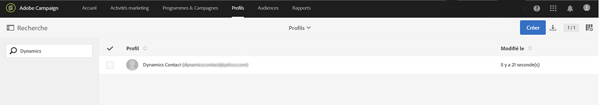

# Utilisation de l&#39;intégration Microsoft Dynamics 365

Il existe plusieurs flux de données que l&#39;intégration Adobe Campaign Standard avec Microsoft Dynamics 365 effectue. Ces flux sont détaillés dans [cette page](../../integrating/using/d365-acs-self-service-app-workflows.md).

Vous trouverez plus de détails sur les flux de données dans ce document dans la section [Flux de données](#data-flows).

## Expérience de l’utilisateur Adobe Campaign Standard

Lorsqu&#39;un contact est créé, modifié ou supprimé (si la suppression est activée) dans Microsoft Dynamics 365, il est envoyé au Campaign Standard. Ces contacts seront visibles dans l’écran Profils de Campaign et peuvent être ciblés dans les campagnes marketing. Voir l’écran Profils ci-dessous.

Lorsqu&#39;un attribut d&#39;exclusion est modifié dans Campaign, il est reflété dans Dynamics 365 si vous avez sélectionné la configuration d&#39;exclusion **unidirectionnelle (Campaign à Microsoft Dynamics 365)** ou **bidirectionnelle** et si cet attribut particulier est correctement mappé.

## Expérience utilisateur de Microsoft Dynamics 365

Pour plus d&#39;informations, les événements de marketing par courriel suivants sont envoyés de Campaign à Dynamics 365 et affichés dans la vue de chronologie Microsoft Dynamics 365 en tant qu&#39;activités personnalisées :

*  Envoi d’email Adobe Campaign

*  Ouverture d’email Adobe Campaign

*  Clic sur une URL d’email Adobe Campaign

*  Email bounce Adobe Campaign

Pour voir la chronologie d’un contact, accédez à votre liste de contacts en cliquant sur Concentrateur des ventes dans le menu déroulant Dynamics 365. Cliquez ensuite sur Contacts dans la barre de menu de gauche et sélectionnez un contact.

>[!NOTE]
>
>L&#39;application **Adobe Campaign for Microsoft Dynamics 365** d&#39;AppSource devra être installée dans votre instance Microsoft Dynamics 365 afin de vue à ces événements. [En savoir plus](../../integrating/using/d365-acs-configure-d365.md#install-appsource-app).

Vous trouverez ci-dessous un instantané de l&#39;écran Contact pour Dynamics User. Dans la vue Chronologie, vous remarquerez que Dynamics User a reçu un courriel associé au Campaign Name &quot;2019LoyaltyCamp&quot; et au Diffusion Name &quot;DM190&quot;. L’utilisateur Dynamics a ouvert l’email et a également cliqué sur une URL contenue dans celui-ci ces deux actions ont créé des événements également présentés ci-dessous. Si vous regardez dans le coin droit, vous verrez la carte de l’assistant de relations (AR) ; il contient actuellement une tâche de suivi de l’URL sur laquelle l’utilisateur a cliqué.

Reportez au gros plan ci-dessous de la vue de chronologie pour l’utilisateur Dynamics.

Vous trouverez ci-dessous un gros plan de la carte de l’assistant de relations (AR). L’application AppSource contient un workflow qui recherche un événement de clic sur l’URL de l’email Adobe. Lorsque cet événement se produit, il crée une tâche et définit une date d’échéance. Cela permet à la tâche de s’afficher dans la carte de l’AR, ce qui lui donne une visibilité supplémentaire. Il existe un workflow similaire pour les événements Email bounce d’Adobe, qui ajoute une tâche pour réconcilier l’adresse email non valide. Ces workflows peuvent être désactivés dans la solution.

Si vous cliquez sur le sujet de l’événement d’envoi, vous verrez un formulaire similaire à celui ci-dessous. Les formulaires pour les événements d’ouverture et de rebond sont similaires.

Le formulaire pour les événements de clic sur l’URL d’un email ajoute un attribut supplémentaire pour l’URL sur laquelle l’utilisateur a cliqué :

Voici une liste des attributs et une description :

* **Objet** : Objet du événement ; composée de l’identifiant Campaign et de l’ID de Diffusion de la diffusion de messagerie

* **Propriétaire** : Utilisateur de l’application créé dans les étapes de post-mise en service

* **Concernant** : Nom du contact

* **Nom** Campaign : L&#39;identifiant Campaign en Campaign Standard

* **Nom** de la diffusion : ID de Diffusion dans le Campaign Standard

* **Date d&#39;envoi/d&#39;ouverture/de clic/de rebonds** : Date/heure de création du événement

* **URL** de suivi : URL sur laquelle l’utilisateur a cliqué

* **URL** de la page miroir : URL vers la page miroir du courrier électronique qui a été envoyé/ouvert/cliqué/rebondi. La période d&#39;expiration de la page miroir de messagerie peut être modifiée dans l&#39;écran de configuration de l&#39;activité de canal de messagerie Campaign correspondante. [En savoir plus](../../administration/using/configuring-email-channel.md#validity-period-parameters).

>[!NOTE]
>
>Pour l&#39;exclusion, si un attribut d&#39;exclusion est modifié dans Microsoft Dynamics 365, il sera reflété dans Campaign si vous avez sélectionné la configuration d&#39;exclusion **Unidirectionnelle (Campaign à Microsoft Dynamics 365)** ou **Bidirectionnelle** et si cet attribut particulier est correctement mappé.

## Flux de données {#data-flows}

### Contact et saisie d&#39;entité personnalisée

Enregistrements nouveaux, mis à jour et supprimés (Remarque : supprimé doit être activé) sont envoyés de la table de contacts Microsoft Dynamics 365 à la table de profil Campaign.

Les mappages de table peuvent être configurés dans l&#39;interface utilisateur de l&#39;application d&#39;intégration pour mapper les attributs de table Microsoft Dynamics 365 aux attributs de table Campaign. Les mappages des tables peuvent être modifiés pour ajouter ou supprimer des attributs, si nécessaire.

L&#39;exécution initiale du flux de données est conçue pour transférer tous les enregistrements mappés, y compris ceux marqués comme &quot;inactifs&quot;; par la suite, l’intégration ne traitera que les mises à jour incrémentielles. L’exception à cette règle est si les données sont relues ou si un filtre est configuré ; des règles de filtrage de base basées sur des attributs peuvent être configurées pour déterminer les enregistrements à synchroniser avec Campaign.

Les règles de remplacement de base peuvent être configurées dans l’interface utilisateur de l’application d’intégration pour remplacer une valeur d’attribut par une autre valeur (par exemple, &quot;vert&quot; pour &quot;#00FF00&quot;, &quot;F&quot; pour 1, etc.).

En fonction du volume d’enregistrements, il se peut que votre stockage SFTP dans Campaign doive être utilisé pour le transfert initial de données. [En savoir plus](#initial-data-transfer).

L’attribut ‘ExternalId’ de la table de profils Campaign doit être renseigné avec l’attribut de contact ‘contactId’ Dynamics 365 pour que l’entrée de contact fonctionne. Les entités personnalisées Campaign doivent également être renseignées avec un attribut d’identifiant unique Dynamics 365 ; cependant, cet attribut peut être stocké dans n’importe quel attribut d’entité personnalisée Campaign (c.-à-d. qu’il n’est pas nécessaire qu’il s’agisse d’externalId).

>[!NOTE]
>
>Pour l’entrée d’entités personnalisées, le suivi des modifications doit être activé dans Dynamics 365 pour les entités personnalisées synchronisées.

#### Entités personnalisées

L’[intégration Microsoft Dynamics 365-Adobe Campaign Standard](../../integrating/using/d365-acs-get-started.md) prend en charge les entités personnalisées, ce qui permet de synchroniser les entités personnalisées de Dynamics 365 avec les ressources personnalisées correspondantes dans Campaign.

Les nouvelles données des ressources personnalisées peuvent être utilisées à plusieurs fins, notamment pour la segmentation et la personnalisation.

L’intégration prend en charge les tables liées et non liées. La liaison est prise en charge jusqu’à trois niveaux (niveau1->niveau2->niveau3).

>[!IMPORTANT]
>
>Si un enregistrement de ressource personnalisée Campaign contient des informations personnelles, des recommandations spécifiques s’appliquent. En savoir plus dans [cette section](../../integrating/using/d365-acs-notices-and-recommendations.md#acs-msdyn-manage-data).

Lors de la configuration des flux de données d’entités personnalisées, il est important de tenir compte des points suivants :

* La création et la modification de ressources personnalisées Campaign sont des opérations délicates qui doivent être effectuées uniquement par des utilisateurs experts.
* Pour les flux de données d’entités personnalisées, le suivi des modifications doit être activé dans Dynamics 365 pour les entités personnalisées synchronisées.
* Si un enregistrement parent et et un enregistrement enfant lié sont créés presque au même moment dans Dynamics 365, en raison du traitement parallèle de l’intégration, il peut arriver qu’un nouvel enregistrement enfant soit créé dans Campaign avant l’enregistrement de son parent.

* Si les enregistrements parent et enfant sont liés du côté Campaign à l’aide de l’option **Lien simple de cardinalité 1**, l’enregistrement enfant reste masqué et inaccessible (via l’interface utilisateur ou l’API) jusqu’à ce que l’enregistrement parent arrive dans Campaign.

* (En supposant que le **lien simple de cardinalité 1** est présent dans Campaign) Si l’enregistrement enfant est mis à jour ou supprimé dans Dynamics 365 et que cette modification est écrite dans Campaign avant que l’enregistrement parent ne s’affiche dans Campaign (ce qui est peu probable, mais qui peut parfois arriver), cette mise à jour ou suppression ne sera pas traitée dans Campaign et une erreur sera générée. Dans le cas d’une mise à jour, l’enregistrement en question devra de nouveau être mis à jour dans Dynamics 365 pour synchroniser l’enregistrement mis à jour. Dans le cas de la suppression, l’enregistrement en question devra être pris en charge séparément du côté Campaign, car il n’y aura plus d’enregistrement dans Dynamics 365 à supprimer ou à mettre à jour.

* Si vous vous trouvez dans une situation où vous pensez avoir masqué des enregistrements enfants sans avoir aucun moyen d’y accéder, vous pouvez temporairement changer le type de lien de cardinalité en **lien simple de cardinalité 0 ou 1** pour accéder à ces enregistrements.

Vous trouverez une présentation plus exhaustive des ressources personnalisées de Campaign dans [cette section](../../developing/using/key-steps-to-add-a-resource.md).

### Flux du événement marketing par courriel {#email-marketing-event-flow}

Les événements de marketing par courrier électronique sont envoyés de Campaign à Microsoft Dynamics 365 pour apparaître dans la vue Chronologie.

Types d’événements de marketing pris en charge :
* Envoi - email envoyé au destinataire
* Ouverture- email ouvert par le destinataire
* Clic - URL dans l’email sur lequel clique le destinataire
* Bounce - l’email envoyé au destinataire a fait l’objet d’un hard bounce

Les attributs de événement suivants s&#39;affichent dans Dynamics 365 :
* Nom de la campagne marketing
* Nom de la diffusion Email
* Date et heure
* URL de la page miroir de l’email
* URL sur laquelle l’utilisateur a cliqué (événements de clic uniquement)

Les événements de marketing email peuvent être activés/désactivés par type (envoi, ouverture, clic, bounce) de sorte que seuls les types d’événements sélectionnés seront transmis à Dynamics 365.

### Flux d’exclusion {#opt-out-flow}

Les valeurs de désinscription (par exemple, denyList) sont synchronisées entre les systèmes ; vous avez le choix entre les options suivantes lors de l’intégration :

* **Unidirectionnel (Microsoft Dynamics 365 à Campaign)** : Dynamics 365 est une source de vérité pour les exclusions. Les attributs d&#39;exclusion seront synchronisés dans une direction entre Dynamics 365 et Campaign Standard&quot;
* **Unidirectionnel (Campaign vers Microsoft Dynamics 365)** : Le Campaign Standard est la source de vérité pour les exclusions. Les attributs d&#39;exclusion seront synchronisés dans une direction, du Campaign Standard à Dynamics 365
* **Bidirectionnel** : Dynamics 365 AND Campaign Standard sont deux sources de vérité. Les attributs d&#39;exclusion seront synchronisés bidirectionnellement entre Campaign Standard et Dynamics 365

Si vous disposez également d’un processus distinct pour gérer la synchronisation des désinscriptions entre les systèmes, le flux de données de désinscription de l’intégration peut être désactivé.

>[!NOTE]
>
>Dans l’interface utilisateur de l’application d’intégration, les cas d’utilisation d’exclusion **unidirectionnelle (Microsoft Dynamics 365 à Campaign)** et **bidirectionnelle** sont configurés dans un processus d’exclusion distinct. [En savoir plus](../../integrating/using/d365-acs-self-service-app-data-sync.md#opt-in-out-wf).
>
>Le cas d&#39;utilisation d&#39;exclusion **unidirectionnelle (Campaign to Microsoft Dynamics 365)** est une exception ; il est configuré dans le processus d’entrée (contact au Profil).

Le mappage de flux de désinscription doit être spécifié par le client, car les besoins métier peuvent varier d’une société à l’autre. Du côté Campaign, seuls les attributs de désinscription d’usine peuvent être utilisés pour le mappage de désinscription :

* denyList
* denyListEmail
* denyListFax
* denyListMobile
* denyListPhone
* denyListPostalMail
* denyListPushnotification
* ccpaOptOut

Dans Dynamics 365, la plupart des champs d&#39;exclusion comportent le préfixe &quot;donot&quot; ; toutefois, vous pouvez également utiliser d’autres attributs à des fins d’exclusion si les types de données sont compatibles.

### Transfert initial de données {#initial-data-transfer}

Le transfert initial de données peut prendre un certain temps en fonction du nombre d&#39;enregistrements que vous ingérez à partir de Microsoft Dynamics 365. Après le transfert initial des données, l’intégration récupérera les mises à jour incrémentielles.
