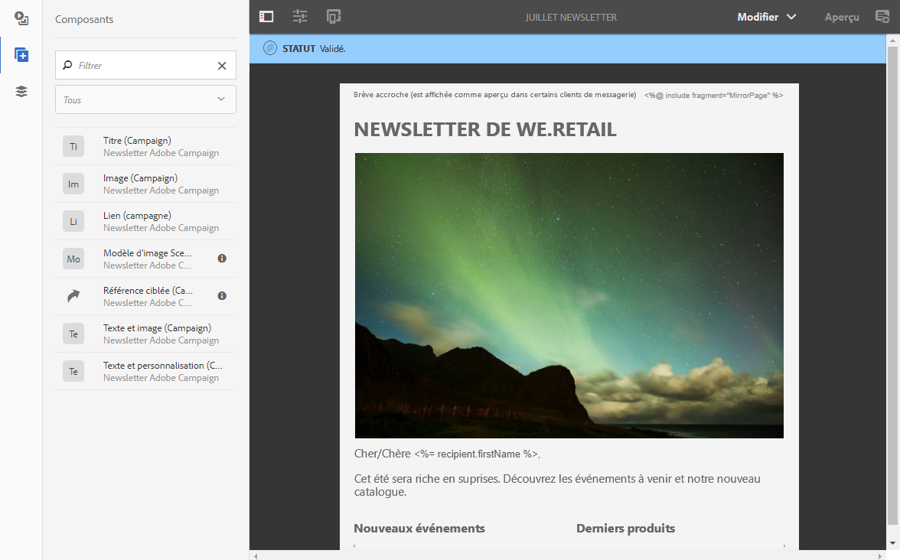
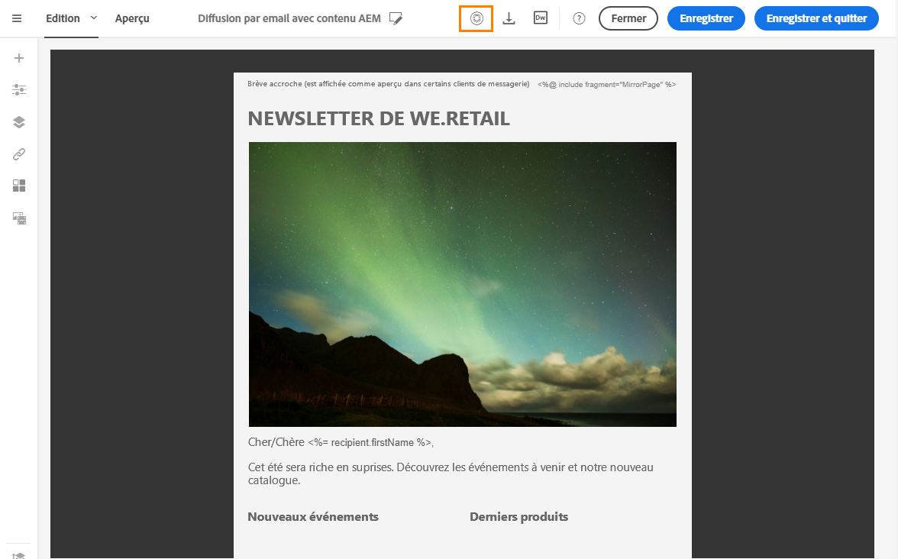

# Intégration avec Experience Manager{#integrating-with-experience-manager}

Cette intégration entre Adobe Campaign Standard et Experience Manager vous permet d'utiliser du contenu créé dans Adobe Experience Manager dans vos emails Adobe Campaign.

Vous avez ainsi la possibilité de profiter à la fois des fonctionnalités d'édition de contenu d'Adobe Experience Manager, et des capacités de diffusion et de gestion de données d'Adobe Campaign.

>[!NOTE]
>
>Vous ne pouvez pas effectuer de test A/B sur des contenus importés depuis Adobe Experience Manager.

Adobe Campaign Standard est compatible avec Adobe Experience Manager 6.1, 6.2, 6.3 et 6.4. Les sections suivantes présentent une vue d’ensemble des actions que vous pouvez exécuter. Pour plus de détails, consultez les sections dédiées au [paramétrage](https://helpx.adobe.com/fr/experience-manager/6-4/sites/administering/using/campaignstandard.html) et à l'[utilisation](https://helpx.adobe.com/fr/experience-manager/6-4/sites/authoring/using/campaign.html) de l'intégration.

## Prérequis {#prerequisites}

Vous devez au préalable posséder les éléments suivants :

* Une instance Adobe Experience Manager de création (également appelée **authoring**).
* Une instance Adobe Experience Manager de publication (également appelée **publishing**).
* Une instance Adobe Campaign.

## Utilisation :  {#use-case}

Pour créer un contenu d'email dans Adobe Experience Manager :

1. Créez un contenu d'email à partir d'un modèle spécifiquement conçu pour Adobe Campaign.
1. Dans les propriétés du contenu, sélectionnez le **[!UICONTROL Cloud Service]** correspondant à votre instance Adobe Campaign.
1. Editez le contenu en y insérant du texte, des images, de la personnalisation, etc.
1. Validez le contenu.

Pour plus d'informations, consultez la [documentation détaillée](https://helpx.adobe.com/fr/experience-manager/6-2/sites/authoring/using/campaign.html).

Pour récupérer le contenu dans Adobe Campaign :

1. Créez un email basé sur un modèle dont le type de contenu est Adobe Experience Manager.
1. Liez un contenu créé avec Adobe Experience Manager via l'écran de définition du contenu de l'email Adobe Campaign.

## Configuration  {#configuration}

Afin de pouvoir utiliser conjointement ces deux solutions, vous devez les paramétrer pour les connecter l'une à l'autre.

1. Paramétrez Adobe Campaign. Pour cela :

   * Configurez un compte externe de type Adobe Experience Manager.
   * Configurez l'option **AEMResourceTypeFilter**, permettant de reconnaître les types de contenus créés pour Adobe Campaign dans Adobe Experience Manager.
   * Créez un modèle d'email spécifiant que le contenu est de type Adobe Experience Manager et associez à ce modèle le compte externe créé précédemment.

1. Paramétrez Adobe Experience Manager. Pour cela :

   * Configurez la réplication entre les instances Adobe Experience Manager de création et de publication.
   * Connectez Adobe Experience Manager à Adobe Campaign en configurant un **[!UICONTROL Cloud Service dédié]**.

