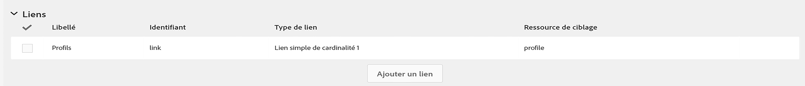

# Mappage Campaign ressources personnalisées et entités personnalisées de Dynamics 365

Découvrez comment mapper des ressources personnalisées et des entités personnalisées dans le contexte de l&#39;intégration entre  Adobe Campaign Standard et Microsoft Dynamics 365.

## Prérequis

La nouvelle version de l&#39;intégration  Microsoft Dynamics 365- Standard Adobe Campaign prend en charge les entités personnalisées.  Cela permet de répliquer les entités personnalisées dans Dynamics 365 sur les ressources personnalisées correspondantes dans Campaign.

Une fois répliquées, les nouvelles données des ressources personnalisées peuvent être utilisées à plusieurs fins, notamment pour la segmentation et la personnalisation.

>[!CAUTION]
>
>Si un enregistrement de ressource personnalisée Campaign contient des informations personnelles, applicables à l’utilisation de Campaign par un client, cet enregistrement doit être lié à un enregistrement de la ressource Campaign correspondante (soit directement, soit par l’intermédiaire d’une autre ressource personnalisée) afin qu’une suppression liée à la confidentialité dans l’enregistrement de la demande de service puisse également supprimer l’enregistrement de la ressource personnalisée liée contenant des informations personnelles; les options de liaison et de suppression entre les entités doivent être configurées pour permettre cette suppression en cascade des enregistrements liés. Les informations personnelles ne doivent pas être saisies dans une ressource personnalisée qui n’est pas liée au .

Vous trouverez un aperçu plus complet de Campaign ressources personnalisées [sur ce lien](../../developing/using/key-steps-to-add-a-resource.md).

Pour configurer l’intégration des entités personnalisées, contactez [adobe-support@unifisoftware.com](mailto:adobe-support@unifisoftware.com) pour demander à ce que ce soit fait.  Unifi exigera les noms des tables d&#39;entités personnalisées dans les deux systèmes, ainsi que les mappages d&#39;attributs souhaités.  Unifi crée alors les tâches et les planifications correspondantes.

Vous trouverez ci-dessous un exemple d’utilisation de la prise en charge des entités personnalisées.

>[!CAUTION]
>
>* Les ressources personnalisées publiées avant Campaign Standard version 19.4 **doivent être republiées** pour être utilisées avec l’intégration.
>* La création et la modification Campaign Standard ressources personnalisées sont des opérations sensibles qui ne doivent être exécutées que par des utilisateurs experts.

## Utilisation : 

### État de début

Le client a un véhicule d&#39;entité personnalisé prédéfini dans Dynamics 365 et un véhicule de ressource personnalisé correspondant prédéfini dans Campaign Standard.  Le client a fourni des détails de mappage d&#39;entités personnalisées à Unifi et Unifi a configuré les tâches et les planifications pour la ressource personnalisée Véhicule, dans Unifi.

|   | Microsoft Dynamics 365 | Adobe Campaign Standard | Notes |
|---|---|---|---|
| Entité de niveau supérieur | Contact | Profile | Entités standard prêtes à l&#39;emploi |
| Entité liée | Véhicule - nouvelle entité personnalisée | Véhicule - nouvelle ressource personnalisée | Nouvelles entités personnalisées |
| Type de lien | Contact parental avec N:1 | Similaire à Dynamics 365 - voir Campaign section ci-dessous pour plus de détails |   |

### Configuration dans Dynamics 365

Les entités personnalisées de ce client dans Dynamics 365 peuvent être affichées dans le des ventes en cliquant sur la liste déroulante en regard de Dynamics 365.  Les entités personnalisées de ce client sont regroupées sous **[!UICONTROL Extensions]**.

Vous pouvez afficher les données du véhicule en cliquant sur l&#39;entité **[!UICONTROL vehicle]** personnalisée.  Voir le  des véhicules ci-dessous.

La relation de l&#39; **[!UICONTROL vehicle]** entité avec l&#39; **[!UICONTROL Contact]** entité peut être vue ci-dessous. **[!UICONTROL Parental]** a été choisi pour le **[!UICONTROL Type of Behavior]**.

### Configuration dans Campaign Standard

Dans Campaign, vous pouvez afficher les ressources personnalisées du client en cliquant **[!UICONTROL Adobe Campaign]** dans le coin supérieur gauche, puis en sélectionnant **[!UICONTROL Client data]**.

### Mappage de ressources personnalisées et d’entités personnalisées

La ressource **[!UICONTROL vehicle]** personnalisée doit avoir été prédéfinie par le client et doit apparaître dans les données du client ; toutefois, nous allons passer en revue les étapes de création de cette ressource **[!UICONTROL vehicle]** personnalisée ci-dessous.

Cliquez sur **[!UICONTROL Adobe Campaign]** dans le coin supérieur gauche, puis sur **[!UICONTROL Administration > Development > Custom Resources]**.

1. Cliquez sur **[!UICONTROL Custom Resources]**.
1. Cliquez sur le **[!UICONTROL Create]** bouton.  Une fenêtre contextuelle s’ouvre alors.
1. Sélectionnez **[!UICONTROL Create a new resource]** et saisissez **[!UICONTROL Vehicle]** le libellé et l’ID.
1. Clics **[!UICONTROL Create]**.

Campaign affiche alors les structures de données et la page de lien.  Vous pouvez constater que plusieurs champs ont été ajoutés.

* ID de véhicule est l&#39;identifiant unique de l&#39; **[!UICONTROL Vehicle]** entité; son ID doit être exactement **[!UICONTROL externalId]**, comme illustré ci-dessous, pour que l’intégration fonctionne.
*  de associé est l&#39;ID du auquel l&#39;enregistrement du véhicule est lié; lorsqu’il est lié, il est lié au **[!UICONTROL externalId]** champ de la table .
* Le NIV et le nom du véhicule sont des champs qui permettent de recueillir des renseignements sur le véhicule.

>[!CAUTION]
>
>Chaque ressource personnalisée doit avoir un champ unique avec un ID externalId (exactement).  Ce champ correspond au champ ID de la ressource personnalisée dans Dynamics 365 (voir ci-dessous).

### Définition des clés d’identification

L&#39;étape suivante consiste à définir les clés d&#39;identification.  Créez d’abord les clés d’identification, comme illustré ci-dessous.

Dans l’écran Définition de clé, veillez à sélectionner le **[!UICONTROL externalId]** champ.

>[!CAUTION]
>
>Chaque ressource personnalisée doit avoir une clé d’identification avec un chemin d’accès &quot;externalId&quot; (exactement).

### Définir le filtre

L’étape suivante consiste à spécifier la définition du filtre.

Sous **[!UICONTROL Filter Definition]**, cliquez sur **[!UICONTROL Add an element]**.\
Donnez l’étiquette et identifiez le nom **[!UICONTROL ExternalId]**.
Clics **[!UICONTROL Add]**.

Cliquez maintenant sur Modifier sur l’élément de filtre nouvellement ajouté et configurez le filtre par image ci-dessous.  Si vous entrez **[!UICONTROL externalId]** dans le **[!UICONTROL Parameters]** champ et cliquez sur le signe plus, **[!UICONTROL externalId_parameter]** s’affiche.  Sélectionnez ce paramètre.

### Définir le lien

Ensuite, nous allons spécifier la liaison de la ressource personnalisée.  Dans ce cas, nous avons choisi de lier l’entité **[!UICONTROL Vehicles]** personnalisée (source) à l’entité  () à l’aide d’une **[!UICONTROL 1 cardinality simple link]**.

1. Dans l’ **[!UICONTROL Link definitions]** écran, choisissez l’option de suppression : **[!UICONTROL Deleting the target record implies deleting records referenced by the link]**. Nous choisissons cette option de sorte que lorsqu&#39;un  de est supprimé, tous les **[!UICONTROL Vehicle]** enregistrements liés à ce  de sont également supprimés.
1. Dans **[!UICONTROL Join Definitions]**, sélectionnez **[!UICONTROL Define specific join conditions]**.
1. Cliquez ensuite sur **[!UICONTROL Add an element]**.

Pour la définition de jointure, nous saisissons les valeurs ci-dessous.

Notez que l’ **[!UICONTROL @externalId]** entrée est le champ externalId de la table  et que l’ **[!UICONTROL ProfileExternalId]** entrée est l’ID du champ correspondant dans la ressource personnalisée Véhicules.  Lorsque la valeur externalId d&#39;un enregistrement  est entrée dans le **[!UICONTROL ProfileExternalId]** champ d&#39;un enregistrement de véhicule, les deux enregistrements sont liés.

Confirmez les modifications et enregistrez l&#39;entité personnalisée.

### Publication et recherche de mises à jour

La dernière étape consiste à publier la ressource personnalisée.

1. Cliquez sur **[!UICONTROL Adobe Campaign]** dans le coin supérieur gauche, cliquez sur **[!UICONTROL Administration > Development > Publishing]**.
1. Conservez l’option par défaut : **[!UICONTROL Determine modifications since the last publication]**.
1. Cliquez **[!UICONTROL Prepare Publication]** et attendez qu’il se termine.

Cliquez ensuite **[!UICONTROL Publish]** et attendez qu’il se termine.

### Calendrier d&#39;entrée Unifi

En supposant que le client a déjà renseigné l&#39;entité personnalisée du véhicule dans Dynamics 365 et qu&#39;Unifi ait configuré les tâches et les calendriers de l&#39;entité personnalisée du véhicule avec, le client devrait être en mesure de démarrer le calendrier d&#39;entrée pour l&#39;entité du véhicule.

Une fois la tâche d’entrée terminée, les données du véhicule sont maintenant visibles dans la ressource **[!UICONTROL Vehicle]** personnalisée nouvellement renseignée dans Campaign.

**Rubriques connexes**

* [Utilisation de  Adobe Campaign Standard - Microsoft Dynamics 365](../../integrating/using/working-with-campaign-standard-and-microsoft-dynamics-365.md)
* [Etapes clés pour ajouter une ressource personnalisée dans Campaign](../../developing/using/key-steps-to-add-a-resource.md)
