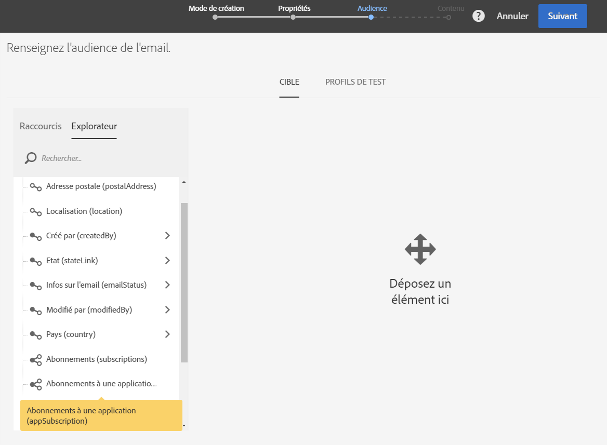
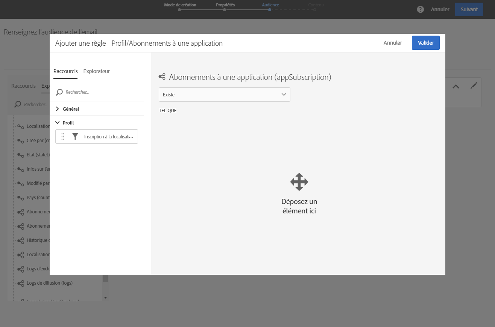
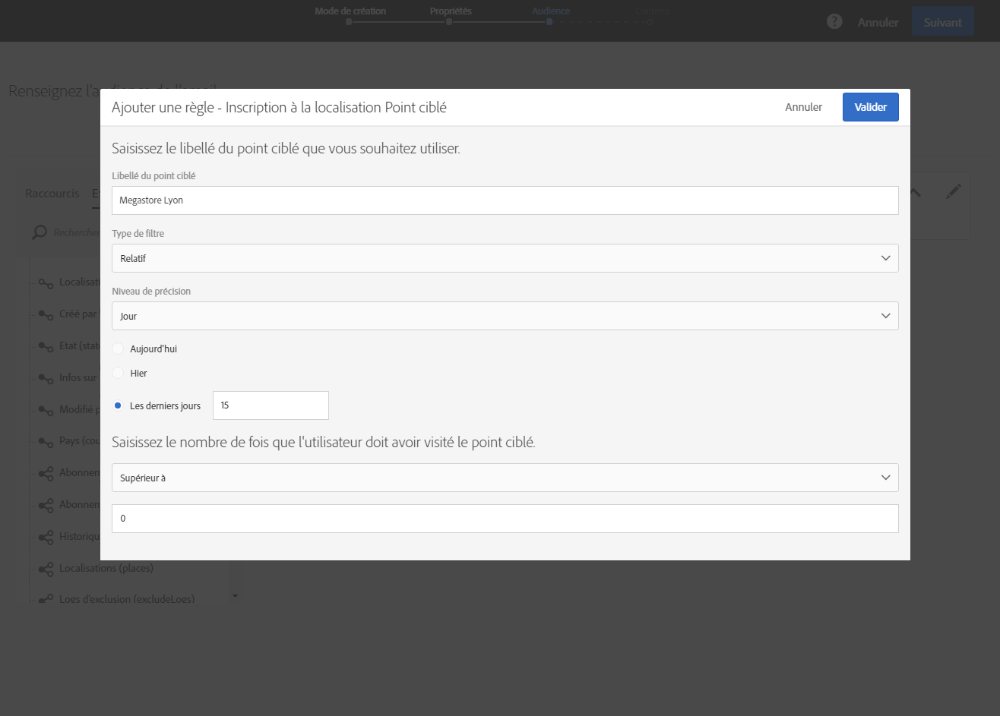
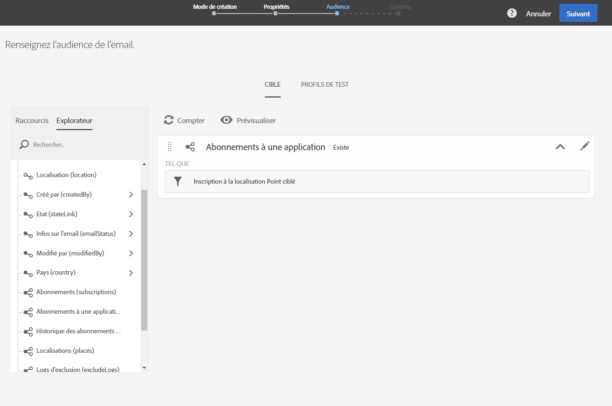
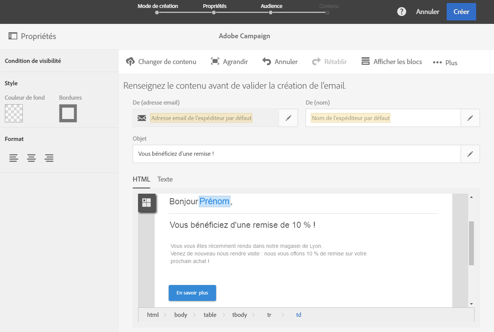

# Personnaliser des messages Campaign avec les données de points ciblés{#personalizing-campaign-messages-with-point-of-interest-data}

Dans Adobe Campaign, vous pouvez utiliser les données de points ciblés collectées auprès des abonnés de votre application mobile pour leur envoyer des messages marketing personnalisés, comme un email.

Seules les diffusions standard vous permettent d'utiliser des données de points ciblés. Les [messages transactionnels](../../channels/using/about-transactional-messaging.md) ne sont pas compatibles avec cette fonctionnalité.

Il faut compter au moins 10 minutes avant de pouvoir utiliser les données reçues.

Dans cet exemple, vous décidez d'envoyer un email à tous vos abonnés s'étant rendus dans votre boutique de Lyon au cours des quinze derniers jours.

1. Créez une activité marketing de type Email.
1. Lors de la définition de l'audience de la diffusion, placez l'élément **[!UICONTROL Abonnements à une application]dans l'espace de travail.**

   

   La gestion des audiences est présentée dans la section [Définir les audiences](../../audiences/using/creating-audiences.md).

1. Dans la fenêtre **[!UICONTROL Ajouter une règle - Profil/Abonnements à une application]**, placez l'élément **Inscription à la localisation Point ciblé]dans l'espace de travail.[!UICONTROL **

   

1. Dans la fenêtre **[!UICONTROL Ajouter une règle - Inscription à la localisation Point ciblé], saisissez le libellé du point ciblé que vous souhaitez utiliser.**

   

1. Dans le champ **[!UICONTROL Type de filtre]**, sélectionnez **[!UICONTROL Relatif]**.
1. Cochez l'option **[!UICONTROL Les derniers jours]** et saisissez **15]dans le champ correspondant.[!UICONTROL **
1. Définissez le nombre de fois que l'utilisateur doit avoir fréquenté le point ciblé.
1. Cliquez sur **[!UICONTROL Confirmer]pour sauvegarder votre audience.**

   

1. Ajoutez du contenu à votre email.

   

1. Confirmez la création de l'activité pour voir le tableau de bord de l'email.
1. Envoyez votre message.

L'email contenant la réduction de 10 % sera envoyé aux abonnés :

* qui se sont rendus dans votre boutique de Lyon au moins une fois au cours des quinze derniers jours ;
* qui ont eu votre application mobile au premier plan au moins une fois dans votre boutique.

**Rubriques connexes :**

* [Créer un email](../../channels/using/creating-an-email.md)
* [Définir le contenu](../../designing/using/example--email-personalization.md)
* [Envoyer les messages](../../sending/using/confirming-the-send.md)

