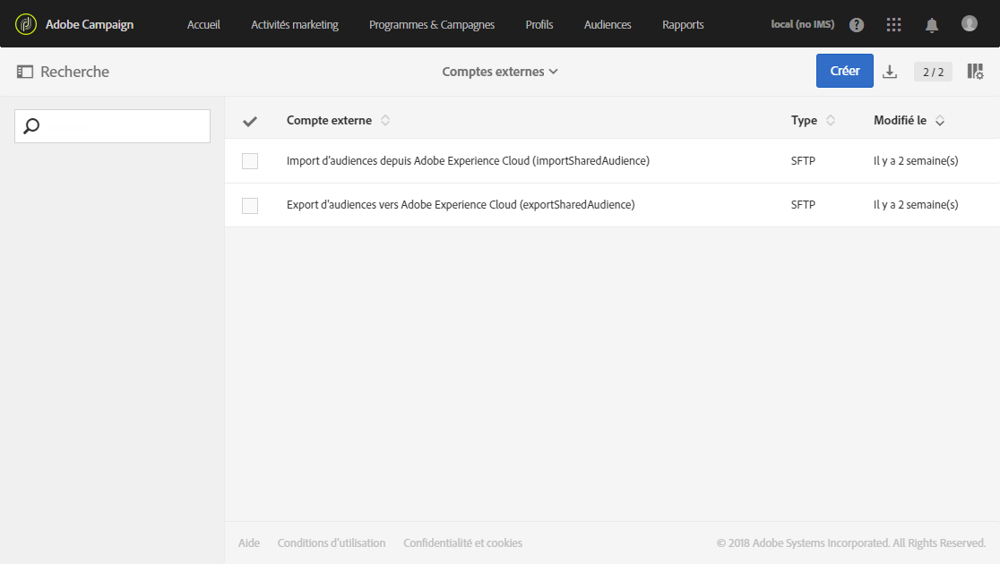
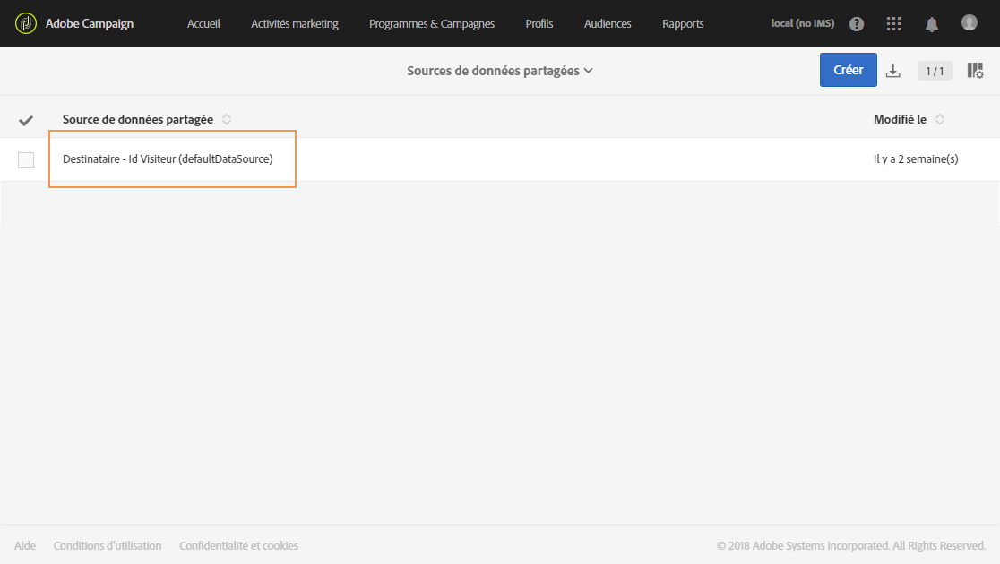
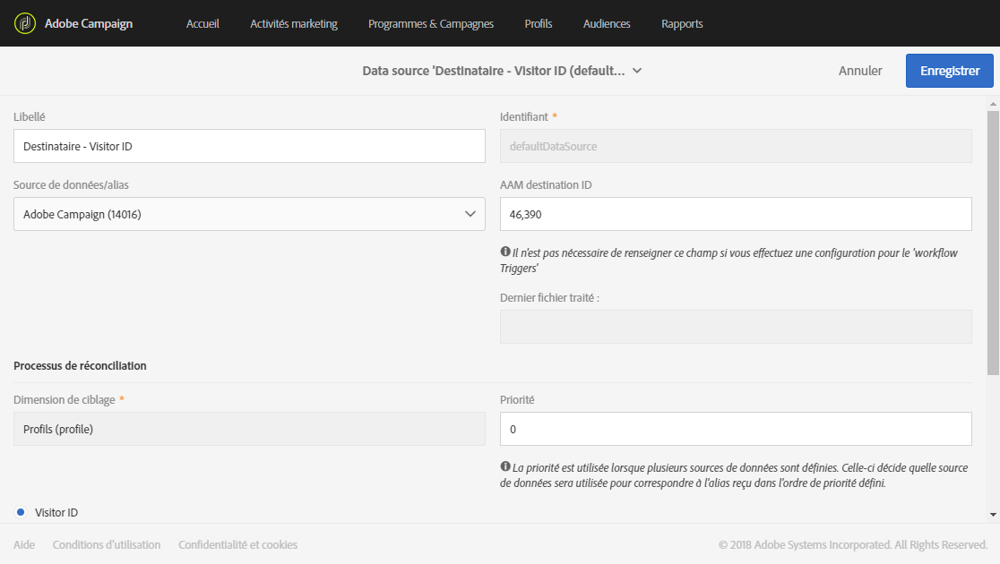

# Mise en service et configuration de l'intégration avec Audience Manager ou People core service{#provisioning-and-configuring-integration-with-audience-manager-or-people-core-service}

La mise en service et la configuration d'Audience Manager et de People core dans Adobe Campaign se fait en deux étapes : l'[envoi d'une demande à Adobe](../../integrating/using/provisioning-and-configuring-integration-with-audience-manager-or-people-core-service.md#submitting-request-to-adobe), puis la [configuration de l'intégration dans Adobe Campaign](../../integrating/using/provisioning-and-configuring-integration-with-audience-manager-or-people-core-service.md#configuring-the-integration-in-adobe-campaign).

## Envoi d'une demande à Adobe {#submitting-request-to-adobe}

L'intégration d'Audience Manager ou de People core service permet d'importer et exporter des audiences ou des segments dans Adobe Campaign.

Cette intégration doit être d'abord configurée. Pour demander la mise en service de cette intégration, envoyez un email à l'adresse [Digital-Request@adobe.com](mailto:Digital-Request@adobe.com) en incluant les informations suivantes :

<table> 
 <tbody> 
  <tr> 
   <td> <strong>Type de demande :</strong>  </td> 
   <td> Configuration de l'intégration AAM/People core service-Campaign </td> 
  </tr> 
  <tr> 
   <td> <strong>Nom de l'organisation :</strong>  </td> 
   <td> Nom de votre organisation </td> 
  </tr> 
  <tr> 
   <td> <strong>Identifiant de l'organisation IMS</strong>  </td> 
   <td> Votre identifiant de l'organisation IMS* </td> 
  </tr> 
  <tr> 
   <td> <strong>Environnement :</strong>  </td> 
   <td> Exemple : Production </td> 
  </tr> 
  <tr> 
   <td> <strong>AAM ou People Service</strong>  </td> 
   <td> Exemple : Adobe Audience Manager </td> 
  </tr> 
  <tr> 
   <td> <strong>Declared ID ou Visitor ID</strong>  </td> 
   <td> Exemple : Declared ID </td> 
  </tr> 
  <tr> 
   <td> <strong>Informations supplémentaires</strong>  </td> 
   <td> Informations ou commentaires utiles que vous souhaitez communiquer </td> 
  </tr> 
 </tbody> 
</table>

* Votre identifiant de l'organisation IMS est accessible dans Experience Cloud, dans le menu **Administration.** Il est également fourni lorsque vous vous connectez pour la première fois à Adobe Experience Cloud.

## Configuration de l'intégration dans Adobe Campaign {#configuring-the-integration-in-adobe-campaign}

Après l'envoi de cette demande, Adobe met en service l'intégration et vous contacte pour vous fournir des informations afin de terminer la configuration :

* [Étape 1 : Configuration ou vérification des comptes externes dans Adobe Campaign](../../integrating/using/provisioning-and-configuring-integration-with-audience-manager-or-people-core-service.md#step-1--configure-or-check-the-external-accounts-in-adobe-campaign)
* [Étape 2 : Configuration des sources de données](../../integrating/using/provisioning-and-configuring-integration-with-audience-manager-or-people-core-service.md#step-2--configure-the-data-sources)
* [Étape 3: Configuration du serveur de tracking Campaign](../../integrating/using/provisioning-and-configuring-integration-with-audience-manager-or-people-core-service.md#step-3--configure-campaign-tracking-server)
* [Étape 4: Configuration du service d'identification des visiteurs](../../integrating/using/provisioning-and-configuring-integration-with-audience-manager-or-people-core-service.md#step-4--configure-the-visitor-id-service)

### Étape 1 : Configuration ou vérification des comptes externes dans Adobe Campaign {#step-1--configure-or-check-the-external-accounts-in-adobe-campaign}

Il nous faut tout d'abord configurer ou vérifier les comptes externes dans Adobe Campaign Ces comptes doivent avoir été configurés par Adobe. De plus, les informations nécessaires ont dû vous être communiquées.

Pour ce faire :

1. Dans le menu avancé, sélectionnez **Application &gt; Paramétrage de l'application &gt; Comptes externes**.

   Sélectionnez l'un des comptes externes suivants disponibles pour cette intégration :

   

1. Saisissez le **[!UICONTROL serveur du récepteur]au format suivant**
1. Enter the **[!UICONTROL AWS Access Key ID]**, **[!UICONTROL Secret Access Key]** and **[!UICONTROL AWS Region]**.

Vos comptes externes sont à présent configurés pour cette intégration.

### Étape 2 : Configuration des sources de données {#step-2--configure-the-data-sources}

Les deux sources de données suivantes ont été créées dans Audience Manager : Adobe Campaign (MID) et Adobe Campaign (DeclaredId). En même temps, ces deux sources de données sont disponibles dans Adobe Campaign :

* **[!UICONTROL Destinataire - Id Visiteur (Defaultdatasources)]** : il s'agit d'une source de données d'usine configurée par défaut pour Id Visiteur. Les segments créés à partir de Campaign feront partie de cette source de données.
* Source de données **ID déclaré** : cette source de données doit être créée et mappée avec la définition de source de données **[!UICONTROL DeclaredId]depuis Audience Manager.**

Dans le cas de plusieurs sites web avec des domaines différents, Adobe Campaign ne prend pas en charge la réconciliation basée sur ECID.

Pour configurer la source de données **[!UICONTROL Destinataire - Id Visiteur (Defaultdatasources)] :**

1. In **[!UICONTROL Administration]** &gt; **[!UICONTROL Application settings]** &gt; **[!UICONTROL Shared Data Sources]**, select **[!UICONTROL Recipient - Visitor ID (Defaultdatasources)]**.

   

1. Choisissez **[!UICONTROL Adobe Campaign]** dans le menu déroulant **Source de données/alias[!UICONTROL .]**
1. Saisissez le **[!UICONTROL AAM Destination ID]fourni par Adobe.**

   

1. Dans la catégorie **[!UICONTROL Processus de réconciliation]**, nous vous conseillons de ne pas modifier les critères de réconciliation et de toujours utiliser l'**[!UICONTROL identifiant du visiteur]**.
1. Cliquez sur **[!UICONTROL Enregistrer]**.

Pour créer la source de données **[!UICONTROL ID déclaré] :**

1. In **[!UICONTROL Administration]** &gt; **[!UICONTROL Application settings]** &gt; **[!UICONTROL Shared Data Sources]**, click the **[!UICONTROL Create]** button.
1. Modifiez le **[!UICONTROL libellé]de votre source de données.**
1. Dans le menu déroulant **[!UICONTROL Source de données/alias]**, choisissez la source de données correspondant à **DeclaredID]depuis Audience Manager.[!UICONTROL **
1. Configurez votre source de données en saisissant les **[!UICONTROL sources de données/alias]** et le **AAM Destination ID]fournis par Adobe.[!UICONTROL **
1. Définissez le **[!UICONTROL processus de réconciliation]selon vos besoins.**
1. Cliquez sur **[!UICONTROL Enregistrer]**.

>[!NOTE]
>
>Le champ **[!UICONTROL AAM Destination ID]** n'est pas obligatoire si vous configurez la data source partagée pour l'[intégration des triggers Campaign](../../integrating/using/configuring-triggers-in-experience-cloud.md). **[!UICONTROL La priorité]** n'est nécessaire que lors de la configuration de l'intégration des triggers Campaign. La priorité détermine quelle source de données sera configurée en premier. Il peut s'agit d'un nombre tel que 1 ou 100. Plus la priorité est élevée, plus la préférence est importante lors de la réconciliation.

### Étape 3: Configuration du serveur de tracking Campaign {#step-3--configure-campaign-tracking-server}

Pour la configuration de l'intégration avec People Core service ou Audience Manager, il faut également configurer le serveur de tracking Campaign.

Ici, vous devez vérifier que le serveur de tracking Campaign est enregistré sur le domaine (CNAME). Vous trouverez des informations supplémentaires sur la délégation des noms de domaine dans [cet article](https://docs.campaign.adobe.com/doc/AC/en/technicalResources/Technotes/AdobeCampaign_Deliverability_Sub_Domain_Delegation.pdf).

### Étape 4: Configuration du service d'identification des visiteurs {#step-4--configure-the-visitor-id-service}

Dans l'hypothèse où votre service d'identification des visiteurs n'aurait jamais été configuré sur vos propriétés Web ou sur vos sites Web, consultez le [document](https://marketing.adobe.com/resources/help/en_US/mcvid/mcvid-setup-aam-analytics.html) suivant pour apprendre à configurer votre service ou regardez la [vidéo](https://helpx.adobe.com/marketing-cloud/how-to/email-marketing.html#step-two) suivante.

La configuration et la mise en service sont terminées. L'intégration peut être maintenant utilisée pour importer et exporter des audiences ou des segments.
