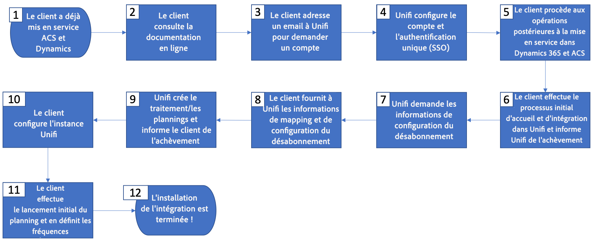

# Demander et configurer l’intégration de Microsoft Dynamics 365

Pour configurer cette intégration, vous devez suivre les étapes ci-dessous.

Veuillez suivre l’organigramme et ses détails ci-dessous pour demander et configurer l’intégration.

Détails de l’organigramme (mise en correspondance avec les étapes ci-dessus) :

* **Étape 1** - Il est supposé que vous disposez déjà, ou êtes en cours d’achat, d’une licence pour Microsoft Dynamics 365 for Sales et pour Adobe Campaign Standard.

* **Étape 2** - L’offre d’intégration standard est gratuite pour tous les clients, toutefois, des coûts supplémentaires peuvent s’appliquer en fonction de vos besoins (voir [Barrières de sécurité et limites d’intégration](../../integrating/using/ms-dynamics-365-integration-guardrails.md)). Une nouveau bon de commande client devra être signé pour tirer parti de l’intégration.

* **Étape 3** - Exécuter les étapes préalables à l’intégration pour Dynamics 365 et Campaign. Voir [Configurer cette intégration](#configure-this-integration).

* **Étapes 4 à 7** - L’équipe d’intégration d’Adobe sera à vos côtés tout au long du processus d’intégration.

## Configurer cette intégration {#configure-this-integration}

Trois systèmes doivent être approvisionnés et configurés pour cette intégration : Adobe Campaign Standard, Microsoft Dynamics 365 for Sales et l’outil d’intégration. Les liens vers les articles de configuration se trouvent ci-dessous.

>[!CAUTION]
>
>Pour chaque système, ces étapes doivent être exécutées par un administrateur.
>
>Les étapes des articles ci-dessous vous guideront tout au long de la création d’intégrations/inscriptions impliquant l’attribution de permissions et/ou d’accès administrateur.  Vous êtes tenu de vous assurer que ces étapes sont conformes aux politiques de votre entreprise avant de les exécuter, et de les exécuter avec précaution.

Dans ADOBE CAMPAIGN, vous devez configurer l’accès à l’API et configurer une nouvelle intégration pour l’outil d’intégration. Pour ce faire, reportez-vous à [cet article](../../integrating/using/configure-adobe-io-for-ms-dynamic.md).

Dans Microsoft Dynamics 365, vous devez créer une nouvelle inscription d’application et permettre à un utilisateur d’utiliser l’intégration.  Pour configurer Microsoft Dynamics 365 pour cette intégration, reportez-vous à [cet article](../../integrating/using/configure-microsoft-dynamics-365-for-campaign-integration.md).

Vous devez collaborer avec l’équipe d’intégration d’Adobe pour paramétrer la configuration des flux de données d’entrée, de sortie et de désinscription.

## Demande d’assistance

Des tickets d’assistance peuvent être consignés auprès de l’Assistance clientèle Adobe, comme d’habitude ; l’Assistance clientèle fera appel au personnel d’assistance, si nécessaire.

Pour tout problème lié aux flux de données d’intégration, veillez à inclure la suite de rapports dans la description du problème ainsi que les informations suivantes :

* **Propriétaire du processus** : architectes d’ingénierie

* **Identifiant du processus ES** : fourni pendant le processus d’intégration

* **Titre du processus** : intégration Dynamics 365/Adobe Campaign Standard

* **Description du problème** : description du problème

La couverture d’assistance pour l’intégration est actuellement de 24h/24, 5j/7 (disponible du lundi au vendredi, à l’exeption des jours fériés et des temps de pause).