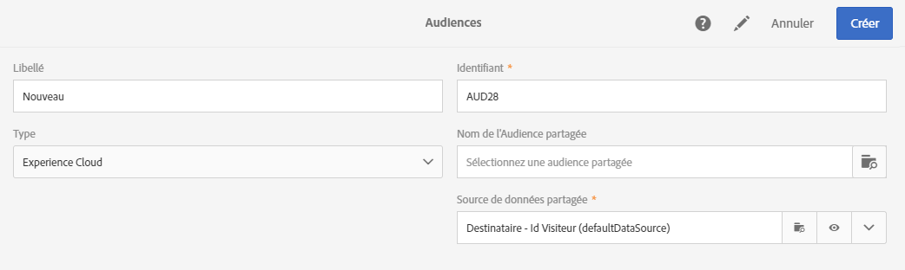
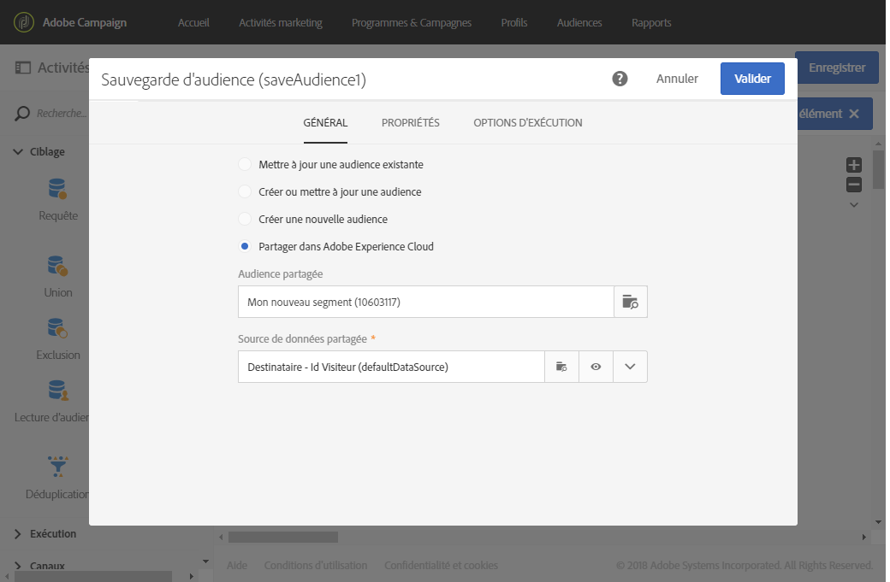
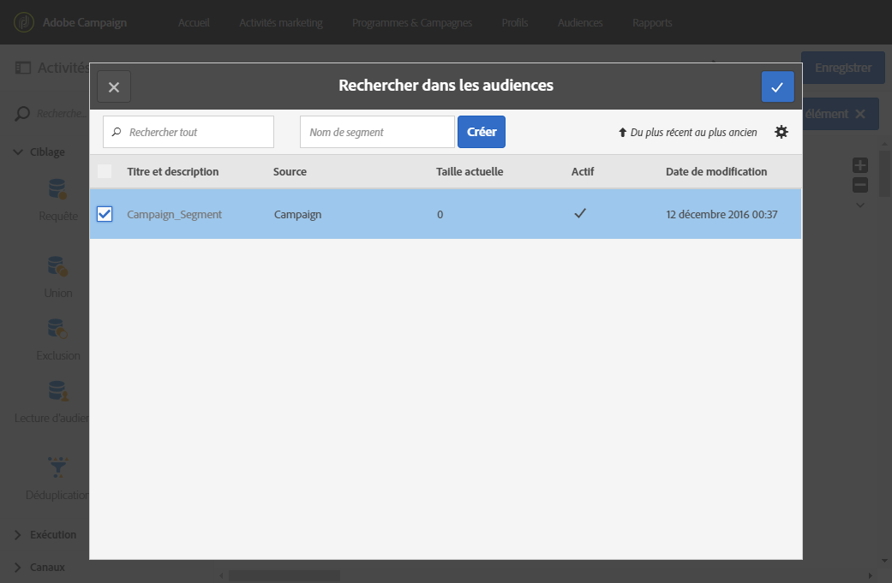

# Partage d'audiences avec Audience Manager ou People core service{#sharing-audiences-with-audience-manager-or-people-core-service}

## Importer une audience {#importing-an-audience}

L'intégration de People core service permet d'importer directement une audience dans Adobe Campaign via un workflow technique afin d'enrichir votre base de données. Pour plus d'informations sur le partage d'audiences dans People core service, consultez cette [documentation](https://marketing.adobe.com/resources/help/fr_FR/mcloud/t_publish_audience_segment.html).

L'import des audiences/segments depuis People core service dans Adobe Campaign peut être effectué à partir du menu **[!UICONTROL Audiences]** uniquement par les utilisateurs connectés via IMS (authentification via l'Adobe ID).

1. Accédez au menu **[!UICONTROL Audiences]**.
1. Depuis la barre d'actions, sélectionnez **[!UICONTROL Créer]** pour accéder à l'écran de création d'une audience.
1. Indiquez le libellé de la nouvelle audience.
1. Paramétrez le **[!UICONTROL Type]** de l'audience sur **[!UICONTROL Experience Cloud]** afin d'indiquer que l'audience en cours de création est une audience importée depuis People core service.
1. Depuis le champ **[!UICONTROL Nom de l'audience partagée]**, sélectionnez l'audience à importer. Seuls les segments peuvent être importés. Les données granulaires, notamment les paires clé-valeur, les caractéristiques et les règles ne sont pas prises en charge.

   

1. Sélectionnez la **[!UICONTROL Data source partagée correspondante]**.

   Si la source de données sélectionnée est configurée pour utiliser un algorithme de cryptage, une option supplémentaire offre la possibilité de **[!UICONTROL Forcer la réconciliation avec un profil]**. Cochez cette option si le champ **[!UICONTROL Canal]** de la source de données est défini sur Email ou Mobile (SMS) et si vous voulez utiliser les données de profil.

   Si vous ne sélectionnez pas l'option **[!UICONTROL Forcer la réconciliation avec un profil]** et si le champ **[!UICONTROL Canal]** est défini dans l'AMC Data source sur Email ou Mobile (SMS), tous les identifiants Declared ID cryptés sont décryptés. Une audience de type **Fichier** avec la liste de toutes les adresses email et de tous les numéros de téléphone mobile est créée/mise à jour. Ainsi, aucune adresse email ni aucun numéro de téléphone mobile n'est perdu lors de l'import d'une audience partagée via cette intégration, et ce même si ce profil n'existe pas dans Campaign. Ces types d'audience ne peuvent pas être utilisés directement car ils doivent être réconciliés manuellement à l'aide de workflows.

1. Validez la création de l'audience.

   L'audience est ensuite importée à l'aide d'un workflow technique. Elle est composée des enregistrements dont l'identifiant (Visitor ID ou Declared ID) a pu être réconcilié avec la dimension des profils. Les identifiants provenant des segments de People core service non reconnus par Adobe Campaign ne sont pas importés.

Votre audience est maintenant importée dans votre base de données Adobe Campaign. Le processus d'importation met entre 24 et 36 heures à se synchroniser, lorsque des segments sont importés directement depuis People core service ou Audience Manager. Passée cette période, vous pourrez trouver et utiliser votre nouvelle audience dans Adobe Campaign.

>[!NOTE]
>
>Si vous importez des audiences d'Adobe Analytics vers Adobe Campaign, celles-ci doivent être partagées au préalable dans People Core Service ou Audience Manager. Ce processus prend entre 12 et 24 heures, en plus des 24 à 36 heures de synchronisation avec Campaign. Dans ce cas spécifique, la durée de partage de l'audience peut prendre jusqu'à 60 heures. Pour plus d'informations sur le partage d'audiences Adobe Analytics dans People Core service et Audience Manager, consultez cette [documentation](https://marketing.adobe.com/resources/help/fr_FR/mcloud/t_publish_audience_segment.html).

## Exporter une audience {#exporting-an-audience}

L'export d'une audience depuis Adobe Campaign vers Audience Manager ou People core service peut être réalisé à l'aide d'un workflow et de l'activité de **[!UICONTROL Sauvegarde d'audience]**.

Il peut être réalisé dans un nouveau workflow par les utilisateurs connectés via IMS uniquement (authentification via l'Adobe ID).

1. Créez un workflow à partir d'un programme, d'une campagne ou de la liste des activités marketing.
1. En utilisant les différentes activités à votre disposition, ciblez un ensemble de profils.
1. A la suite du ciblage, placez une activité **[!UICONTROL Sauvegarde d'audience]** puis ouvrez-la.
1. Sélectionnez **[!UICONTROL Partager dans Adobe Experience Cloud]**.

   

1. Définissez l'audience à l'aide du champ **[!UICONTROL Audience partagée]**. Dans la fenêtre qui s'ouvre, vous pouvez sélectionner une audience existante ou créer une nouvelle audience :

   * Si vous sélectionnez une audience existante, seuls les nouveaux enregistrements seront ajoutés à l'audience.
   * Pour exporter votre liste de profils dans une nouvelle audience, renseignez le champ **[!UICONTROL Nom de segment]** puis cliquez sur **[!UICONTROL Créer]** avant de sélectionner l'audience nouvellement créée.
   

   Pour pouvoir être réconciliés et échangés, les enregistrements doivent posséder un identifiant Adobe Experience Cloud ('Visitor ID' ou 'Declared ID'). Les enregistrements non réconciliés sont ignorés lors des exports et des imports d'audiences.

1. Terminez l'opération à l'aide de la coche de validation située en haut à droite de la fenêtre.
1. Sélectionnez la **[!UICONTROL Data source partagée correspondante]**.
1. Si vous le souhaitez, cochez la case **[!UICONTROL Générer une transition sortante]** afin d'exploiter les profils ayant pu être exportés. Seuls les profils pouvant être réconciliés sont exportés.
1. Validez la configuration de l'activité et enregistrez votre workflow.
1. Démarrez votre workflow pour exporter votre audience. La synchronisation entre Adobe Campaign et People core service peut prendre plusieurs heures.

La synchronisation entre Adobe Campaign et People core service prend entre 24 et 36 heures. Passée cette période, vous pourrez trouver votre audience dans People core service et la réutiliser dans d'autres solutions Adobe Experience Cloud. Pour plus d'informations sur les audiences partagées Adobe Campaign dans Adobe People core service, consultez cette [documentation](https://marketing.adobe.com/resources/help/fr_FR/mcloud/t_audience_create.html).

**Rubriques connexes :**

* [Workflows](../../automating/using/workflow-data-and-processes.md)
* [Audiences](../../audiences/using/about-audiences.md)

