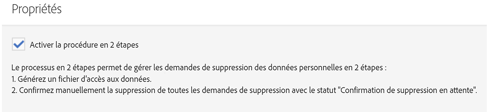

# Utilisation de Microsoft Dynamics 365 avec intégration Campaign Standard

Cette intégration exécute plusieurs tâches :

* **Synchronisation** des contacts : Les contacts sont envoyés de Dynamics 365 à Campaign (remarque : synchronisation unidirectionnelle).
* **Synchronisation** d&#39;entité personnalisée : Les enregistrements d&#39;entité personnalisés sont envoyés de Dynamics 365 à Campaign (remarque : synchronisation unidirectionnelle).  Pour plus d&#39;informations, consultez la page sur les entités personnalisées.
* **d&#39;affichage** du : Certains de marketing par courrier électronique sont envoyés de Campaign à Dynamics 365. Voir la remarque ci-dessous.
* **Suppression** de contact : Campaign est ajouté à la file d&#39;attente de suppression liée à la confidentialité lorsque le contact correspondant est supprimé dans Dynamics 365.
* **Synchronisation** d’exclusion : Les exclusions sont synchronisées entre Dynamics 365 et Campaign selon la configuration que le client sélectionne lors de l’intégration (c.-à-d., Dynamics 365 à Campaign synchronisation, Campaign à la synchronisation Dynamics 365 ou à la synchronisation bidirectionnelle).
* **Authentification unique (SSO)**: Les détails de votre intégration dans Unifi sont accessibles directement depuis Campaign, à l’aide de votre authentification Adobe IMS.

>[!NOTE]
>
>Pour l’affichage **des**, un maximum de 10 000  de sera récupéré chaque fois que la tâche d’insertion s’exécute dans Unifi.

##  Adobe Campaign utilisateur standard

Lorsqu’un contact est créé ou modifié dans Dynamics 365, il est synchronisé vers Campaign après l’exécution de la synchronisation des contacts.  Ces contacts seront visibles dans l’écran  du dans Campaign et peuvent être ciblés dans les campagnes marketing.  Voir l’écran  du ci-dessous.

Lorsqu’un contact est supprimé dans Dynamics 365, le  correspondant dans Campaign est ajouté à la file d’attente de suppression du service de confidentialité dans l’écran Demande de confidentialité de Campaign.  Pour plus de détails sur l&#39;exécution des demandes de suppression de personnes, selon les besoins, pour se conformer aux lois applicables en matière de confidentialité des données dans Campaign, veuillez vous reporter à Comment exécuter les demandes de suppression prescrites par la loi dans  Adobe Campaign Norme.

Il est important de noter que si le processus en deux étapes est activé dans l’écran des propriétés, vous devez confirmer manuellement la suppression de chaque enregistrement dans l’écran de confidentialité avant qu’il ne soit définitivement supprimé.  Consultez l’écran de processus en deux étapes ci-dessous :

Lorsqu’un attribut d’exclusion/liste noire est modifié dans Campaign, il est reflété dans Dynamics 365 si vous avez sélectionné la configuration d’exclusion Campaign/dynamique 365 ou bidirectionnelle et si cet attribut est correctement mappé.

Pour accéder aux détails de votre intégration par authentification unique, accédez au menu de navigation Campaign et cliquez sur Administration > Intégration de Microsoft Dynamics 365.

Cette page contient des liens vers la documentation sur l&#39;intégration et des directives sur l&#39;utilisation des fonctionnalités conformément à vos obligations légales potentielles. Cliquez sur l&#39;icône du globe, qui vous acheminera et vous connectera automatiquement à votre instance Unifi où vous pourrez gérer les détails de votre intégration.

Vous pouvez voir une vidéo de cette fonctionnalité dans la vidéo ci-dessous.

>[!VIDEO](https://video.tv.adobe.com/v/29254)

>[!NOTE]
>
>Vous devrez envoyer un ticket au service à la clientèle d’Adobe (directement ou par l’intermédiaire de votre contact Adobe) pour que l’indicateur de fonction de connexion unique soit activé dans votre instance Campaign.

>[!NOTE]
>
>L&#39;icône d&#39;intégration de Microsoft Dynamics 365 ne s&#39;affiche pas dans le panneau d&#39;administration.  Vous (ou votre contact Adobe) devrez envoyer un ticket pour que cet indicateur de fonctionnalité soit activé pour votre instance Campaign.
>
>En outre, le service Unifi devra activer l’accès SSO pour que les utilisateurs puissent se connecter via l’authentification unique à partir de Campaign.

## Expérience utilisateur de Microsoft Dynamics 365

Pour l’affichage des , les de marketing par courrier électronique suivants sont envoyés de  à Dynamics 365 et affichés dans le de chronologie de Dynamics 365 sous forme de personnalisé :

*  Adobe Campaign Envoyer par courrier électronique

*  Adobe Campaign E-mail ouvert

*  Adobe Campaign URL de courriel clic

*  Adobe Campaign de retour de courriel

Pour le Journal d’un contact, accédez à vos contacts  en cliquant sur le Centre de ventes dans le menu déroulant Dynamique 365.  Cliquez ensuite sur Contacts dans la barre de menu de gauche et sélectionnez un contact.

>[!NOTE]
>
>L&#39;application  Adobe Campaign pour Dynamics 365 dans AppSource devra être installée dans votre instance Dynamics 365 afin de ces.

Vous trouverez ci-dessous un instantané de l’écran Contact pour &quot;Dynamics User&quot;.  Dans le de chronologie, vous remarquerez que l’utilisateur de Dynamics a reçu un courrier électronique associé au Campaign Nom &quot;2019LoyaltyCamp&quot; et auNom de la  &quot;DM190&quot;.  Dynamics User a ouvert le courrier électronique et a également cliqué sur une URL dans le courrier électronique ; ces deux actions ont créé des  qui sont également présentées ci-dessous.  Si vous regardez dans le coin droit, vous verrez la carte de l&#39;assistant de relations (AR); il contient actuellement un  de suivi de l’URL sur laquelle l’utilisateur a cliqué.

Voir ci-dessous un résumé du de chronologie pour l’utilisateur de Dynamics.

Ci-dessous se trouve un gros plan de la carte de l&#39;Assistant Relations (RA).  L’application AppSource contient un flux de travail qui recherche un de clics sur l’URL de courriel Adobe.  Lorsque ce se produit, il crée un  de et définit une date d’échéance.  Cela permet au de s’afficher dans la carte d’évaluation, ce qui lui donne une visibilité supplémentaire.  Il existe un flux de travail similaire pour le de rebonds de courrier électronique Adobe, en ajoutant un  pour rapprocher l’adresse électronique non valide.  Ces  peuvent être désactivées dans la solution.

Si vous cliquez sur le sujet du  d’envoi, vous verrez un formulaire similaire à celui ci-dessous.  Les formulaires pour les  d’ouverture et de rebond sont similaires.

Le formulaire pour le de clics d’URL de courriel ajoute un attribut supplémentaire pour l’URL sur laquelle l’utilisateur a cliqué :

Voici un  des attributs et une description :

* Objet: Objet du ; composé de l’ID Campaign et de l’ID  de l’ de courriel

* Propriétaire : Utilisateur de l’application créé lors des étapes de post-mise en service

* Concernant : Nom du contact

* Nom Campaign : L&#39;ID Campaign dans Campaign Standard

* Nom de  du : L&#39;ID  dans Campaign Standard

* Date d&#39;envoi/d&#39;ouverture/de clic/de rebonds : Date/heure de création du  de

* URL de suivi : URL sur laquelle l’utilisateur a cliqué

* URL  : URL du du courrier électronique envoyé/ouvert/sur lequel l’utilisateur a cliqué/a rebondi

Vous pouvez voir une vidéo de l’URL  du utilisée dans la vidéo ci-dessous.

>[!VIDEO](https://video.tv.adobe.com/v/29253)

>[!NOTE]
>
>Dans le cas de l’exclusion, lorsqu’un attribut d’exclusion est modifié dans Dynamics 365, il est reflété dans Campaign si vous avez sélectionné la configuration d’exclusion de la Campaign de la conversion de la conversion de la conversion de la conversion de la conversion de la conversion de la conversion de la conversion de la conversion de la conversion de la conversion de la conversion de la conversion de la conversion à la conversion et si cet attribut est correctement mappé.

**Rubriques connexes**

* Configuration de Campaign pour l’intégration Campaign/Dynamics 365
* Configuration de Dynamics pour l’intégration Campaign/Dynamics 365
* Configuration d’Unifi pour l’intégration Campaign/Dynamics 365
* Découvrez comment mapper des ressources personnalisées et des entités personnalisées