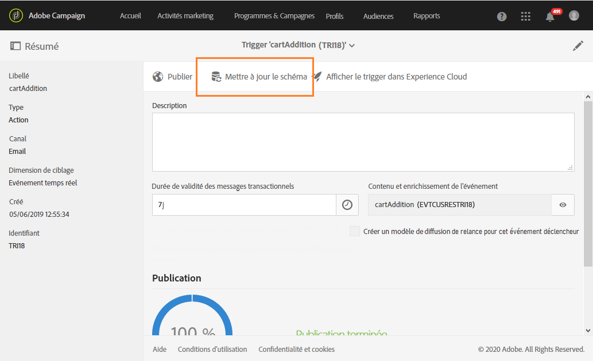
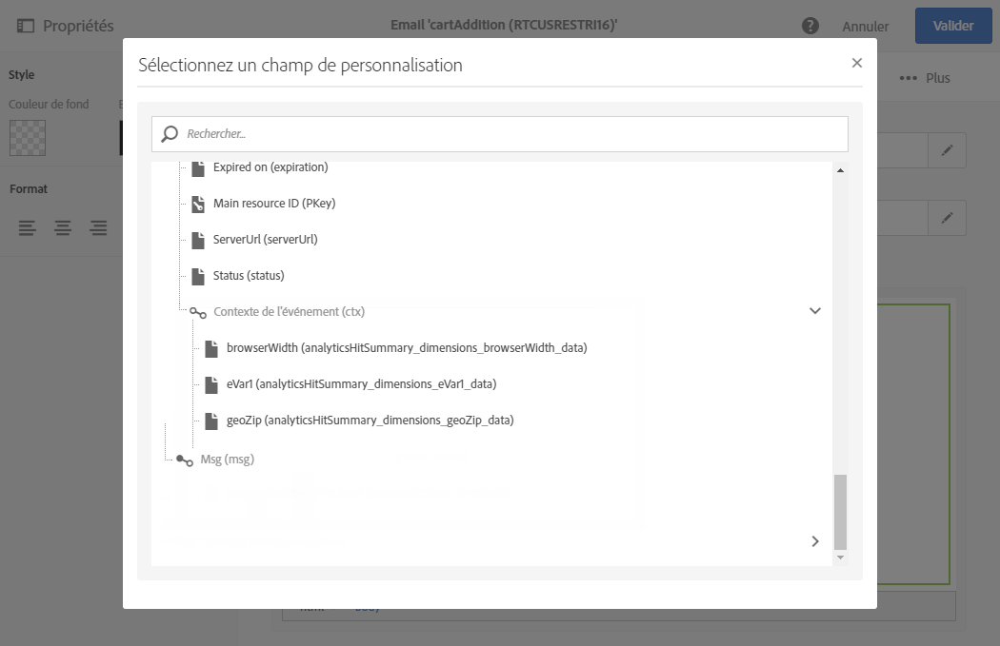

# Utilisation de Triggers dans Campaign{#using-triggers-in-campaign}

## Création d'un trigger mappé dans Campaign {#creating-a-mapped-trigger-in-campaign}

Vous devez au préalable définir les comportements que vous souhaitez contrôler dans Adobe Experience Cloud (core service **[!UICONTROL Triggers).]** Voir à ce propos la [documentation Adobe Experience Cloud](https://marketing.adobe.com/resources/help/en_US/mcloud/triggers.html). Lorsque vous définissez le trigger, vous devez activer les alias. Pour chaque comportement (abandon de navigation/formulaire, ajout/suppression de produits, session expirée, etc.), un nouveau trigger doit être ajouté dans Adobe Experience Cloud.

Vous devez à présent créer un événement déclencheur dans Adobe Campaign. Celui-ci doit être basé sur un trigger Adobe Experience Cloud existant.

Vous pouvez regarder cette [vidéo](https://helpx.adobe.com/marketing-cloud/how-to/email-marketing.html#step-two) pour mieux comprendre comment les triggers sont configurés dans Adobe Campaign.

Les étapes de mise en œuvre sont les suivantes :

1. Click the **[!UICONTROL Adobe Campaign]** logo, in the top left corner, then select **[!UICONTROL Marketing plans]** &gt; **[!UICONTROL Transactional messages]** &gt; **[!UICONTROL Experience Cloud Triggers]**.

   

1. Cliquez sur le bouton **[!UICONTROL Créer.]** L'assistant de création qui s'affiche contient la liste de tous les triggers définis dans Adobe Experience Cloud. La colonne **[!UICONTROL Nombre d'envois Analytics]indique le nombre d'événements envoyés à Campaign par le trigger Adobe Experience Cloud.** Il s'agit d'un mappage des triggers créés dans l'interface d'Experience Cloud.

   

1. Sélectionnez le trigger Adobe Experience Cloud que vous souhaitez utiliser, puis cliquez sur **[!UICONTROL Suivant]**.
1. Configurez les propriétés générales du trigger. A cette étape de l'assistant, indiquez également le canal et la dimension de ciblage à utiliser pour le trigger (voir [Dimensions de ciblage et ressources](../../automating/using/query.md#targeting-dimensions-and-resources)). Validez ensuite la création du trigger.
1. Cliquez sur le bouton situé à droite du champ **[!UICONTROL Contenu et enrichissement de l'événement]pour afficher le contenu de la payload.** Cet écran vous permet également d'enrichir les données de l'événement avec les données de profil stockées dans la base de données Adobe Campaign. L'enrichissement s'effectue de la même manière que pour un message transactionnel standard.

   

1. Dans le champ **[!UICONTROL Durée de validité du message transactionnel], définissez la durée de validité du message après l'envoi de l'événement par Analytics.** Si vous définissez une durée de 2 jours, le message n'est plus envoyé une fois cette durée écoulée. Si vous suspendez plusieurs messages, ceux-ci ne sont pas envoyés en cas de reprise après un certain temps.

   

1. Si un score de propension est défini dans Analytics (voir la [documentation Experience Cloud](https://marketing.adobe.com/resources/help/en_US/insight/client/c_visitor_propensity.html)), vous pouvez choisir de ne pas envoyer le message si la probabilité que le client revienne prochainement sur le site web est élevée. Le contenu du score et du seuil est disponible dans le contenu de la payload. Vous pouvez ainsi utiliser ces valeurs pour personnaliser le message. Pour utiliser cette option, cochez la case située en bas de l'écran. Les clients ayant une forte probabilité de revenir sur le site prochainement ne recevront pas de message.
1. Cliquez sur le bouton **[!UICONTROL Publier]pour lancer la publication de l'événement déclencheur.**
1. Si vous devez apporter une modification à votre schéma de trigger même après la publication de votre événement de trigger, cliquez sur le bouton **[!UICONTROL Mettre à jour le schéma]pour récupérer les dernières modifications.**

   Cette action entraîne la dépublication de votre trigger et du message transactionnel. Vous devrez les republier par la suite.

   

Le bouton **[!UICONTROL Afficher le trigger dans Experience Cloud]permet d'afficher la définition du trigger dans Adobe Experience Cloud.**

Une fois la publication effectuée, un modèle transactionnel associé au nouvel événement est alors automatiquement créé. Vous devez ensuite modifier et publier le modèle qui vient d'être créé. Voir à ce propos la section [Edition du modèle](../../start/using/about-templates.md).

## Édition du modèle de message transactionnel {#editing-the-transactional-message-template}

Une fois que vous avez créé et publié l'événement déclencheur, le modèle transactionnel correspondant est automatiquement créé. Consultez la section [Création d'un trigger mappé dans Campaign](../../integrating/using/using-triggers-in-campaign.md#creating-a-mapped-trigger-in-campaign) pour en savoir plus.

Pour que l'événement entraîne l'envoi d'un message transactionnel, vous devez personnaliser ce modèle, le tester et le publier. Ces étapes sont les mêmes que pour un message transactionnel standard. Voir à ce propos la section [Modèle transactionnel](../../channels/using/event-transactional-messages.md#personalizing-a-transactional-message).

>[!NOTE]
>
>Si vous dépubliez le modèle, l'événement déclencheur sera automatiquement dépublié.

Lors de l'édition du contenu, vous pouvez ajouter un champ de personnalisation basé sur les informations envoyées par le trigger Analytics. Si vous enrichissez les données de l'événement avec les données de profil Adobe Campaign, vous pouvez personnaliser le message selon ces informations. To personalize your message, select **[!UICONTROL Transactional event]** &gt; **[!UICONTROL Event context]** and select a field.

## Accès aux rapports {#accessing-the-reports}

Pour afficher le rapport de trigger dédié dans Adobe Campaign, ouvrez l'événement déclencheur que vous avez précédemment créé, puis cliquez sur **[!UICONTROL Afficher le rapport]**.

Le rapport montre le nombre d'événements traités par rapport au nombre d'événements envoyés par Analytics. Il affiche également la liste de tous les triggers récents.

