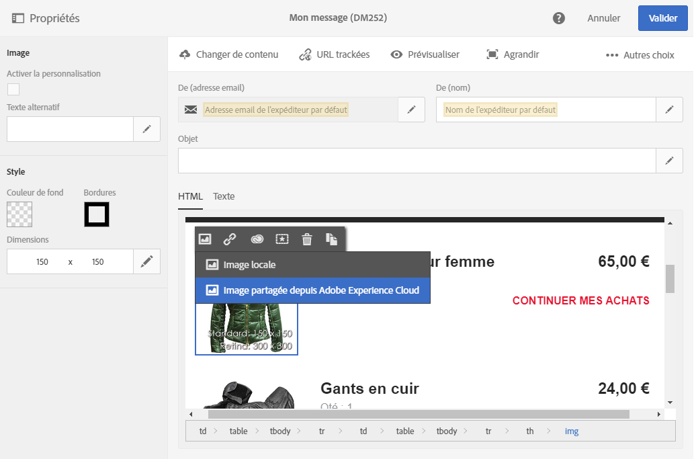
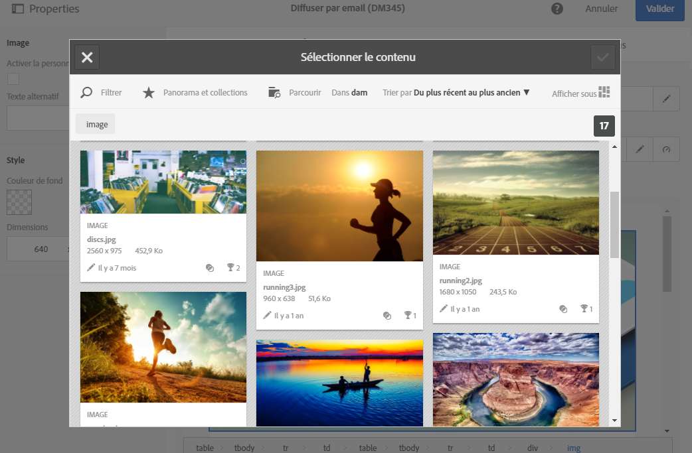

# Utilisation de Campaign et Assets core service{#working-with-campaign-and-assets-core-service}

L'intégration d'Assets core service ou d'Assets On Demand (en fonction de la configuration de votre environnement Adobe Marketing Cloud) avec Adobe Campaign permet d'utiliser des ressources partagées depuis Adobe Experience Cloud dans vos emails et landing pages Adobe Campaign.

Les ressources partagées depuis Adobe Experience Cloud peuvent être utilisées dans vos emails et landing pages.

1. Depuis l'édition du contenu d'un email ou d'une landing page, placez-vous sur un bloc de type image, puis via le menu contextuel, sélectionnez **[!UICONTROL Image partagée depuis Adobe Experience Cloud].**

   

1. Dans la fenêtre de sélection qui s'ouvre, sélectionnez une image, puis validez.

   

L'image est alors insérée. La diffusion peut à présent être personnalisée selon les besoins et envoyée.

**Rubriques connexes :**

* [Ressources et partage](https://marketing.adobe.com/resources/help/en_US/mcloud/experience-cloud-assets.html)
* [Editeur de contenus](../../designing/using/example--email-personalization.md)

