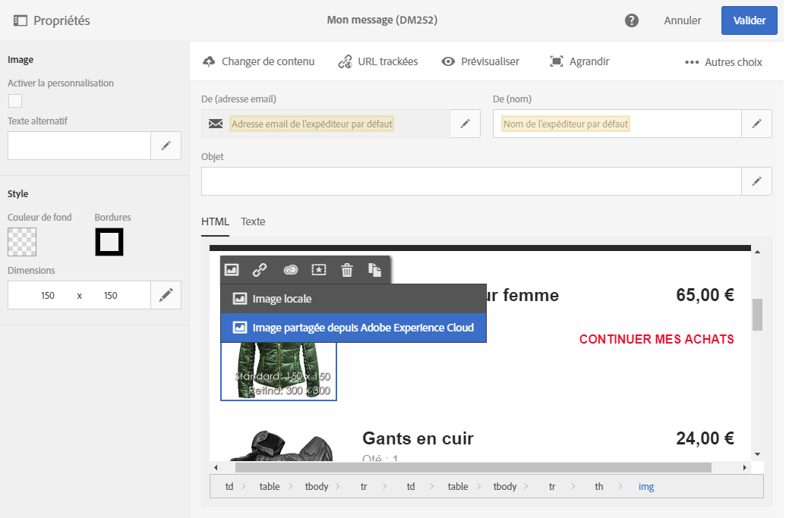
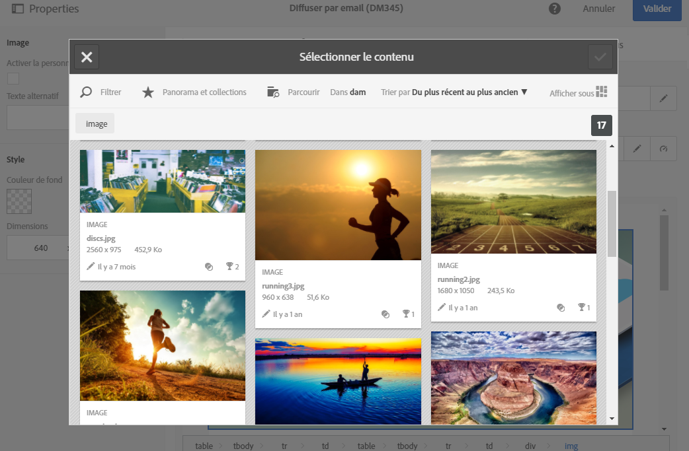

# Utilisation de Campaign et Assets core service{#working-with-campaign-and-assets-core-service}

L&#39;intégration d&#39;Assets core service ou d&#39;Assets On Demand (en fonction de la configuration de votre environnement Adobe Experience Cloud) avec Adobe Campaign permet d&#39;utiliser des ressources partagées depuis Adobe Experience Cloud dans vos e-mails et landing pages Adobe Campaign.

L&#39;intégration avec Assets Core Service est limitée aux [administrateurs fonctionnels](../../administration/using/users-management.md#functional-administrators).

Les ressources partagées depuis Adobe Experience Cloud peuvent être utilisées dans vos e-mails et landing pages comme suit :

1. Depuis l&#39;édition du contenu d&#39;un e-mail ou d&#39;une landing page, placez-vous sur un bloc de type image, puis via le menu contextuel, sélectionnez **[!UICONTROL Image partagée depuis Adobe Experience Cloud]**.

   

1. Dans la fenêtre de sélection qui s&#39;ouvre, sélectionnez une image, puis validez.

   

L&#39;image est alors insérée. La diffusion peut à présent être personnalisée selon les besoins et envoyée.

**Rubriques connexes :**

* [Ressources et partage](https://experienceleague.adobe.com/docs/core-services/interface/assets/experience-cloud-assets.html?lang=fr)
* [Éditeur de contenus](../../designing/using/personalization.md#example-email-personalization)
