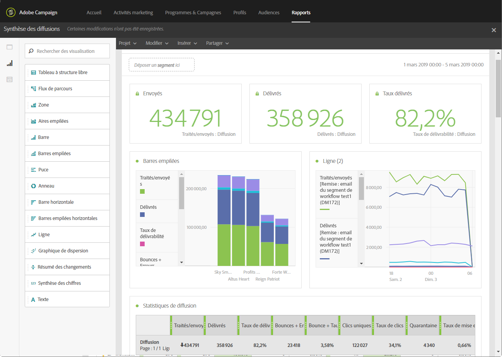
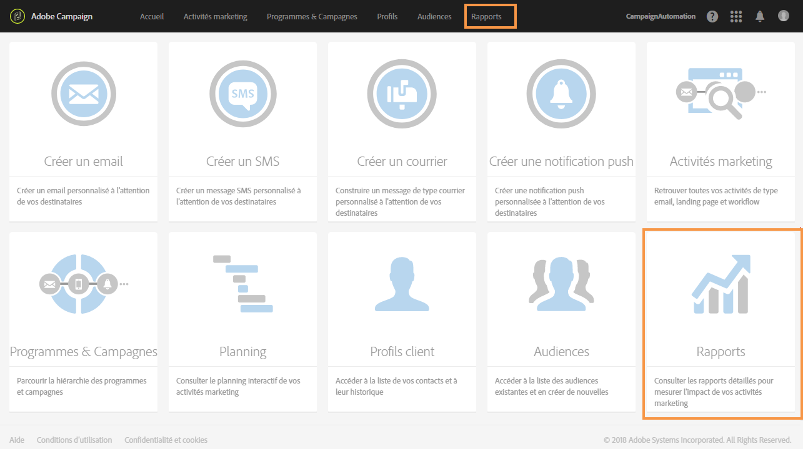
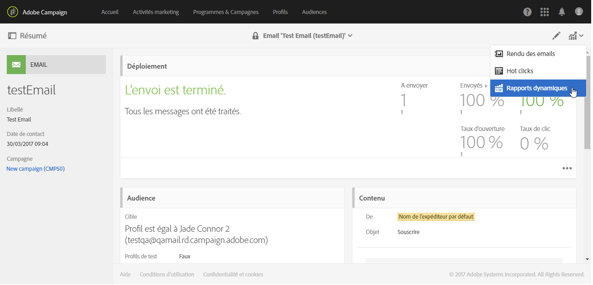
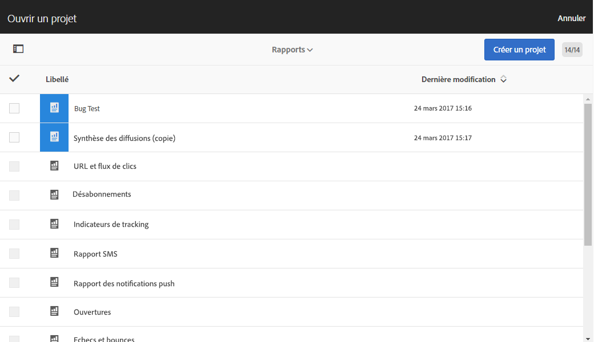
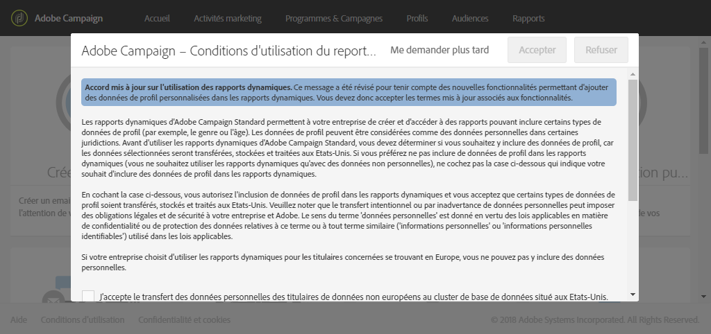
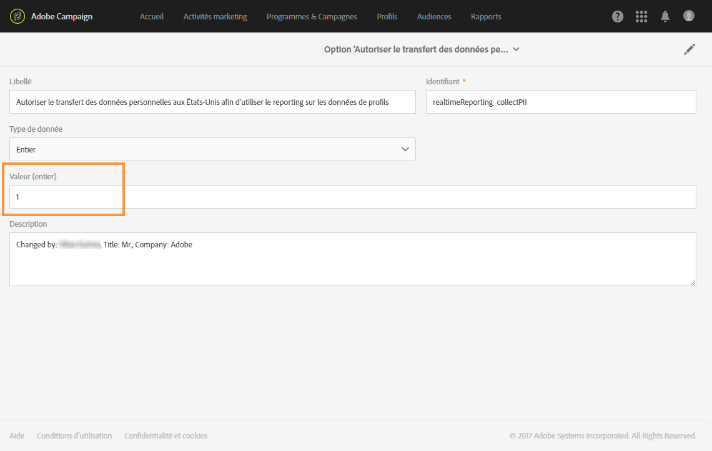

# Rapports dynamiques{#about-dynamic-reports}

>[!NOTE]
>
>Seuls les utilisateurs disposant de droits d'administration ou pour lesquels les entités organisationnelles sont définies sur **Tous** peuvent créer ou enregistrer un nouveau rapport. Voir à ce propos cette [section](../../administration/using/types-of-users.md).

Les rapports dynamiques fournissent des rapports entièrement personnalisables et en temps réel. Il permet d'ajouter l'accès aux données de profil, ce qui permet l'analyse démographique par dimensions de profil, telles que le sexe, la ville et l'âge, en plus des données de campagne par courriel fonctionnelles telles que les ouvertures et les clics. Grâce à l'interface glisser-déposer, vous pouvez explorer les données, déterminer comment vos campagnes par courriel sont exécutées par rapport à vos segments de clients les plus importants et mesurer leur impact sur les destinataires.

Grâce à son menu glisser-déposer et à ses visualisations personnalisables, la fonctionnalité rapports dynamiques vous permet de créer n'importe quelle combinaison de dimensions, d'indicateurs métriques et de plage horaire avec un nombre illimité de répartitions et de comparaisons.

**Rubriques connexes :**

* [Liste des rapports](../../reporting/using/defining-the-report-period.md)
* [Entités organisationnelles](../../administration/using/organizational-units.md)
* Vidéo [Rapports dynamiques](https://helpx.adobe.com/campaign/kt/acs/using/acs-creating-a-dynamic-report-feature-video-use.html)

## Accès aux rapports dynamiques {#accessing-dynamic-reports}

Les rapports sont accessibles :

* depuis la page d'accueil, en sélectionnant l'onglet **[!UICONTROL Rapports]** dans la barre supérieure ou la vignette **Rapports]pour accéder aux rapports relatifs à toutes les diffusions ;[!UICONTROL **

   

* dans chaque programme, campagne et message, depuis le bouton **Rapports**, en cliquant sur **Rapports dynamiques** pour consulter uniquement les rapports spécifiques à la diffusion.

   

Certains rapports peuvent ne pas être immédiatement disponibles après une diffusion, selon le délai de collecte et de traitement des informations.

Les rapports dynamiques sont divisés en deux catégories :

* les **modèles**, qui peuvent être modifiés après avoir été copiés à l'aide de l'option **Enregistrer sous** (**Projet &gt; Enregistrer sous...**) dans le modèle.
* les **rapports personnalisés** (en bleu), qui peuvent être créés directement en cliquant sur le bouton **Créer un nouveau projet** sur la page d'accueil des **Rapports**.

>[!NOTE]
>
>Les données sont filtrées en fonction de vos entités organisationnelles.

## Accord sur l'utilisation du reporting dynamique {#dynamic-reporting-usage-agreement}

Les rapports dynamiques permettent de filtrer un rapport selon les données de profil avec des dimensions de profil.

Les dimensions de profil ne peuvent être affichées et utilisées dans vos rapports qu'une fois que vous avez accepté l'Accord d'utilisation du reporting dynamique. Par défaut, seuls les utilisateurs auxquels sont affectés des droits d'administration peuvent afficher et accepter ou refuser cet accord.

Cet accord autorise le transfert et le stockage aux Etats-Unis des données de profil suivantes : ville, pays/zone géographique, état, genre et segments sur la base de l'âge.

En acceptant le présent accord, toutes les données européennes et non européennes seront transférées aux États-Unis.

Trois options sont disponibles :

* **[!UICONTROL Me demander plus tard]** : lorsque vous cliquez sur Me demander plus tard, la fenêtre ne s'affiche plus pendant 24 heures.
* **[!UICONTROL Accepter]** : lorsque vous acceptez les termes de cet accord, vous autorisez Adobe Campaign à collecter les PII de vos clients et à les transférer vers les États-Unis.
* **[!UICONTROL Refuser]** : lorsque vous refusez les termes de l'accord, les dimensions de profil ne s'affichent pas dans vos rapports et les PII de vos clients ne sont pas collectées ni envoyées.

This choice is not final, you can always change it by selecting **[!UICONTROL Enable PII data to be transferred to US region to use reporting on Profile data]** in **[!UICONTROL Administration]** &gt; **[!UICONTROL Application Settings]** &gt; **[!UICONTROL Options]**.

La valeur peut être modifiée à tout moment. The value -1 corresponds to **[!UICONTROL Ask me later]**, 1 **[!UICONTROL Accept]** and 0 **[!UICONTROL Decline]**.

