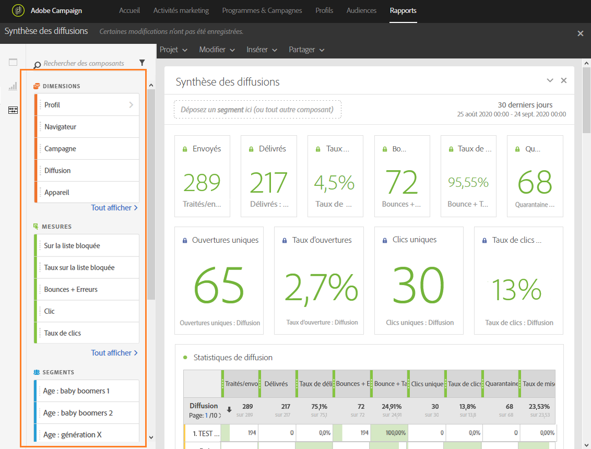

# Ajouter des composants{#adding-components}

Les composants vous permettent de personnaliser vos rapports grâce à différentes dimensions, valeurs métriques et périodes.

1. Cliquez sur l'onglet **[!UICONTROL Composants]pour accéder à la liste des composants.**

   

1. Chaque catégorie présentée dans l'onglet **[!UICONTROL Composants]affiche les cinq éléments les plus utilisés. Cliquez sur le nom d'une catégorie pour accéder à la liste complète de ses composants.**

   Le tableau des composants se divise en quatre parties :

   * **Dimensions** : obtenez des détails issus du log de diffusion, tels que le navigateur du destinataire, son domaine, ou la réussite d'une diffusion.
   * **Mesures** : obtenez des détails sur le statut d'un message. Par exemple, s'il a été délivré et si l'utilisateur l'a ouvert.
   * **[!UICONTROL Segments]** : filtrez les données selon la tranche d'âge du destinataire. **[!UICONTROL Les Segments]** peuvent être placés directement dans un tableau Structure libre ou dans la barre supérieure du panneau.

      Cette catégorie est disponible uniquement lorsque l'administrateur a accepté les conditions générales de l'accord sur l'utilisation des rapports dynamiques qui s'affiche à l'écran. Si l'administrateur refuse les conditions générales de l'accord, les segments ne sont pas visibles dans l'onglet **[!UICONTROL Composants]et les données ne sont pas collectées.**

   * **Temps** : configurez une période de temps pour votre tableau.

1. Déposez des composants dans un panneau pour commencer à filtrer vos données.

Vous pouvez déposer autant de composants que nécessaire et les comparer les uns aux autres.

**Rubriques connexes :**

* [Liste des composants](../../reporting/using/list-of-components-.md)
* [Liste des rapports](../../reporting/using/defining-the-report-period.md)

