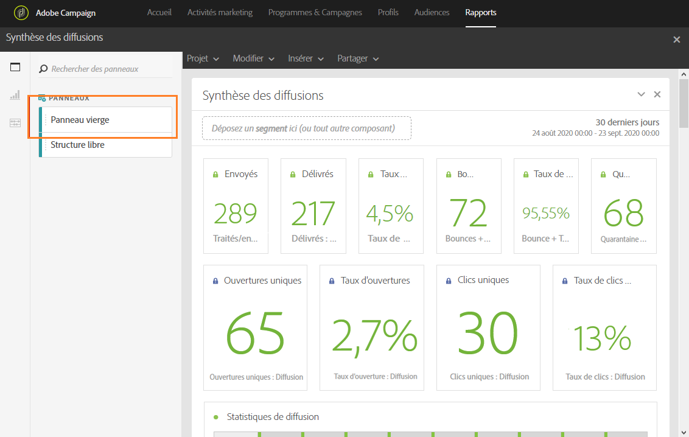
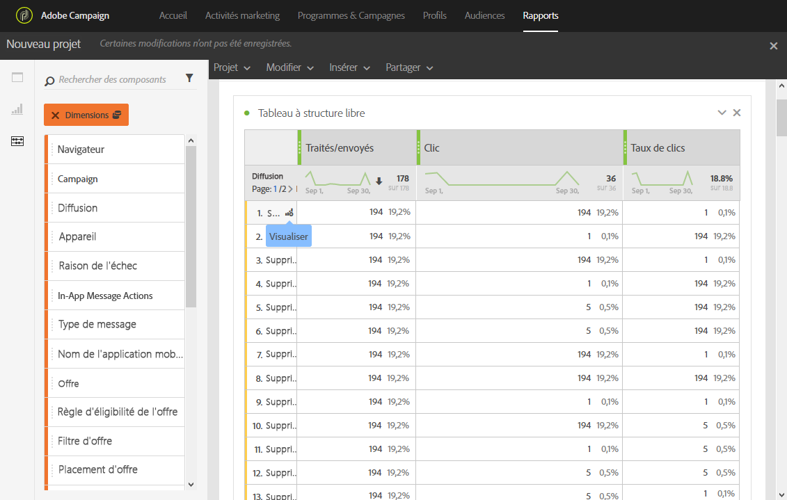

# Ajouter des panneaux{#adding-panels}

## Ajouter un panneau vide {#adding-a-blank-panel}

Pour commencer votre rapport, vous pouvez ajouter un ensemble de panneaux à un rapport d&#39;usine ou personnalisé. Chaque panneau contient différents jeux de données et est composé de visualisations et de tableaux Structure libre.

Ce panneau vous permet de créer vos rapports selon vos besoins. Vous pouvez ajouter autant de panneaux que vous voulez dans vos rapports afin de filtrer vos données avec différentes périodes.

1. Cliquez sur l’icône **Panneaux.** Vous pouvez également ajouter un panneau en cliquant sur l’onglet **Insertion** et en sélectionnant **Nouveau panneau vierge**.

   

1. Placez le **Panneau vierge** sur votre tableau de bord.

   

Vous pouvez ajouter à présent un tableau Structure libre à votre panneau pour commencer à cibler les données.

## Ajouter un tableau Structure libre      {#adding-a-freeform-table}

Les tableaux Structure libre vous permettent de créer un tableau pour analyser vos données à l’aide des différentes valeurs métriques et des dimensions disponibles dans le tableau **Composant**.

Les tableaux et les visualisations sont redimensionnables et peuvent être déplacés pour améliorer la personnalisation de votre rapport.

1. Cliquez sur l’icône **Panneaux**.

   

1. Placez l’élément **Structure libre** sur votre tableau de bord.

   Vous pouvez également ajouter un tableau en cliquant sur l’onglet **Insérer** et en sélectionnant **Nouvelle Forme Libre** ou en cliquant sur **Ajouter un panneau structure libre** dans un panneau vide.

   

1. Le segment **[!UICONTROL Exclure le BAT]** est déjà sélectionné par défaut. Si nécessaire, vous pouvez la modifier en faisant glisser l&#39;un des **[!UICONTROL segments]** depuis l&#39;onglet **[!UICONTROL Composants]** vers la barre supérieure.

   

1. Positionnez des éléments de l’onglet **Composants** dans les colonnes et les rangées pour créer votre tableau.

   

1. Cliquez sur l’icône **Paramètres** pour modifier l’affichage des données dans vos colonnes.

   

   L’option **[!UICONTROL Paramètres de colonne]** est composée des éléments suivants :

   * **[!UICONTROL Nombre]** : permet d&#39;afficher ou de masquer les nombres de synthèse dans la colonne.
   * **[!UICONTROL Pourcentage]** : permet d&#39;afficher ou de masquer le pourcentage dans la colonne.
   * **[!UICONTROL Interpréter zéro comme n&#39;étant pas une valeur]** : permet d&#39;afficher ou de masquer une valeur lorsqu&#39;elle est égale à zéro.
   * **[!UICONTROL Arrière-plan]** : permet d’afficher ou de masquer la barre de progression horizontale dans les cellules.
   * **[!UICONTROL Inclure les nouvelles tentatives]** : permet d’inclure les nouvelles tentatives dans le résultat. Cette option est uniquement disponible pour les éléments **[!UICONTROL Envoyés]** et **[!UICONTROL Bounces + erreurs]**.

1. Sélectionnez une ou plusieurs rangées et cliquez sur l’icône **Visualiser.** Une visualisation représentant les rangées sélectionnées est ajoutée.

   

Vous pouvez ajouter à présent autant de composants que nécessaire ainsi que des visualisations pour offrir une représentation graphique à vos données.
