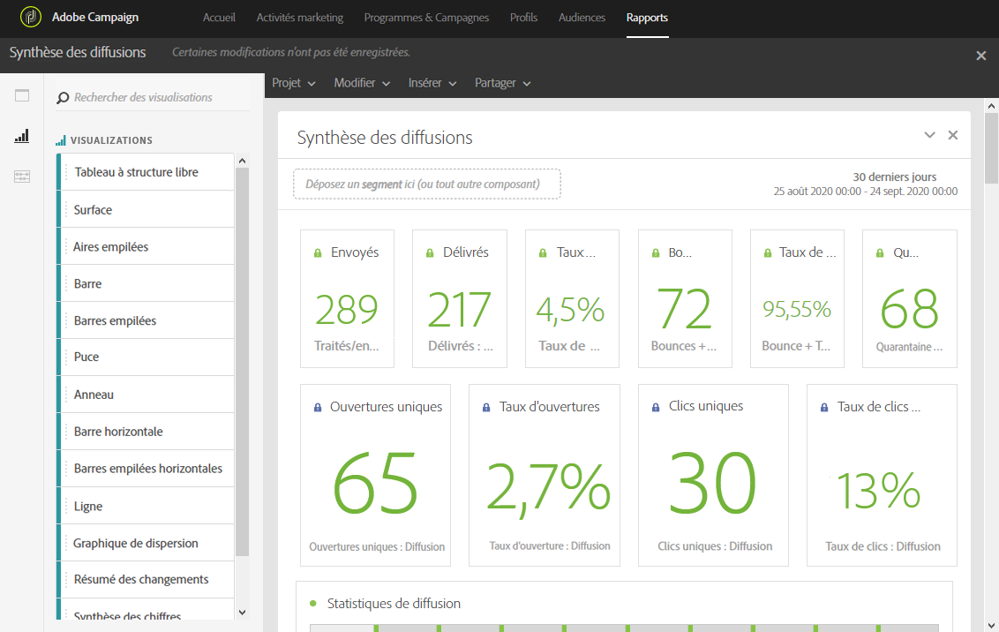
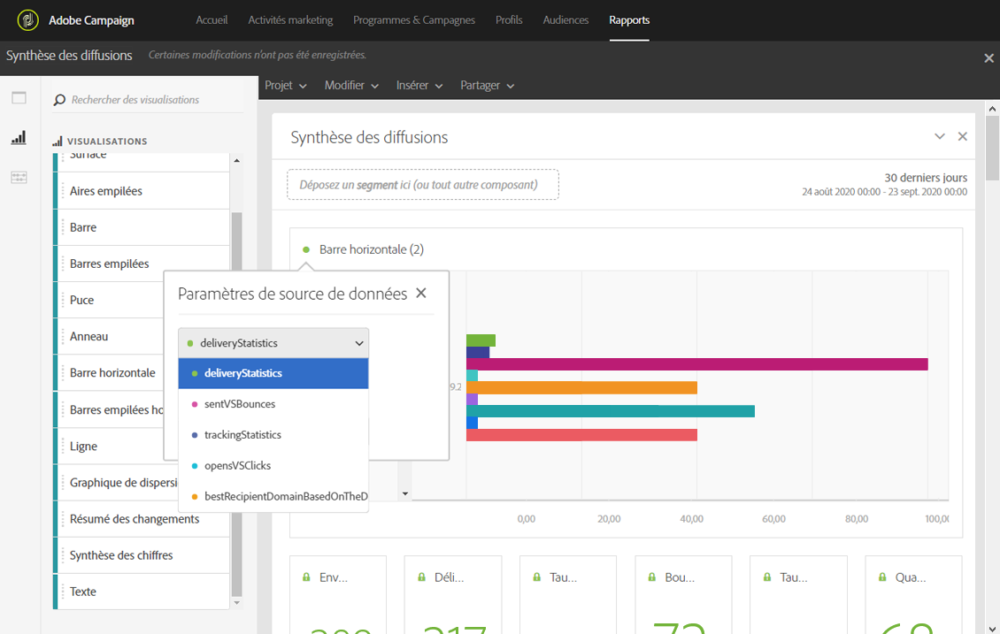

# Ajouter des visualisations{#adding-visualizations}

L'onglet **Visualisations** vous permet de positionner des éléments de visualisation, tels que des zones, des diagrammes circulaires ou des graphiques. Les visualisations vous offrent une représentation graphique de vos données.

1. Dans l'onglet **[!UICONTROL Visualisations], déposez un élément de visualisation dans un panneau.**

   

1. Après avoir ajouté une visualisation à votre panneau, Rapports Dynamiques détecte automatiquement les données dans votre tableau Structure libre. Sélectionnez les paramètres de votre visualisation.
1. S'il existe plusieurs tableaux Structure libre, sélectionnez la source de données à ajouter à votre graphique dans la fenêtre **Paramètres de source de données.** Cette fenêtre peut également être ouverte en cliquant sur le point de couleur à côté de votre titre de visualisation.

   

1. Cliquez sur le bouton des paramètres de **[!UICONTROL Visualisation]pour modifier directement le type de graphique ou les données qui y sont affichées :**

   * **Pourcentages** : affiche les valeurs sous forme de pourcentage.
   * **Ancrer l'axe Y à zéro** : force l'axe Y à zéro, même si des valeurs sont supérieures à zéro.
   * **Légende visible** : permet de masquer la légende.
   * **Normalisation** : force la correspondance des valeurs.
   * **Afficher l'axe double** : ajoute un axe à votre graphique.
   * **Limiter les éléments maximum** : limite le nombre de graphiques affichés.
   * **Seuil** : permet de configurer un seuil pour votre graphique. Il apparaît sous forme de ligne pointillée noire.
   

Cette visualisation vous permet d'avoir une vue plus claire de vos données dans les rapports.
