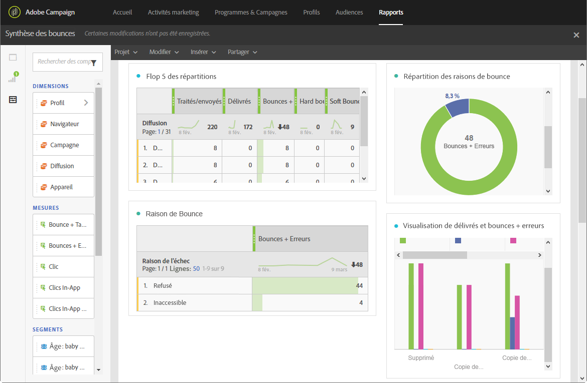

# Synthèse des rebonds (Bounce summary){#bounce-summary}

Ce rapport présente l'ensemble des statistiques d'erreurs hard et soft survenues lors des diffusions ainsi que le traitement automatique des retours.

Chaque tableau est représenté par des nombres et des graphiques de synthèse. Les paramètres de visualisation des détails vous permettent de modifier leur affichage.

**Flop 5 des répartitions** liste les cinq diffusions présentant le plus grand nombre de mises en quarantaine :

Le tableau **Raisons de bounce** contient les données disponibles pour les types d'erreur ayant causé des bounces pour chaque diffusion :

* **[!UICONTROL Utilisateur inconnu]** : type d'erreur générée lors de l'envoi d'une diffusion indiquant que l'adresse email est invalide.
* **[!UICONTROL Domaine invalide]** : type d'erreur générée lors de l'envoi d'une diffusion indiquant que le domaine de l'adresse email est erroné ou n'existe plus.
* **[!UICONTROL Inatteignable]** : type d'erreur survenue dans la chaîne de diffusion du message. Par exemple, incident sur le relais SMTP, domaine temporairement inatteignable, etc.
* **[!UICONTROL Compte désactivé]** : type d'erreur générée lors de l'envoi d'une diffusion indiquant que l'adresse n'existe plus.
* **[!UICONTROL Boîte pleine]** : type d'erreur générée lorsque la boîte de réception du destinataire est pleine. Il y a cinq tentatives d'envoi du message avant que cette erreur soit générée.
* **[!UICONTROL Non connecté]** : type d'erreur générée lorsque le téléphone portable du destinataire est éteint ou n'est pas connecté au réseau au moment de l'envoi du message.

   >[!NOTE]
   >
   >Ce type d'envoi ne concerne que les diffusions sur les canaux mobiles.

* **[!UICONTROL Refusé]** : type d'erreur générée lorsqu'une adresse est refusée par le fournisseur d'accès Internet (FAI). Par exemple, lorsqu'une règle de sécurité a été appliquée par un logiciel anti-spam.

Le tableau **Répartition des domaines** affiche les problèmes généraux survenus au cours des diffusions, en fonction du domaine du destinataire.
