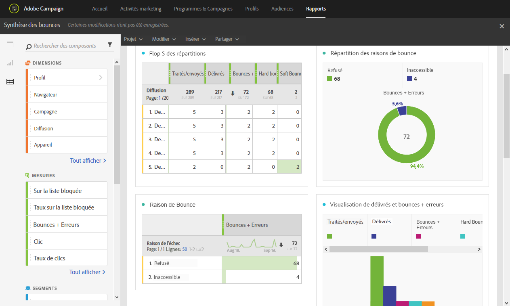

# Synthèse des rebonds (Bounce summary){#bounce-summary}

Ce rapport présente l&#39;ensemble des statistiques d&#39;erreurs hard et soft survenues lors des diffusions ainsi que le traitement automatique des retours.

Chaque tableau est représenté par des nombres et des graphiques de synthèse. Les paramètres de visualisation des détails vous permettent de modifier leur affichage.

**Flop 5 des répartitions** liste les cinq diffusions présentant le plus grand nombre de mises en quarantaine :

Le tableau **Raisons de bounce** contient les données disponibles pour les types d&#39;erreur ayant causé des bounces pour chaque diffusion :

* **[!UICONTROL User unknown]**: Type d’erreur généré lorsqu’un est envoyé à une adresse électronique non valide.
* **[!UICONTROL Invalid domain]**: Type d’erreur généré lorsqu’un est envoyé à une adresse électronique dont le domaine est incorrect ou n’existe plus.
* **[!UICONTROL Unreachable]**: Type d’erreur rencontré dans la chaîne de de messages, par exemple domaine temporairement --------.
* **[!UICONTROL Account disabled]**: Type d’erreur généré lorsqu’un est envoyé à une adresse électronique qui n’existe plus.
* **[!UICONTROL Mailbox full]**: Type d’erreur généré lorsque la boîte de réception du est pleine. Il y a cinq tentatives d&#39;envoi du message avant que cette erreur soit générée.
* **[!UICONTROL Not connected]**: Type d’erreur généré lorsque le  téléphone mobile est désactivé ou n’est pas connecté à un réseau au moment de l’envoi du message.

   >[!NOTE]
   >
   >Ce type d&#39;envoi ne concerne que les diffusions sur les canaux mobiles.

* **[!UICONTROL Refused]**: Type d’erreur généré lorsqu’une adresse est refusée par le Internet (FAI). Par exemple, lorsqu&#39;une règle de sécurité a été appliquée par un logiciel anti-spam.

Le tableau **Répartition des domaines** affiche les problèmes généraux survenus au cours des diffusions, en fonction du domaine du destinataire.
