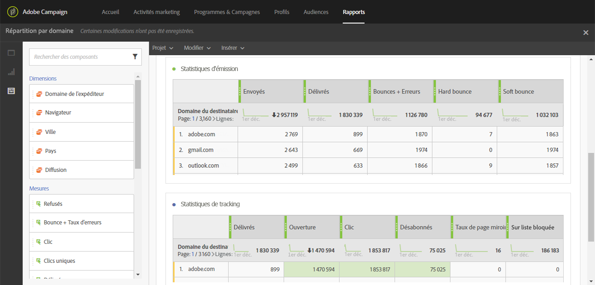

# Répartition par domaine (Breakdown by domains){#breakdown-by-domains}

Ce rapport contient les données de performance pour chaque domaine représenté dans l'audience pour une diffusion email. S'il s'agit d'un rapport de campagne ou de programme, les données de performance sont disponibles pour des audiences multiples. Ces données vous permettent d'analyser le comportement de chaque domaine par rapport à des événements spécifiques. Par exemple l'affichage de liens, le blacklistage d'URL, etc.

Le tableau **Broadcast statistics** contient les données disponibles liées aux erreurs possibles rencontrées pour chaque domaine, telles que :

* **Traités/envoyés** : nombre d'emails envoyés.
* **Délivrés** : nombre d'emails délivrés.
* **Bounces + erreurs** : nombre d'emails qui n'ont pas pu être livrés.
* **Hard bounce** : nombre total d'erreurs permanentes, telles qu'une adresse email incorrecte.
* **Soft bounce** : nombre total d'erreurs temporaires, telles qu'une boîte de réception pleine.

Le deuxième tableau, **Statistiques de tracking**, contient les données disponibles concernant la réactivité des destinataires par rapport à la diffusion, telles que :

* **Délivrés** : nombre d'emails délivrés
* **Ouverture** : nombre d'ouvertures d'un message dans une diffusion.
* **Clic** : nombre de clics sur un contenu dans une diffusion.
* **Désabonnés** : nombre de clics sur le lien de désinscription.
* **Page miroir** : nombre de clics sur le lien de la page miroir.
* **Blacklistage** :nombre de destinataires ayant déclaré un email comme étant un spam ou un courrier indésirable (voir [Gestion du blacklistage dans Campaign](../../audiences/using/about-opt-in-and-opt-out-in-campaign.md)).

