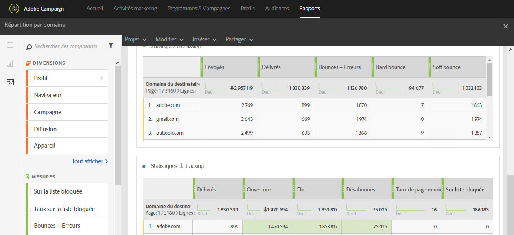

# Répartition par domaine (Breakdown by domains){#breakdown-by-domains}

Ce rapport contient les données de performance pour chaque domaine représenté dans l&#39;audience pour une diffusion email. S&#39;il s&#39;agit d&#39;un rapport de campagne ou de programme, les données de performance sont disponibles pour des audiences multiples. Ces données vous permettent d&#39;analyser le comportement de chaque domaine par rapport à des événements spécifiques. Par exemple, affichage des liens, URL en liste bloquée, etc.

Le tableau **Broadcast statistics** contient les données disponibles liées aux erreurs possibles rencontrées pour chaque domaine, telles que :

* **Traités/envoyés** : nombre d&#39;emails envoyés.
* **Délivrés** : nombre d&#39;emails délivrés.
* **Bounces + erreurs** : nombre d&#39;emails qui n&#39;ont pas pu être livrés.
* **Hard bounce** : nombre total d&#39;erreurs permanentes, telles qu&#39;une adresse email incorrecte.
* **Soft bounce** : nombre total d&#39;erreurs temporaires, telles qu&#39;une boîte de réception pleine.

Le deuxième tableau, **Statistiques de tracking**, contient les données disponibles concernant la réactivité des destinataires par rapport à la diffusion, telles que :

* **Délivrés** : nombre d&#39;emails délivrés
* **Ouverture** : nombre d&#39;ouvertures d&#39;un message dans une diffusion.
* **Clic** : nombre de clics sur un contenu dans une diffusion.
* **Désabonnés** : nombre de clics sur le lien de désinscription.
* **Page miroir** : nombre de clics sur le lien de la page miroir.
* **Placé sur la liste bloquée** : nombre de destinataires ayant déclaré un email comme étant un spam ou un courrier indésirable (voir la section [Gestion de la liste bloquée dans Campaign](../../audiences/using/about-opt-in-and-opt-out-in-campaign.md)).

