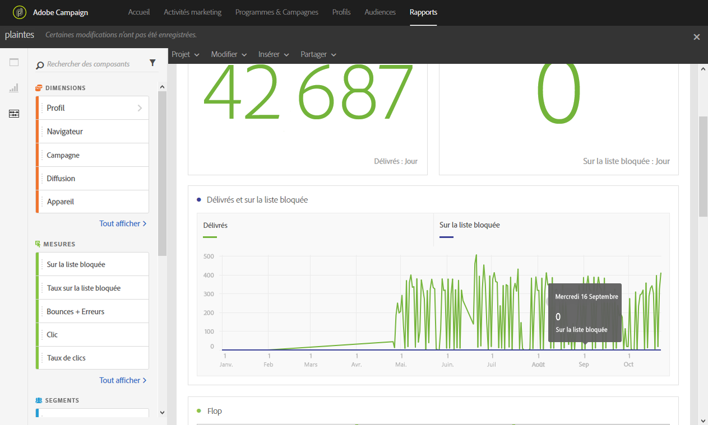

# Plaintes (Complaints){#complaints}

Le rapport **[!UICONTROL Plaintes]** permet d'identifier les diffusions ayant reçu le plus de déclarations comme spam.

Le tableau **Flop**, trié par domaine de destinataire, affiche le nombre de destinataires ayant déclaré un email comme spam ou courrier indésirable. Les résultats du tableau sont également disponibles sous forme de graphique et de nombres de synthèse.

Le tableau **Taux délivrés et en quarantaine** liste le nombre de destinataires ayant déclaré un email comme spam ou courrier indésirable. Le tableau est trié par diffusion.
