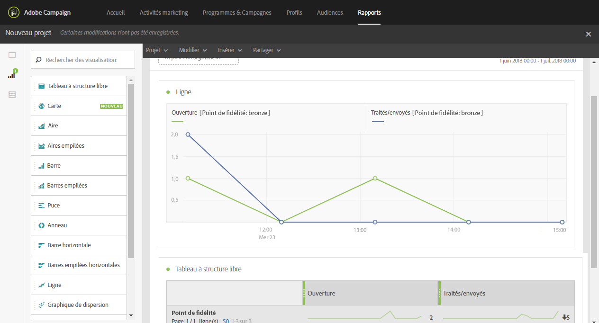

# Création d'une dimension de profil personnalisé{#creating-a-custom-profile-dimension}

Les rapports peuvent également être créés et gérés en fonction des données de profil personnalisé créé lors de l'extension de ressource personnalisée du profil.

Dans cet exemple, nous souhaitons créer le champ de profil personnalisé **Programmes de fidélité**, qui sera divisé en trois niveaux : or, argent et bronze. Le profil personnalisé sera étendu pour pouvoir l'utiliser comme une dimension de profil personnalisé dans les rapports dynamiques.

* [Étape 1 : Création d'un champ de profil](../../reporting/using/creating-a-custom-profile-dimension.md#step-1--create-a-new-profile-field)
* [Étape 2 : Extension des envois avec le champ de profil](../../reporting/using/creating-a-custom-profile-dimension.md#step-2--extend-the-sending-logs-with-the-profile-field)
* [Étape 3 : Création d'une diffusion ciblant des destinataires inscrits dans le programme de fidélité](../../reporting/using/creating-a-custom-profile-dimension.md#step-3--create-a-delivery-targeting-recipients-enrolled-in-the-loyalty-program)
* [Étape 4 : Création d'un rapport dynamique pour filtrer les destinataires avec la dimension de profil personnalisé](../../reporting/using/creating-a-custom-profile-dimension.md#step-4--create-a-dynamic-report-to-filter-recipients-with-the-custom-profile-dimension)

## Étape 1 : Création d'un champ de profil  {#step-1--create-a-new-profile-field}

Nous devons d'abord créer le champ de profil **Programme de fidélité** qui attribuera un niveau de fidélité à nos destinataires : or, argent ou bronze.

>[!NOTE]
>
>Les ressources personnalisées ne peuvent être gérées que par un administrateur.

Pour ce faire :

1. À partir du menu avancé, sélectionnez **[!UICONTROL Administration]** &gt; **[!UICONTROL Développement]** &gt; **[!UICONTROL Ressources personnalisées]**, puis la ressource personnalisée **[!UICONTROL Profil (profile)]**.

   

1. À partir de l'onglet **[!UICONTROL Structure de données]**, dans la catégorie **[!UICONTROL Champs]**, cliquez sur le bouton **[!UICONTROL Ajouter un champ]**.

   

1. Saisissez le **[!UICONTROL libellé]**, l'**[!UICONTROL identifiant]** et sélectionnez le **[!UICONTROL type]** de ressource personnalisée. Ici, nous avons sélectionné **[!UICONTROL Texte]** puisque les destinataires auront à choisir entre or, argent et bronze.

   

1. Cliquez sur l'icône  pour définir votre champ.

   

1. Ici, il nous faut indiquer les valeurs autorisées en cochant **[!UICONTROL Définir une liste de valeurs autorisées]** et créer chaque valeur en cliquant sur **[!UICONTROL Créer un élément]**.

   

1. Saisissez le **[!UICONTROL libellé]** et la **[!UICONTROL valeur]**, puis cliquez sur **[!UICONTROL Ajouter]**. Pour cet exemple, nous devons créer la valeur or, argent et bronze. Une fois terminé, cliquez sur **[!UICONTROL Confirmer]**.

   

1. Sélectionnez l'onglet **[!UICONTROL Définition des écrans]**. Dans le menu déroulant **[!UICONTROL Configuration de l'écran de détail]**, cochez la section **[!UICONTROL Ajouter des champs personnalisés]** pour créer une section dans notre profil.

   

1. Cliquez sur le bouton **[!UICONTROL Ajouter un élément]** pour créer une section. Sélectionnez le **[!UICONTROL type]** : **[!UICONTROL Champ de saisie]**, **[!UICONTROL Valeur]** ou **[!UICONTROL Liste]**, puis le champ à ajouter à cette nouvelle section.

   

1. Vous pouvez également ajouter un titre à votre section dans le champ **[!UICONTROL Personnaliser le titre de la section où seront affichés les champs]**.

   Une fois la configuration terminée, cliquez sur **[!UICONTROL Enregistrer]**.

   

1. À partir du menu avancé, sélectionnez **[!UICONTROL Administration]** &gt; **[!UICONTROL Développement]** &gt; **[!UICONTROL Publication]** pour lancer la publication de votre ressource personnalisée.
1. Cliquez sur **[!UICONTROL Préparer la publication]** puis, une fois la préparation terminée, cliquez sur le bouton **[!UICONTROL Publier]**.

   

Votre nouveau champ de profil est maintenant prêt à être utilisé et sélectionné par vos destinataires.

## Étape 2 : Extension des envois avec le champ de profil  {#step-2--extend-the-sending-logs-with-the-profile-field}

Maintenant que votre champ de profil est créé, nous devons étendre les envois avec notre champ de profil pour créer la dimension de profil personnalisé associé dans les rapports dynamiques.

Avant d'étendre le log avec votre champ de profil, veillez à ce que la fenêtre des PII a été acceptée pour accéder à l'onglet **[!UICONTROL Extension des envois]**. Pour plus d'informations à ce propos, consultez [cette page](../../reporting/using/about-dynamic-reports.md#dynamic-reporting-usage-agreement).

>[!NOTE]
>
>Seuls les administrateurs peuvent étendre les logs avec les champs de profil.

1. À partir du menu avancé, sélectionnez **[!UICONTROL Administration]** &gt; **[!UICONTROL Développement]** &gt; **[!UICONTROL Ressources personnalisées]**, puis la ressource personnalisée **[!UICONTROL Profil (profile)]**.
1. Ouvrez le menu déroulant **[!UICONTROL Extension des envois]**.
1. Cliquez sur le bouton **[!UICONTROL Créer un élément]**.

   

1. Sélectionnez le champ précédemment créé puis cliquez sur **[!UICONTROL Confirmer]**.
1. Cochez **[!UICONTROL Ajouter ce champ en tant que nouvelle dimension dans les rapports dynamiques]** pour créer la dimension de votre profil personnalisé.

   

   Cette option n'est disponible que si la fenêtre de PII a été acceptée. Pour plus d'informations à ce propos, consultez [cette page](../../reporting/using/about-dynamic-reports.md#dynamic-reporting-usage-agreement).

1. Cliquez sur **[!UICONTROL Ajouter]**, puis enregistrez votre ressource personnalisée.
1. La ressource personnalisée étant modifiée, nous devons la publier pour implémenter les nouvelles modifications.

   À partir du menu avancé, sélectionnez **[!UICONTROL Administration]** &gt; **[!UICONTROL Développement]** &gt; **[!UICONTROL Publication]** pour lancer la publication de votre ressource personnalisée.

1. Cliquez sur **[!UICONTROL Préparer la publication]** puis, une fois la préparation terminée, cliquez sur le bouton **[!UICONTROL Publier]**.

   

Votre profil personnalisé est maintenant disponible en tant que dimension de profil personnalisé dans vos rapports.

À présent que votre champ a été créé et que les envois ont été étendus avec ce champ de profil, vous pouvez commencer à cibler des destinataires dans les diffusions.

## Étape 3 : Création d'une diffusion ciblant des destinataires inscrits dans le programme de fidélité  {#step-3--create-a-delivery-targeting-recipients-enrolled-in-the-loyalty-program}

Une fois votre champ de profil publié, vous pouvez lancer votre diffusion. Dans cet exemple, nous voulons cibler tous les destinataires inscrits dans le programme de fidélité.

1. À partir de l'onglet **[!UICONTROL Activités marketing]**, cliquez sur **[!UICONTROL Créer]** et sélectionnez **[!UICONTROL Email]**.
1. Choisissez un **[!UICONTROL type d'email]**, puis saisissez vos propriétés d'emails.
1. Pour cibler un destinataire inscrit dans le programme de fidélité, faites glisser et déposez l'activité **[!UICONTROL Profils (attributs)]**.
1. Sélectionnez le champ créé précédemment dans la liste déroulante **[!UICONTROL Champ]**.

   

1. Sélectionnez vos **[!UICONTROL conditions de filtrage]**. Ici, nous voulons cibler les destinataires qui font partie de l'un des trois niveaux de programme de fidélité.

   

1. Cliquez sur **[!UICONTROL Confirmer]** puis, une fois le filtrage terminé, cliquez sur **[!UICONTROL Suivant]**.
1. Définissez et personnalisez le contenu, le nom de l'expéditeur et l'objet du message. Pour plus d'informations sur la création d'emails, consultez cette [page](../../designing/using/about-email-content-design.md#about-the-email-designer).

   Cliquez ensuite sur **[!UICONTROL Créer]**.

1. Une fois prêt, vous pouvez prévisualiser et envoyer votre message. Pour plus d'informations sur la préparation et l'envoi de votre message, consultez cette [page](../../sending/using/preparing-the-send.md).

Une fois votre email correctement envoyé aux destinataires sélectionnés, vous pouvez commencer à filtrer vos données et à tracker le succès de vos diffusions avec les rapports.

## Étape 4 : Création d'un rapport dynamique pour filtrer les destinataires avec la dimension de profil personnalisé  {#step-4--create-a-dynamic-report-to-filter-recipients-with-the-custom-profile-dimension}

Après l'envoi de votre diffusion, vous pouvez ventiler des rapports à l'aide de la dimension de votre profil personnalisé à partir de l'onglet **[!UICONTROL Profil]**.

1. Depuis l'onglet **[!UICONTROL Rapports]**, sélectionnez un rapport aux paramètres d'usine et cliquez sur le bouton **[!UICONTROL Créer]** pour en lancer un à partir de zéro.

   

1. Dans la catégorie **[!UICONTROL Dimensions]**, cliquez sur **[!UICONTROL Profil]**, puis faites glisser et déposez la dimension de votre profil personnalisé de **programme de fidélité** à votre tableau à structure libre.

   

1. Faites glisser et déposez les mesures **[!UICONTROL Traités/envoyés]** et **[!UICONTROL Ouverts]** pour commencer à filtrer vos données.

   

1. Faites glisser et déposez une visualisation dans votre espace de travail, le cas échéant.

   

