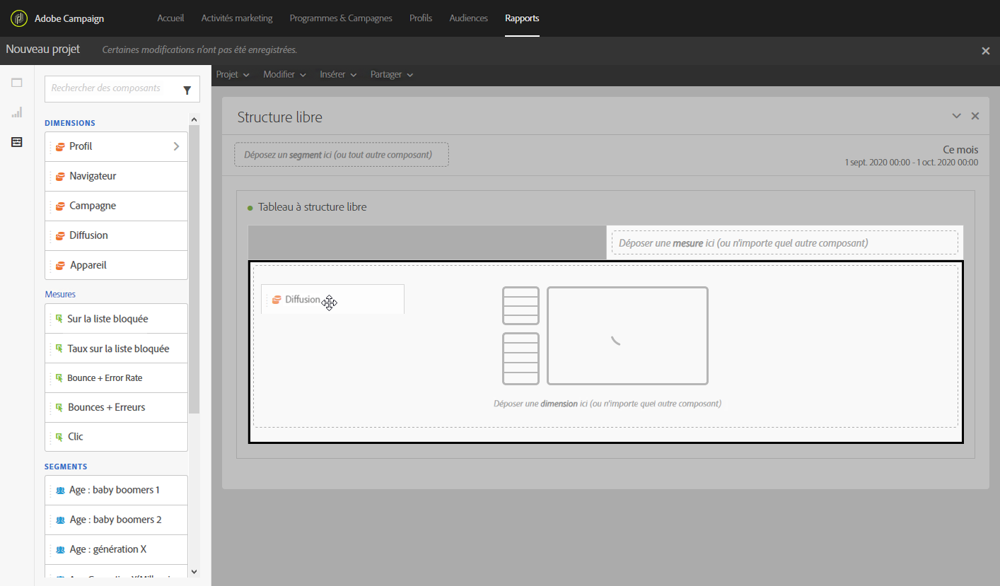

# Creating a report based on workflow segments{#creating-a-report-workflow-segment}

Après avoir créé un flux de travail et filtré votre population en une audience ciblée différente, vous pouvez mesurer l'efficacité de vos campagnes marketing en fonction des segments définis dans ce processus de ciblage.
Pour cibler ces segments dans vos rapports :

* [Étape 1 : Mise à jour des ressources personnalisées avec les segments](#step-1--update-profiles-custom-resource-segments)
* [Étape 2 : Création d'un processus avec des segments](#step-2--create-a-workflow-segments)
* [Étape 3 : Création d'un rapport dynamique pour filtrer les segments](#step-3--create-a-dynamic-report-filter-segments)

>[!CAUTION]
>L'accord d'utilisation dynamique des rapports doit être accepté pour commencer à collecter ces données.
>For more on this agreement, refer to this [page](../../reporting/using/about-dynamic-reports.md#dynamic-reporting-usage-agreement).

## Step 1: Update Profiles custom resource with segments{#step-1--update-profiles-custom-resource-segments}

Before reporting on your segment code, you need to update your **[!UICONTROL Profiles]** custom resource for your segment codes to be stored.

1. From the advanced menu, via the Adobe Campaign logo, select **[!UICONTROL Administration]** &gt; **[!UICONTROL Development]** &gt; **[!UICONTROL Custom resources]**, then select the **[!UICONTROL Profile (profile)]** resource.
1. In the **[!UICONTROL Sending logs extension]** menu from the **[!UICONTROL Data structure]** tab, check **[!UICONTROL Add segment code]** to allow storage of your segment codes from targeting workflows and to send it to dynamic reporting.

   The **[!UICONTROL Segment code]** will then be available in the **[!UICONTROL Profile]** dimension section of your report.

   

1. Enregistrez votre ressource personnalisée.

1. Vous devez maintenant publier votre ressource personnalisée.
From the advanced menu, select **[!UICONTROL Administration]** &gt; **[!UICONTROL Development]** &gt; **[!UICONTROL Publishing]**.

   

1. Cliquez sur **[!UICONTROL Préparer la publication]** puis, une fois la préparation terminée, cliquez sur le bouton **Publier.** For more information on custom resource, refer to this [page](../../developing/using/updating-the-database-structure.md).

Vous pouvez désormais commencer à créer votre flux de travail avec des codes de segment.

Note that segment codes will be collected as soon as you enable the segment code in the **[!UICONTROL Sending logs extension]**.

## Step 2: Create a workflow with segments {#step-2--create-a-workflow-segments}

>[!NOTE]
>Si la transition d'entrée de la livraison par courrier électronique est vide, le code Segment de la transition précédente sera ajouté par défaut.

Vous devez d'abord créer un flux de travail avec une population ciblée différente. Ici, nous souhaitons envoyer un courriel personnalisé selon l'âge de l'audience : une remise de 20 à 30 ans et une autre pour les profils entre 30 et 40 ans.

1. Créez votre flux de travail. For more details on how to create your workflow, refer to this [page](../../automating/using/building-a-workflow.md).

1. Add a **[!UICONTROL Query]** activity by dragging it from the palette and dropping it in the workspace.

1. Ciblez les profils de 20 à 40 ans pour les segmenter ultérieurement en populations plus ciblées.

   

1. Add a **[!UICONTROL Segmentation]** activity to split your query results into two targeted populations. For more on segmentation, refer to this [page](../../automating/using/targeting-data.md#segmenting-data).

1. Double click the **[!UICONTROL Segmentation]** activity to configure it. Edit the first segment by clicking **[!UICONTROL Edit properties]**.

   

1. Query profiles between the age of 20 to 30 and click **[!UICONTROL Confirm]** when done.

   

1. Click **[!UICONTROL Add an element]** to create your second segment and configure it as described in the steps above to target profiles between the age of 30 to 40.

1. Edit the **[!UICONTROL Segment code]** for each population to be passed on through dynamic reporting.

   >[!NOTE]
   >Cette étape est obligatoire ou vous ne pourrez pas identifier les segments sur lesquels créer des rapports.

   

1. Drag and drop an **[!UICONTROL Email delivery]** activity after your segments.

   

1. Personnalisez vos remises selon les populations ciblées différentes. For more on email creation, refer to this [page](../../designing/using/about-email-content-design.md).

1. Enregistrez le workflow.

1. Click **[!UICONTROL Start]** when your workflow is ready.

Vous pouvez maintenant accéder à vos rapports pour assurer le suivi des codes de segments.

## Step 3: Create a dynamic report to filter segments {#step-3--create-a-dynamic-report-filter-segments}

Après avoir envoyé des distributions avec votre flux de travail, vous pouvez ventiler les rapports à l'aide de vos codes de segments depuis votre flux de travail.

1. From the **[!UICONTROL Reports]** tab, select an out-of-the-box report or click the **[!UICONTROL Create new project]** button to start one from scratch.

   
1. Drag and drop the **[!UICONTROL Delivery]** dimension to your freeform table.

   

1. Drag and drop different metrics to your table such as the **[!UICONTROL Open]** and **[!UICONTROL Click]** metrics to start filtering your data.
1. In the **[!UICONTROL Dimensions]** category, click the **[!UICONTROL Profile]** dimension then drag and drop the **[!UICONTROL Segment code]** dimension on your workflow's delivery to measure the success of your email delivery depending on the targeted populations.

   

1. Faites glisser et déposez une visualisation dans votre espace de travail, le cas échéant.

   
