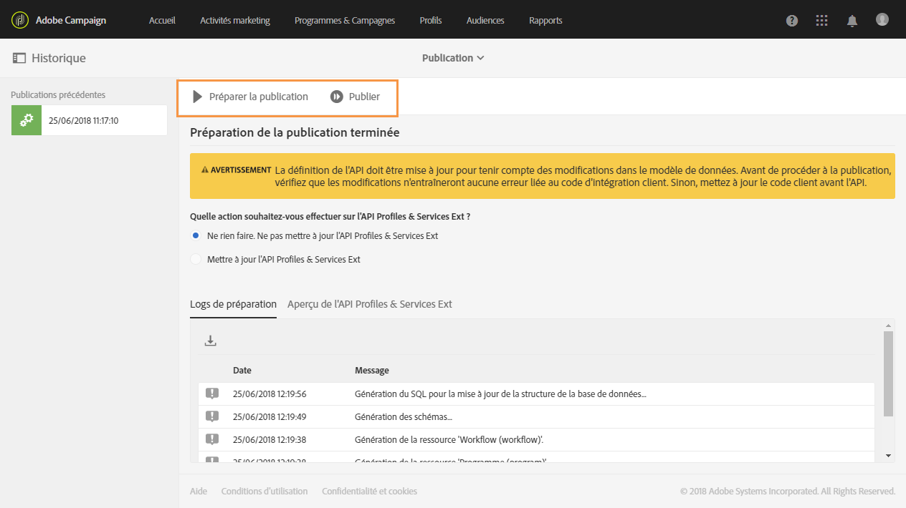
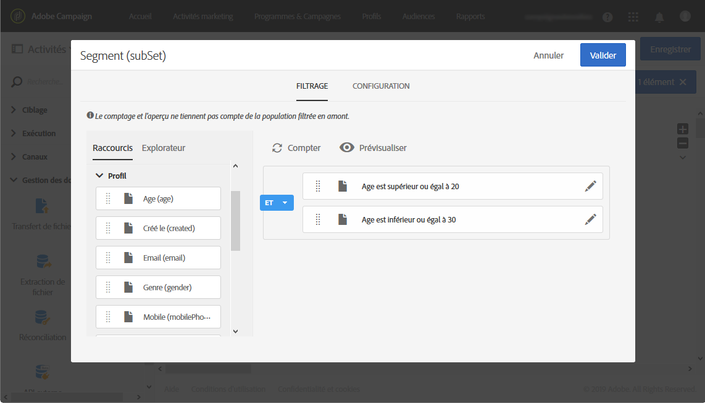

# Création d&#39;un rapport à partir des segments de workflow{#creating-a-report-workflow-segment}

Après avoir créé un workflow et filtré votre population dans une audience ciblée différente, vous pouvez mesurer l&#39;efficacité de vos campagnes marketing en fonction des segments définis dans ce workflow de ciblage.
Pour cibler ces segments dans vos rapports :

* [Etape 1 : mise à jour de la ressource personnalisée Profils avec les segments](#step-1--update-profiles-custom-resource-segments)
* [Etape 2 : création d&#39;un workflow avec des segments](#step-2--create-a-workflow-segments)
* [Etape 3 : création d&#39;un rapport dynamique pour filtrer les segments](#step-3--create-a-dynamic-report-filter-segments)

>[!CAUTION]
>Le contrat d&#39;utilisation des rapports dynamiques doit être accepté pour commencer à collecter ces données.
>Pour plus d&#39;informations sur ce contrat, consultez [cette page](../../reporting/using/about-dynamic-reports.md#dynamic-reporting-usage-agreement).

## Etape 1 : mise à jour de la ressource personnalisée Profils avec les segments{#step-1--update-profiles-custom-resource-segments}

Avant de créer des rapports sur le code segment, vous devez mettre à jour la ressource personnalisée **[!UICONTROL Profils]** pour que les codes segment soient stockés.

1. Dans le menu avancé, via le logo Adobe Campaign, sélectionnez **[!UICONTROL Administration]** > **[!UICONTROL Développement]** > **[!UICONTROL Ressources personnalisées]**, puis sélectionnez la ressource **[!UICONTROL Profil (profil)]**.
1. Dans le menu **[!UICONTROL Extension des logs d&#39;envoi]**, à partir de l&#39;onglet **[!UICONTROL Structure de données]**, cochez la case **[!UICONTROL Ajouter un code segment]** pour permettre le stockage de vos codes segment à partir des workflows de ciblage et pour les envoyer aux rapports dynamiques.

   Le **[!UICONTROL Code segment]** sera ensuite disponible dans la section de dimension **[!UICONTROL Profil]** de votre rapport.

   

1. Enregistrez votre ressource personnalisée.

1. Vous devez maintenant publier votre ressource personnalisée.
Dans le menu avancé, sélectionnez **[!UICONTROL Administration]** > **[!UICONTROL Développement]** > **[!UICONTROL Publication]**.

   

1. Cliquez sur **[!UICONTROL Préparer la publication]** puis, une fois la préparation terminée, cliquez sur le bouton **[!UICONTROL Publier]**. Pour plus d&#39;informations sur la ressource personnalisée, consultez cette [page](../../developing/using/updating-the-database-structure.md).

Vous pouvez maintenant commencer à créer votre workflow avec des codes segment.

Les codes segment seront collectés dès que vous aurez activé l&#39;option de code segment dans **[!UICONTROL Extension des logs d&#39;envoi]**.

## Etape 2 : création d&#39;un workflow avec des segments{#step-2--create-a-workflow-segments}

>[!NOTE]
>Si la transition d&#39;entrée de la diffusion email est vide, le code segment de la transition précédente sera ajouté par défaut.

Vous devez d&#39;abord créer un workflow avec une population ciblée différente. Dans le cas présent, nous souhaitons envoyer un email qui sera personnalisé en fonction de l&#39;âge de l&#39;audience : une diffusion pour les profils âgés entre 20 et 30 ans et une autre pour les profils âgés entre 30 et 40 ans.

1. Créez votre workflow. Pour plus d&#39;informations sur la création de votre workflow, consultez cette [page](../../automating/using/building-a-workflow.md).

1. Ajoutez une activité **[!UICONTROL Requête]** en la sélectionnant dans la palette et en la relâchant dans l&#39;espace de travail.

1. Ciblez les profils âgés entre 20 et 40 ans pour les segmenter ultérieurement en populations plus ciblées.

   

1. Ajoutez une activité **[!UICONTROL Segmentation]** pour diviser vos résultats de requête en deux populations ciblées. Pour plus d&#39;informations sur la segmentation, consultez cette [page](../../automating/using/segmentation.md).

1. Double-cliquez sur l&#39;activité **[!UICONTROL Segmentation]** pour la configurer. Editez le premier segment en cliquant sur **[!UICONTROL Editer les propriétés]**.

   

1. Interrogez les profils entre 20 et 30 ans et cliquez sur **[!UICONTROL Confirmer]** lorsque vous avez terminé.

   

1. Cliquez sur **[!UICONTROL Ajouter un élément]** pour créer votre second segment et configurez-le comme décrit dans la procédure ci-dessus pour cibler les profils entre 30 et 40 ans.

1. Editez le **[!UICONTROL Code segment]** pour chaque population à transmettre par le biais des rapports dynamiques.

   >[!NOTE]
   >Cette étape est obligatoire ou vous ne pourrez pas identifier les segments sur lesquels créer des rapports.

   

1. Placez une activité **[!UICONTROL Diffusion Email]** après vos segments.

   

1. Personnalisez vos diffusions selon les différentes populations ciblées. Pour plus d&#39;informations sur la création d&#39;un email, consultez cette [page](../../designing/using/designing-content-in-adobe-campaign.md).

1. Enregistrez le workflow.

1. Cliquez sur **[!UICONTROL Démarrer]** lorsque votre workflow est prêt.

Vous pouvez maintenant accéder à vos rapports pour tracker les codes segment.

## Etape 3 : création d&#39;un rapport dynamique pour filtrer les segments{#step-3--create-a-dynamic-report-filter-segments}

Après avoir envoyé des diffusions avec votre workflow, vous pouvez répartir les rapports à l&#39;aide des codes segment de votre workflow.

1. Dans l&#39;onglet **[!UICONTROL Rapports]**, sélectionnez un rapport d&#39;usine et cliquez sur le bouton **[!UICONTROL Créer un projet]** pour en lancer un à partir de zéro.

   
1. Placez la dimension **[!UICONTROL Diffusion]** dans votre tableau à structure libre.

   

1. Placez différentes mesures dans votre tableau, telles que **[!UICONTROL Ouverture]** et **[!UICONTROL Clic]**, pour commencer à filtrer vos données.
1. Dans la catégorie **[!UICONTROL Dimensions]**, cliquez sur la dimension **[!UICONTROL Profil]**, puis placez la dimension **[!UICONTROL Code segment]** sur la diffusion de votre workflow pour mesurer le succès de votre diffusion email selon les populations ciblées.

   

1. Faites glisser et déposez une visualisation dans votre espace de travail, le cas échéant.

   
