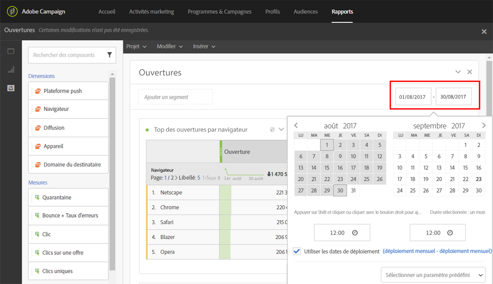

# Définir la période d'un rapport{#defining-the-report-period}

Avant de lancer un rapport ou d'y accéder, vous devez appliquer une période. La période donnée est accessible en haut à droite du rapport.

Par défaut, pour une campagne ou un programme, la période de filtrage commence à la date de début et termine à la date de fin du programme ou de la campagne. Pour une diffusion, la date de début correspond à la date d'envoi et la date de fin correspond à la date d'envoi plus 7 jours.

Pour modifier le filtre, sélectionnez une date de début et une période ou utilisez la période pré-configurée, telle que la semaine dernière, il y a deux mois, etc.

Le rapport est automatiquement mis à jour lorsqu'un filtre est appliqué ou modifié. La période de rapport sélectionnée régira les événements ayant eu lieu au cours de cette période, et non l'intégralité du jeu de données de vos diffusions créées dans l'intervalle. Par exemple, si une diffusion a été exécutée du 1er au 5 janvier et que la période de rapport est du 1er au 2 janvier, vous pourrez voir des données partielles. Cela peut affecter les nombres d'ouvertures/de clics, car les ouvertures et les clics peuvent se produire même un mois après l'envoi de la diffusion.

