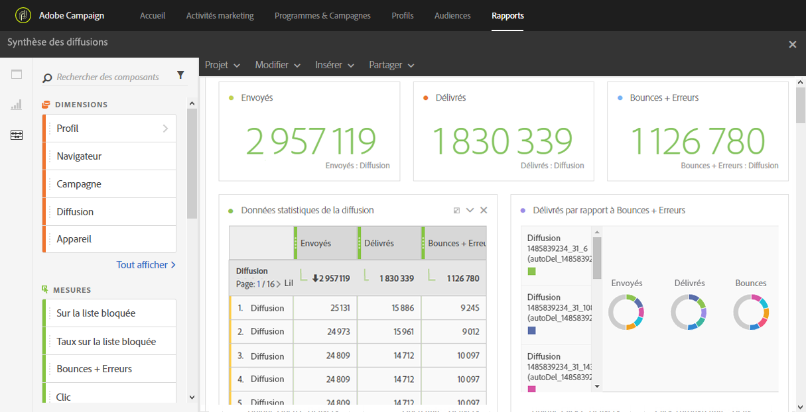

# Synthèse des diffusions (Delivery summary){#delivery-summary}

Le rapport **[!UICONTROL Synthèse des diffusions](Delivery summary) présente l'ensemble des informations principales relatives à un email, ou à plusieurs emails.**

Chaque tableau est représenté par des nombres et des graphiques de synthèse. Les paramètres de visualisation des détails vous permettent de modifier leur affichage.

Le tableau **Statistiques de diffusion** contient les données disponibles pour les emails envoyés, telles que :

* **[!UICONTROL Traités/envoyés]** : nombre total d'envois pour la diffusion.
* **[!UICONTROL Délivrés]** : nombre de messages envoyés avec succès, par rapport au nombre total de messages envoyés. Les erreurs remontées (rebonds) sont prises en compte. Cependant, les plaintes (déclarations comme spam) et les messages d'absence de type "absent du bureau" ne sont pas pris en compte.
* **[!UICONTROL Bounces + erreurs]** : nombre total d'erreurs cumulées lors des diffusions et du traitement automatique des retours par rapport au nombre total de messages envoyés.

Le tableau **Open and clicks** contient les données disponibles concernant l'activité des destinataires pour chaque diffusion, telles que :

* **Clic** : nombre de clics sur un contenu dans une diffusion.
* **Ouverture** : nombre d'ouvertures d'un message dans une diffusion.
* **Ouvertures uniques** : nombre de destinataires ayant ouvert la diffusion.
* **Clics uniques** : nombre de destinataires ayant cliqué sur un contenu dans une diffusion.

Le tableau **Répartition des domaines** affiche l'état des diffusions en fonction du domaine du destinataire.
