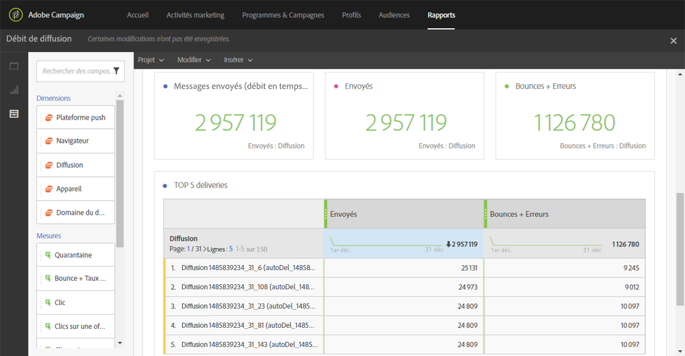

# Débit des diffusions (Delivery throughput){#delivery-throughput}

Ce rapport regroupe les informations relatives au débit de diffusion d'un envoi, ou de plusieurs envois. Ces données sont :

* nombre de messages traités par heure
* Le tableau **[!UICONTROL Top 5 des diffusions]** et les nombres de synthèse complémentaires qui affichent les cinq diffusions présentant le meilleur gain de reprise.

