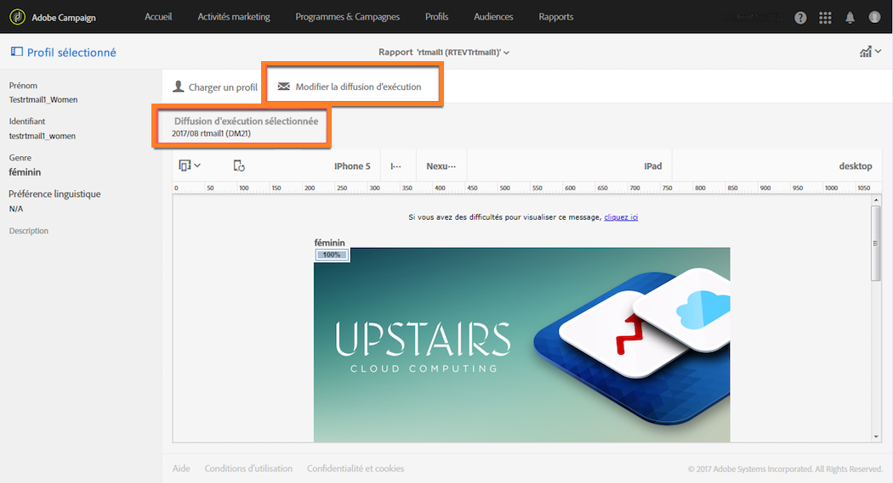

# Hot clicks{#hot-clicks}

Ce rapport est consultable au niveau de chaque diffusion ou chaque message transactionnel, à partir du bouton **[!UICONTROL Rapports].**

Il présente le contenu du message (HTML et/ou texte) avec, sur chaque lien, le pourcentage de clics sur ce lien.

Si vous avez créé du contenu dynamique pour votre diffusion, vous pouvez afficher les pourcentages de chaque condition que vous avez définie. Pour plus d'informations sur l'insertion de contenu conditionnel dans une diffusion, voir [Définir un contenu dynamique](../../designing/using/defining-dynamic-content-in-a-landing-page.md).

Imaginez par exemple que vous avez créé une diffusion avec les conditions suivantes :

* Le lien de l'image principale est différent selon que le destinataire est un homme ou une femme.
* Vous avez également ajouté un lien vers une offre spéciale visible uniquement par les destinataires de plus de 25 ans.

Once your message is sent, select **[!UICONTROL Reports]** &gt; **[!UICONTROL Hot clicks]** from the delivery dashboard.

Par défaut, aucun profil n'est sélectionné. Seuls les clics des destinataires dont le genre est inconnu et ceux âgés de moins de 25 ans ou dont l'âge est inconnu sont affichés.

Pour afficher les clics des femmes, cliquez sur le bouton **[!UICONTROL Charger un profil]et sélectionnez un profil de test féminin.** Pour afficher les clics des hommes, procédez de façon identique et sélectionnez un profil de test masculin.

Pour afficher les clics des destinataires de plus de 25 ans, cliquez sur le bouton **[!UICONTROL Charger un profil]et sélectionnez un profil de test dont la date de naissance correspond à cette condition.**

Pour en savoir plus sur les profils de test, voir [Profils de test](../../sending/using/managing-test-profiles-and-sending-proofs.md#about-test-profiles).

>[!NOTE]
>
>Le nombre de clics sur un lien spécifique est un pourcentage du nombre total de clics pour tous les contenus conditionnels d'une diffusion. Par conséquent, si vous avez défini du contenu dynamique, le total des pourcentages affichés pour un profil de test spécifique peut ne pas être égal à 100.

De même, pour les diffusions récurrentes et les messages transactionnels, vous pouvez sélectionner le profil de test correspondant au contenu dynamique que vous souhaitez afficher. Vous pouvez aussi afficher les pourcentages de clics selon la diffusion d'exécution sélectionnée.

Une diffusion d'exécution est un message technique non fonctionnel et non exploitable qui est créé dans les cas suivants :

* Chaque fois qu'une diffusion récurrente est exécutée ou mise à jour.

   Par exemple, si le workflow qui gère cette diffusion est exécuté une fois par mois, il y aura une diffusion d'exécution par mois. De plus, chaque fois que le contenu de la diffusion est mis à jour, une autre diffusion d'exécution est créée.

   Pour plus d'informations sur les diffusions email récurrentes, voir [Diffusion Email](../../automating/using/email-delivery.md).

* Par défaut, une fois par mois pour les messages transactionnels et chaque fois qu'un message transactionnel est édité et republié.

   Pour plus d'informations sur les messages transactionnels, voir [A propos des messages transactionnels](../../channels/using/about-transactional-messaging.md).

>[!NOTE]
>
>Dans la mesure où les identifiants des URL trackées sont différents pour chaque exécution, les données de hot clicks ne peuvent pas être agrégées pour toutes les diffusions d'exécution d'un message donné. Elles s'affichent pour une seule diffusion d'exécution à la fois.

Once your message is sent, select **[!UICONTROL Reports]** &gt; **[!UICONTROL Hot clicks]** from the delivery dashboard.

Par défaut, la dernière diffusion d'exécution est sélectionnée. Cliquez sur le bouton **[!UICONTROL Modifier la diffusion d'exécution]pour en sélectionner une autre.**

Seuls les pourcentages de clics pour l'exécution de la diffusion sélectionnée sont affichés.
