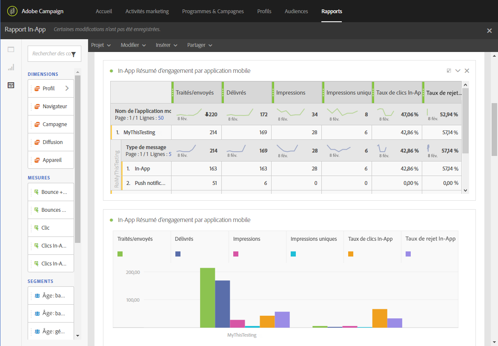
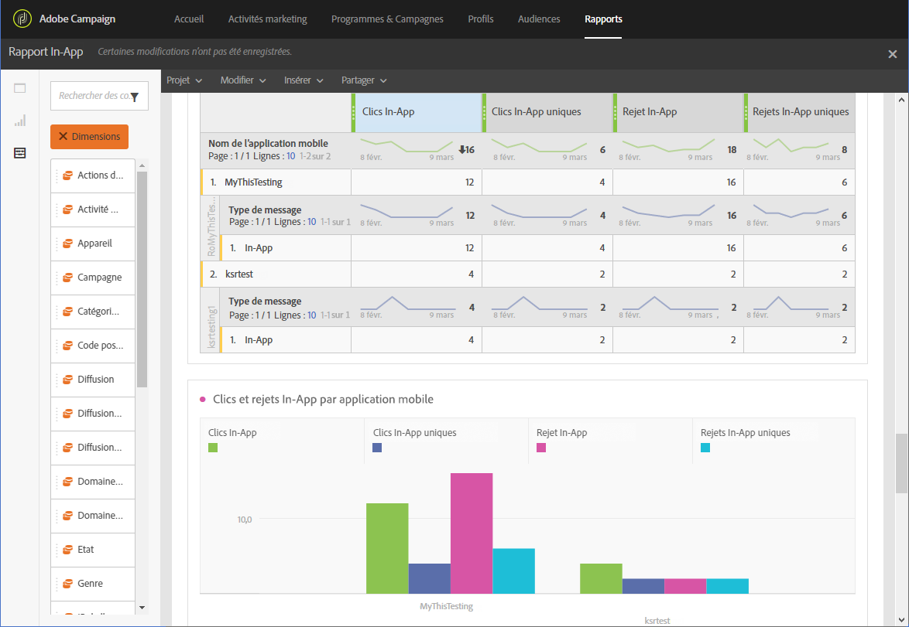

# Rapport In-App{#in-app-report}

>[!CAUTION]
>
>Vous devez faire glisser les mesures **[!UICONTROL Type de message]dans vos tableaux pour fractionner vos données en fonction de vos types de diffusion, dans ce cas des diffusions In-App.**

Le rapport **In-App** fournit des détails liés aux diffusions In-App.

Chaque tableau est représenté par des nombres et des graphiques de synthèse. Les paramètres de visualisation des détails vous permettent de modifier leur affichage.

Le premier tableau **Résumé de l'engagement In-App** (In-App Engagement Summary) est divisé en trois catégories : par jour, par application mobile et par diffusion. Il contient les données disponibles sur la réactivité du destinataire face à la diffusion :

* **[!UICONTROL Traités/Envoyés]** : nombre total d'envois pour la diffusion In-App.
* **[!UICONTROL Délivrés]** : nombre de messages In-App envoyés avec succès, par rapport au nombre total de messages envoyés.
* **[!UICONTROL Impressions]** : nombre total de messages In-App vus par les destinataires selon que le critère de déclenchement a été rempli ou non.
* **[!UICONTROL Impressions uniques]** : nombre d'impressions par destinataire.
* **[!UICONTROL Taux de clics In-App]** : pourcentage d'utilisateurs ayant cliqué sur le bouton 1 ou le bouton 2 par rapport au nombre d'utilisateurs ayant vu le message.
* **[!UICONTROL Taux de rejet In-App]** : pourcentage de messages In-App ignorés par les destinataires.

Le deuxième tableau **Clics et rejets In-App** (In-App Clicks &amp; Dismissals) est divisé en trois catégories : par jour, par application mobile et par diffusion. Il contient les données disponibles sur le comportement du destinataire par diffusion :

* **[!UICONTROL Clics In-App]** : nombre total de destinataires ayant cliqué sur le bouton 1 ou le bouton 2.
* **[!UICONTROL Clics In-App uniques]** : nombre de fois où les destinataires ont cliqué sur le bouton 1 ou le bouton 2.
* **[!UICONTROL Rejet In-App]** : nombre total de messages que les destinataires ont ignoré en cliquant sur le bouton de fermeture ou en l'ignorant automatiquement.
* **[!UICONTROL Rejet In-App unique]** : nombre de fois où les destinataires ont ignoré un message In-App.

