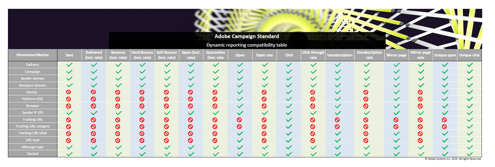

# Liste des composants {#list-of-components}

Pour plus d&#39;informations sur la compatibilité entre les dimensions et les mesures, consultez ce [tableau](/help/reporting/using/assets/dynamic_report_compatibility.pdf). Si deux composants ne sont pas compatibles, la cellule affiche la valeur **Aucun**.

## Dimensions {#dimensions}

Le tableau ci-dessous contient la liste des dimensions utilisées dans les différents rapports et leur définition.

<table> 
 <thead> 
  <tr> 
   <th> Dimension  </th> 
   <th> Définition  </th> 
  </tr> 
 </thead> 
 <tbody> 
  <tr> 
   <td> Navigateur  </td> 
   <td> Navigateur dans lequel le message a été ouvert ou a fait l’objet d’un clic.  </td> 
  </tr> 
  <tr> 
   <td> Campagne  </td> 
   <td> Libellé et identifiant de votre campagne.  </td> 
  </tr> 
  <tr> 
   <td> Ville  </td> 
   <td> Ville enregistrée dans le profil du destinataire.  </td> 
  </tr> 
  <tr> 
   <td> Pays/zone géographique  </td> 
   <td> Pays enregistré dans le profil du destinataire.  </td> 
  </tr> 
  <tr> 
   <td> Diffusion  </td> 
   <td> Libellé et identifiant de la diffusion.  </td> 
  </tr> 
  <tr> 
   <td> Appareil  </td> 
   <td> Appareil sur lequel l’email/le SMS/la notification push ont été ouverts/vus ou ont fait l’objet d’un clic.  </td> 
  </tr> 
  <tr> 
   <td> Raison de l'échec  </td> 
   <td> Types d'erreurs qui provoquaient des bounces pour chaque diffusion (par exemple : utilisateur inconnu, domaine non valide ou boîte pleine).  </td> 
  </tr> 
  <tr> 
   <td> Genre  </td> 
   <td> Genre du destinataire (masculin ou féminin). Si le champ Genre est vide dans le profil du destinataire, la valeur sera aucune.  </td> 
  </tr> 
  <tr> 
   <td> Actions de message In-App  </td> 
   <td> Actions sur le message In-App diffusé, par exemple actions sur le bouton 1 ou 2 ou masquage.  </td> 
  </tr> 
  <tr> 
   <td> Type de message  </td> 
   <td> Canal utilisé pour la diffusion, par exemple email, SMS, notification push ou In-App.  </td> 
  </tr> 
  <tr> 
   <td> Nom de l’application mobile  </td> 
   <td> Nom de l’application mobile.  </td> 
  </tr> 
  <tr> 
   <td> Plateforme  </td> 
   <td> Plateforme de l’appareil sur lequel le message a été ouvert/vu ou a fait l’objet d’un clic.  </td> 
  </tr> 
  <tr> 
   <td> Profil  </td> 
   <td> Regroupe les champs de paramètres d'usine et de profil personnalisé créés lors de l'extension de la ressource de profil. Pour plus d'informations, consultez cette <a href="../../developing/using/key-steps-to-add-a-resource.md">page</a> ou cet <a href="../../reporting/using/creating-a-custom-profile-dimension.md">exemple</a>.  Notez que les données de cette dimension sont récupérées dès la publication de la ressource personnalisée liée au champ de profil.  </td> 
  </tr> 
  <tr> 
   <td> Plateforme push  </td> 
   <td> Plateforme de l’appareil sur lequel la notification push a été ouverte (iOS ou Android, par exemple).  </td> 
  </tr> 
  <tr> 
   <td> Domaine du destinataire  </td> 
   <td> Domaine utilisé pour ouvrir l’email.  </td> 
  </tr> 
  <tr> 
   <td> Diffusion récurrente  </td> 
   <td> Libellé et identifiant de la diffusion récurrente.  </td> 
  </tr> 
  <tr> 
   <td> Domaine de l'expéditeur  </td> 
   <td> Domaine utilisé pour envoyer l'email.  </td> 
  </tr> 
  <tr> 
   <td> IP de l'expéditeur  </td> 
   <td> Adresse IP utilisée pour envoyer l'email.  </td> 
  </tr> 
  <tr> 
   <td> Etat  </td> 
   <td> Etat enregistré dans le profil du destinataire.  </td> 
  </tr> 
  <tr> 
   <td> URL de tracking  </td> 
   <td> URL sur laquelle a cliqué l’utilisateur dans le message.  </td> 
  </tr> 
  <tr> 
   <td> Catégorie de l’URL de tracking  </td> 
   <td> Catégorie affectée à l’URL de tracking.  </td> 
  </tr> 
  <tr> 
   <td> Libellé de l’URL de tracking  </td> 
   <td> Libellé attribué à l'URL (page miroir, contactez-nous ou ouvrir, par exemple).  </td> 
  </tr> 
  <tr> 
   <td> Diffusion transactionnelle  </td> 
   <td> Libellé et identifiant de la diffusion transactionnelle.  </td> 
  </tr> 
  <tr> 
   <td> Variante  </td> 
   <td> Variante de l’email en cas de test A/B.  </td> 
  </tr> 
 </tbody> 
</table>

## Mesures        {#metrics}

Les tableaux ci-dessous contiennent la liste des mesures utilisées dans les différents rapports et leur définition.

### Mesures des emails et SMS        {#email-and-sms-metrics}

<table> 
 <thead> 
  <tr> 
   <th> Mesure  </th> 
   <th> Définition  </th> 
  </tr> 
 </thead> 
 <tbody> 
  <tr> 
   <td> Sur la liste bloquée  </td> 
   <td> Nombre de destinataires ayant déclaré un email comme étant un spam ou un courrier indésirable.  </td> 
  </tr> 
  <tr> 
   <td> Taux sur la liste bloquée  </td> 
   <td> Pourcentage de diffusions marquées sur la liste bloquée.  </td> 
  </tr> 
  <tr> 
   <td> Bounces + Erreurs  </td> 
   <td> Nombre total d'erreurs cumulées lors des diffusions et du traitement automatique des retours par rapport au nombre total de messages envoyés.  </td> 
  </tr> 
  <tr> 
   <td> Taux Bounces + Erreurs  </td> 
   <td> Pourcentage d'emails qui ont fait l'objet d'un bounce par rapport au nombre d'emails envoyés.  </td> 
  </tr> 
  <tr> 
   <td> Clics  </td> 
   <td> Nombre de clics sur un contenu dans une diffusion.  </td> 
  </tr> 
  <tr> 
   <td> Taux de clics  </td> 
   <td> Pourcentage de clics dans une diffusion.  </td> 
  </tr> 
  <tr> 
   <td> Delivrés  </td> 
   <td> Nombre de messages envoyés avec succès, par rapport au nombre total de messages envoyés.  </td> 
  </tr> 
  <tr> 
   <td> Taux de délivrabilité  </td> 
   <td> Pourcentage de messages envoyés avec succès.  </td> 
  </tr> 
  <tr> 
   <td> Hard bounce  </td> 
   <td> Nombre total d’erreurs permanentes, telles qu’une adresse email incorrecte.  </td> 
  </tr> 
  <tr> 
   <td> Taux de hard bounce  </td> 
   <td> Pourcentage de diffusions en erreur en raison d'erreurs permanentes.  </td> 
  </tr> 
  <tr> 
   <td> Page miroir  </td> 
   <td> Nombre de destinataires ayant cliqué sur le lien de la page miroir.  </td> 
  </tr> 
  <tr> 
   <td> Taux de page miroir  </td> 
   <td> Pourcentage de clics sur le lien de la page miroir par rapport au nombre total de messages de la diffusion.  </td> 
  </tr> 
  <tr> 
   <td> Clics sur une offre  </td> 
   <td> Nombre de clics sur une offre dans une diffusion.  </td> 
  </tr> 
  <tr> 
   <td> Taux de clics de l'offre  </td> 
   <td> Pourcentage de clics sur une offre.  </td> 
  </tr> 
  <tr> 
   <td> Ouvertures  </td> 
   <td> Nombre d'ouvertures d'un message dans une diffusion.  </td> 
  </tr> 
  <tr> 
   <td> Taux d'ouverture  </td> 
   <td> Pourcentage de messages ouverts.  </td> 
  </tr> 
  <tr> 
   <td> Traités/envoyés  </td> 
   <td> Nombre total d’envois pour la diffusion.  </td> 
  </tr> 
  <tr> 
   <td> Quarantaine  </td> 
   <td> Nombre de messages qui ont fait l’objet d’un bounce et qui ont entraîné la mise en quarantaine de l’adresse.  </td> 
  </tr> 
  <tr> 
   <td> Taux de mise en quarantaine  </td> 
   <td> Pourcentage de mises en quarantaine par rapport au nombre de messages envoyés.  </td> 
  </tr> 
  <tr> 
   <td> Rejetés  </td> 
   <td> Nombre de messages classés comme spam par les serveurs SMTP.  </td> 
  </tr> 
  <tr> 
   <td> Taux de rejet  </td> 
   <td> Pourcentage de messages marqués comme rejetés.  </td> 
  </tr> 
  <tr> 
   <td> Soft bounce  </td> 
   <td> Nombre total d’erreurs temporaires, telles qu’une boîte de réception pleine.  </td> 
  </tr> 
  <tr> 
   <td> Taux de soft bounces  </td> 
   <td> Pourcentage de diffusions en erreur pour une raison temporaire.  </td> 
  </tr> 
  <tr> 
   <td> Clics uniques  </td> 
   <td> Nombre de destinataires ayant cliqué sur un contenu dans une diffusion.  </td> 
  </tr> 
  <tr> 
   <td> Ouvertures uniques  </td> 
   <td> Nombre de destinataires ayant ouvert la diffusion.  </td> 
  </tr> 
  <tr> 
   <td> Taux de désabonnement  </td> 
   <td> Pourcentage de désabonnements par destinataire par rapport au nombre de messages délivrés.  </td> 
  </tr> 
  <tr> 
   <td> Désabonnement  </td> 
   <td> Nombre de clics sur le lien de désabonnement.  </td> 
  </tr> 
 </tbody> 
</table>

### Mesures des notifications push        {#push-notification-metrics}

<table> 
 <thead> 
  <tr> 
   <th> Mesure  </th> 
   <th> Définition  </th> 
  </tr> 
 </thead> 
 <tbody> 
  <tr> 
   <td> Bounces + Erreurs  </td> 
   <td> Nombre total d'erreurs cumulées lors des diffusions par rapport au nombre total de messages envoyés, par exemple erreurs du MCPNS ou du fournisseur.  </td> 
  </tr> 
  <tr> 
   <td> Taux Bounces + Erreurs  </td> 
   <td> Pourcentage de notifications push qui ont fait l'objet d'un bounce par rapport au nombre de notifications push envoyées.  </td> 
  </tr> 
  <tr> 
   <td> Clics  </td> 
   <td> Nombre de fois qu'une notification push a été diffusée sur l'appareil et a fait l'objet d'un clic par l'utilisateur. L'utilisateur souhaitait afficher la notification, qui sera déplacée vers le tracking Ouverture push, ou l'ignorer.  </td> 
  </tr> 
  <tr> 
   <td> Taux de clics  </td> 
   <td> Pourcentage d'utilisateurs ayant interagi avec la notification push.  </td> 
  </tr> 
  <tr> 
   <td> Delivrés  </td> 
   <td> Nombre de notifications push envoyées avec succès, par rapport au nombre total de notifications push envoyées.  </td> 
  </tr> 
  <tr> 
   <td> Taux de délivrabilité  </td> 
   <td> Pourcentage de notifications push envoyées avec succès.  </td> 
  </tr> 
  <tr> 
   <td> Impressions  </td> 
   <td> Nombre de fois qu'une notification push a été diffusée sur l'appareil et laissée intacte dans le centre de notification. Dans la plupart des cas, le nombre d'impressions doit être similaire au nombre délivrés. Cela garantit que l'appareil reçoit le message et transmet cette information au serveur.  </td> 
  </tr> 
  <tr> 
   <td> Traités/envoyés  </td> 
   <td> Nombre total de notifications push envoyées.  </td> 
  </tr> 
  <tr> 
   <td> Ouvertures  </td> 
   <td> Nombre total de notifications push diffusées sur l'appareil et ayant fait l'objet d'un clic par les utilisateurs ouvrant l'application. Cette mesure est similaire au Clic push, sauf qu'une Ouverture push ne sera pas déclenchée si la notification a été ignorée.  </td> 
  </tr> 
  <tr> 
   <td> Taux d'ouverture  </td> 
   <td> Pourcentage de notifications push ouvertes.  </td> 
  </tr> 
  <tr> 
   <td> Clics uniques  </td> 
   <td> Nombre de fois où un utilisateur unique interagit avec la notification push, par exemple clics sur la notification ou le bouton.  </td> 
  </tr> 
  <tr> 
   <td> Impressions uniques  </td> 
   <td> Nombre d'impressions par destinataire.  </td> 
  </tr> 
  <tr> 
   <td> Ouvertures uniques  </td> 
   <td> Nombre de destinataires ayant ouvert la diffusion.  </td> 
  </tr> 
 </tbody> 
</table>

### Mesures In-App        {#in-app-metrics}

<table> 
 <thead> 
  <tr> 
   <th> Mesure  </th> 
   <th> Définition  </th> 
  </tr> 
 </thead> 
 <tbody> 
  <tr> 
   <td> Delivrés  </td> 
   <td> Nombre total de messages In-App remis à l'appareil par le fournisseur.  </td> 
  </tr> 
  <tr> 
   <td> Impressions  </td> 
   <td> Nombre total de messages In-App vus par les destinataires selon que le critère de déclenchement a été rempli ou non.  </td> 
  </tr> 
  <tr> 
   <td> Clics In-App   </td> 
   <td> Nombre total de destinataires ayant cliqué sur le bouton 1 ou le bouton 2.  </td> 
  </tr> 
  <tr> 
   <td> Taux de clics In-App  </td> 
   <td> Pourcentage d'utilisateurs ayant cliqué sur le bouton 1 ou le bouton 2 par rapport au nombre d'utilisateurs ayant vu le message.  </td> 
  </tr> 
  <tr> 
   <td> Rejet In-App  </td> 
   <td> Nombre total de messages que les destinataires ont ignoré en cliquant sur le bouton de fermeture ou en l'ignorant automatiquement.  </td> 
  </tr> 
  <tr> 
   <td> Taux de rejet In-App  </td> 
   <td> Pourcentage de messages In-App ignorés par les destinataires.  </td> 
  </tr> 
  <tr> 
   <td> Traités/envoyés  </td> 
   <td> Nombre total de messages In-App envoyés depuis Adobe Campaign dans le cadre du processus d'envoi de la diffusion.  </td> 
  </tr> 
  <tr> 
   <td> Impressions uniques  </td> 
   <td> Nombre d'impressions par un destinataire unique.  </td> 
  </tr> 
  <tr> 
   <td> Clics In-App uniques  </td> 
   <td> Nombre de fois où les destinataires ont cliqué sur le bouton 1 ou le bouton 2.  </td> 
  </tr> 
  <tr> 
   <td> Rejets In-App uniques  </td> 
   <td> Nombre de fois où les destinataires ont ignoré un message In-App.  </td> 
  </tr> 
 </tbody> 
</table>

## Segments {#segments}

>[!NOTE]
>
>Par défaut, le segment **[!UICONTROL Exclure le BAT]** est déjà sélectionné pour filtrer vos rapports, mais il peut être modifié si nécessaire.

Le tableau ci-dessous contient la liste des segments utilisés dans les différents rapports et leur définition.

<table> 
 <thead> 
  <tr> 
   <th> Segment  </th> 
   <th> Définition  </th> 
  </tr> 
 </thead> 
 <tbody> 
  <tr> 
   <td> Age : baby boomers 1  </td> 
   <td> Destinataires nés entre 1946 et 1954.  </td> 
  </tr> 
  <tr> 
   <td> Age : baby boomers 2  </td> 
   <td> Destinataires nés entre 1955 et 1965.  </td> 
  </tr> 
  <tr> 
   <td> Age : de 18 à 25 ans  </td> 
   <td> Destinataires âgés de 18 à 25 ans.  </td> 
  </tr> 
  <tr> 
   <td> Age : de 26 à 30 ans  </td> 
   <td> Destinataires âgés de 26 à 30 ans.  </td> 
  </tr> 
  <tr> 
   <td> Age : de 31 à 40 ans  </td> 
   <td> Destinataires âgés de 31 à 40 ans.  </td> 
  </tr> 
  <tr> 
   <td> Age : de 41 à 50 ans  </td> 
   <td> Destinataires âgés de 41 à 50 ans.  </td> 
  </tr> 
  <tr> 
   <td> Age : génération X  </td> 
   <td> Destinataires nés entre 1966 et 1976.  </td> 
  </tr> 
  <tr> 
   <td> Age : génération Y (enfants du millénaire)  </td> 
   <td> Destinataires nés entre 1977 et 1994.  </td> 
  </tr> 
  <tr> 
   <td> Age : génération Z  </td> 
   <td> Destinataires nés entre 1995 et aujourd'hui.  </td> 
  </tr> 
  <tr> 
   <td> Age : plus de 50 ans  </td> 
   <td> Destinataires dont l'âge est supérieur à 50 ans.  </td> 
  </tr> 
  <tr> 
   <td> Age : moins de 25 ans  </td> 
   <td> Destinataires dont l'âge est inférieur à 25 ans.  </td> 
  </tr> 
  <tr> 
   <td> Age : moins de 30 ans  </td> 
   <td> Destinataires dont l'âge est inférieur à 30 ans.  </td> 
  </tr> 
  <tr> 
   <td> Age : moins de 40 ans  </td> 
   <td> Destinataires dont l'âge est inférieur à 40 ans.  </td> 
  </tr> 
  <tr> 
   <td> Age : moins de 50 ans  </td> 
   <td> Destinataires dont l'âge est inférieur à 50 ans.  </td> 
  </tr> 
  <tr> 
   <td> Age : génération silencieuse  </td> 
   <td> Destinataires nés en 1945 ou avant.  </td> 
  </tr> 
  <tr> 
   <td> Toutes les visites  </td> 
   <td> Tous les destinataires  </td> 
  </tr> 
    <tr> 
   <td> Exclure le BAT  </td> 
   <td> Exclure les BAT de vos rapports  </td> 
  </tr> 
 </tbody> 
</table>

