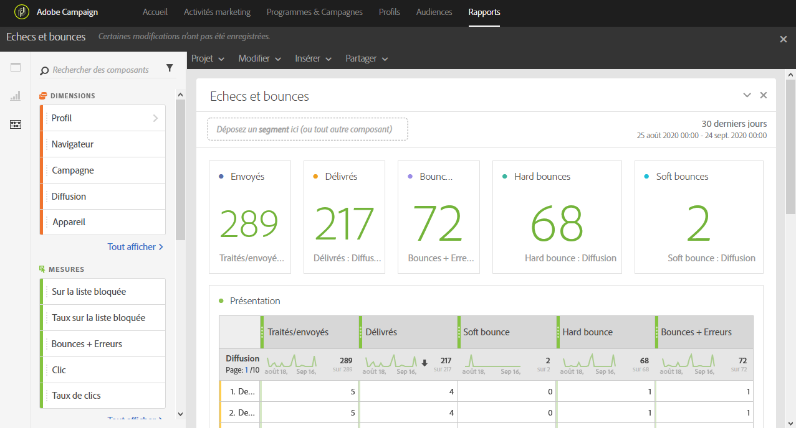

# Echecs et bounces{#non-deliverables-and-bounces}

Le rapport **[!UICONTROL Echecs et bounces]** fournit des détails sur toutes les erreurs rencontrées lors d&#39;une diffusion.

Le tableau **[!UICONTROL Présentation]** contient les données disponibles concernant les erreurs potentielles pour chaque diffusion, telles que :

* **Traités/envoyés** : nombre d&#39;emails envoyés.
* **Délivrés** : nombre d&#39;emails délivrés.
* **Soft bounce** : nombre total d&#39;erreurs temporaires, telles qu&#39;une boîte de réception pleine.
* **Hard bounce** : nombre total d&#39;erreurs permanentes, telles qu&#39;une adresse email incorrecte.
* **Bounces + Erreurs** : nombre d&#39;emails qui n&#39;ont pas pu être livrés.

Le tableau **Répartition par domaine** liste les bounce par domaine des destinataires.
