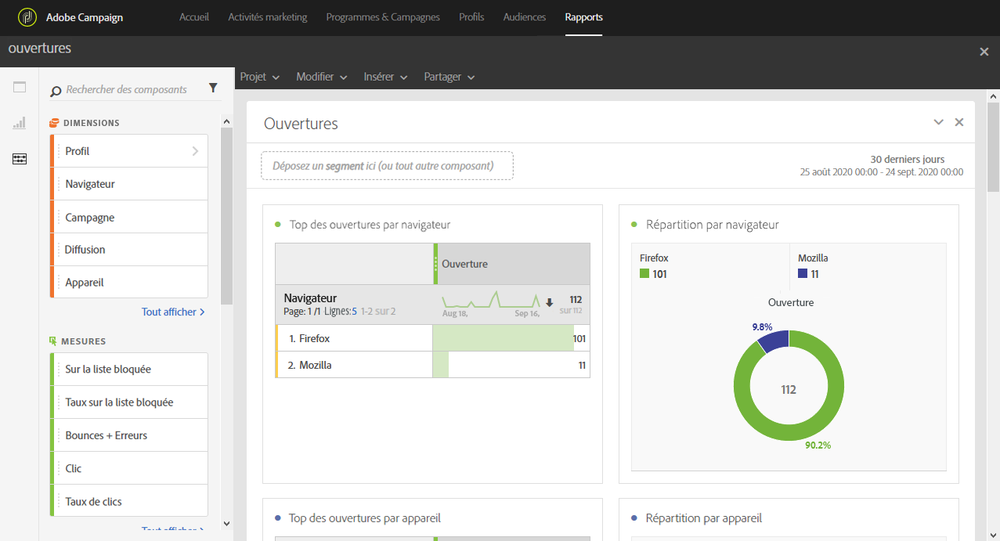

# Ouvertures{#opens}

Le rapport **[!UICONTROL Ouvertures]** permet d&#39;identifier les diffusions qui ont été les plus visionnées par les destinataires.

Quatre tableaux et graphiques offrent une répartition du nombre total de destinataires ayant ouvert un email, en fonction de leur :

* Navigateur
* Appareil
* Plate-forme
* Domaine

Les tableaux et graphiques **[!UICONTROL TOP 5]** affichent les diffusions ayant le plus grand nombre de messages délivrés.
