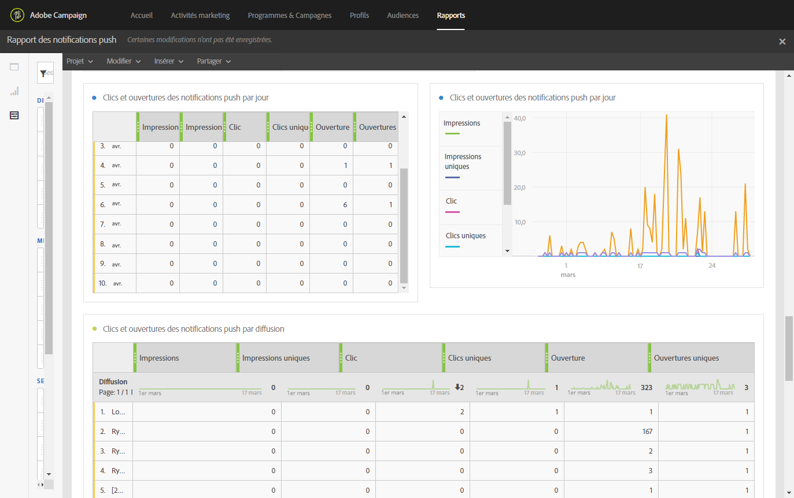

# Rapport des notifications push (Push notification){#push-notification-report}

>[!CAUTION]
>
>Vous devez faire glisser les mesures **[!UICONTROL Type de message]dans vos tableaux pour fractionner vos données en fonction de vos types de diffusion, dans ce cas des diffusions Notification push.**

Le rapport **notification push** (Push notification) fournit des informations détaillées sur les performances marketing des notifications push dans Adobe Campaign. Ce rapport d'usine permet de comprendre comment les utilisateurs interagissent avec les notifications push, les applications mobiles et les diffusions.

Une configuration est nécessaire dans l'application mobile pour mettre en œuvre le tracking des notifications push. Pour obtenir les étapes détaillées, consultez cette [page](https://helpx.adobe.com/campaign/kb/push-tracking.html).

Chaque tableau est représenté par des nombres et des graphiques de synthèse. Les paramètres de visualisation des détails vous permettent de modifier leur affichage.

Le premier tableau **Résumé d'engagement des notifications push** (Push notification Engagement Summary) est divisé en trois catégories : par jour, par application mobile et par diffusion. Il contient les données disponibles sur la réactivité du destinataire face à la diffusion :

* **[!UICONTROL Traités/envoyés]** : nombre total de notifications push envoyées.
* **[!UICONTROL Délivrés]** : nombre de notifications push envoyées avec succès, par rapport au nombre total de notifications push envoyées.
* **[!UICONTROL Impressions]** : nombre total de notifications push vues par les destinataires.
* **[!UICONTROL Impressions uniques]** : nombre d'impressions par destinataire.
* **[!UICONTROL Taux de clics]** : pourcentage d'utilisateurs ayant interagi avec la notification push.
* **[!UICONTROL Taux d'ouverture]** : pourcentage de notifications push ouvertes.

Le deuxième tableau **Clics et ouvertures des notifications push** (Push notification Clicks &amp; opens) est divisé en trois catégories : par jour, par application mobile et par diffusion. Il contient les données disponibles sur le comportement du destinataire par diffusion :

* **[!UICONTROL Impressions]** : nombre total de notifications push vues par les destinataires.
* **[!UICONTROL Impressions uniques]** : nombre d'impressions par destinataire.
* **[!UICONTROL Clic]** : nombre de fois où les utilisateurs interagissent avec la notification push, par exemple clics sur la notification ou le bouton.
* **[!UICONTROL Clics uniques]** : nombre de fois où un utilisateur unique interagit avec la notification push, par exemple clics sur la notification ou le bouton.
* **[!UICONTROL Ouverture]** : nombre total d'applications lancées lorsque les utilisateurs ouvrent la notification push.
* **[!UICONTROL Ouvertures uniques]** : nombre de destinataires ayant ouvert la diffusion.

