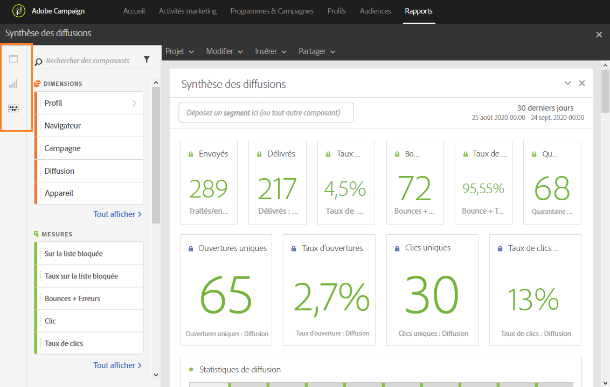
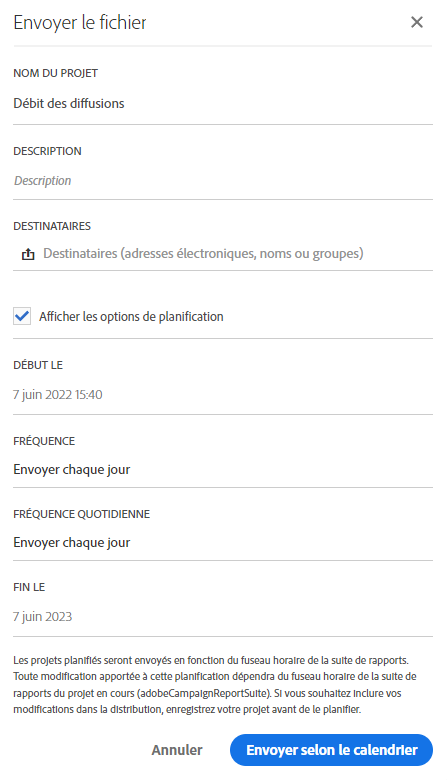

# Interface du reporting{#reporting-interface}

La barre d'outils supérieure vous permet de modifier, d'enregistrer ou d'imprimer votre rapport, par exemple.

Utilisez l'onglet **Projet** pour :

* **Ouvrir...** : ouvre un rapport ou un modèle créé précédemment.
* **Enregistrer sous...** : duplique les modèles pour les rendre modifiables.
* **Actualiser le projet** : met à jour votre rapport en fonction des nouvelles données et des changements de filtre.
* **Télécharger CSV** : exporte vos rapports sous forme de fichier CSV.

L'onglet **Modifier** vous permet de :

* **Annuler** : annule la dernière action effectuée sur votre tableau de bord.
* **Effacer tout** : supprime tous les panneaux sur votre tableau de bord.

Le tableau **Insérer** vous permet de personnaliser vos rapports en ajoutant des graphiques et des tableaux à votre tableau de bord :

* **Nouveau panneau vierge** : ajoute un nouveau panneau vierge à votre tableau de bord.
* **Nouvelle structure libre** : ajoute une nouvelle structure libre à votre tableau de bord.
* **Nouvelle ligne** : ajoute un nouveau graphique linéaire à votre tableau de bord.
* **Nouvelle barre** : ajoute un nouveau graphique en barres à votre tableau de bord.

**Rubriques connexes :**

* [Ajouter des panneaux](../../reporting/using/adding-panels.md)
* [Ajouter des visualisations](../../reporting/using/adding-visualizations.md)
* [Ajouter des composants](../../reporting/using/adding-components.md)
* [Partage automatique de rapports avec les parties prenantes par courriel](https://helpx.adobe.com/campaign/kb/simplify-campaign-management.html#Reportandshareinsightswithallstakeholders)

## Onglets  {#tabs}

Les onglets de gauche vous permettent de créer votre rapport et de filtrer les données selon les besoins.

Ces onglets vous donnent accès aux éléments suivants :

* **[!UICONTROL Panneaux]** : ajoutez un panneau vide ou une forme libre à votre rapport pour commencer à filtrer les données. Voir à ce propos la section Ajouter des panneaux.
* **[!UICONTROL Visualisations]** : déposez une sélection d'éléments de visualisation pour donner à votre rapport une dimension graphique. Voir à ce propos la section Ajouter des visualisations.
* **[!UICONTROL Composants]** : permettent de personnaliser les rapports grâce à différentes dimensions, valeurs métriques et périodes et à différents segments.

## Barre d'outils {#toolbar}

La barre d'outils se trouve au-dessus de votre espace de travail. Composée de différents onglets, elle permet de modifier, d'enregistrer, de partager ou d'imprimer votre rapport, par exemple.

**Rubriques connexes :**

* [Ajouter des panneaux](../../reporting/using/adding-panels.md)
* [Ajouter des visualisations](../../reporting/using/adding-visualizations.md)
* [Ajouter des composants](../../reporting/using/adding-components.md)

### Onglet Projet  {#project-tab}

Utilisez l'onglet **Projet** pour :

* **Ouvrir...** : ouvre un rapport ou un modèle créé précédemment.
* **Enregistrer sous...** : duplique les modèles pour les rendre modifiables.
* **Actualiser le projet** : met à jour votre rapport en fonction des nouvelles données et des changements de filtre.
* **Télécharger CSV** : exporte vos rapports sous forme de fichier CSV.
* **[!UICONTROL Imprimer]** : imprime votre rapport.

### Onglet Modifier {#edit-tab}

L'onglet **Modifier** vous permet de :

* **Annuler** : annule la dernière action effectuée sur votre tableau de bord.
* **Effacer tout** : supprime tous les panneaux sur votre tableau de bord.

### Onglet Insérer  {#insert-tab}

L'onglet **Insérer** vous permet de personnaliser vos rapports en ajoutant des graphiques et des tableaux à votre tableau de bord :

* **Nouveau panneau vierge** : ajoute un nouveau panneau vierge à votre tableau de bord.
* **Nouvelle structure libre** : ajoute une nouvelle structure libre à votre tableau de bord.
* **Nouvelle ligne** : ajoute un nouveau graphique linéaire à votre tableau de bord.
* **Nouvelle barre** : ajoute un nouveau graphique en barres à votre tableau de bord.

### Onglet Partager  {#share-tab}

L'onglet **[!UICONTROL Partager]** permet d'envoyer vos rapports aux utilisateurs d'Adobe Campaign par le biais d'emails ponctuels ou récurrents. Les utilisateurs ciblés recevront alors votre rapport joint à un email.

* **[!UICONTROL Envoyer le rapport maintenant]** : envoyez votre rapport à une liste de destinataires sélectionnés par le biais d'un email ponctuel.

   1. Au besoin, dans la fenêtre **[!UICONTROL Envoyer le rapport]**, ajoutez une description.

      

   1. Pour sélectionner les destinataires de votre email, cliquez sur le champ et sélectionnez-les dans la liste déroulante ou saisissez leur adresse email.
   1. Cochez la case **[!UICONTROL Afficher les options de planification]** si vous souhaitez envoyer des emails récurrents. Vous pouvez également sélectionner l'option **[!UICONTROL Envoyer le rapport d'après le planning]** dans l'onglet **[!UICONTROL Partager]**.
   1. Cliquez sur **[!UICONTROL Envoyer maintenant]**. Les destinataires recevront alors votre rapport joint à un email.

* **[!UICONTROL Envoyer le rapport d'après le planning]** : planifiez votre rapport et envoyez des emails récurrents à vos destinataires.

   1. Au besoin, dans la fenêtre **[!UICONTROL Envoyer le rapport]**, ajoutez une description.
   1. Pour sélectionner les destinataires de votre email, cliquez sur le champ et sélectionnez-les dans la liste déroulante ou saisissez leur adresse email.

      

   1. Dans les champs **[!UICONTROL Début le]** et **[!UICONTROL Fin le]**, sélectionnez les dates de début et de fin pour configurer la validité de l'email.
   1. Sélectionnez la fréquence d'envoi de votre email.

      

   1. Cliquez sur **[!UICONTROL Envoyer selon le calendrier]**. Vos destinataires recevront votre email récurrent selon la fréquence sélectionnée.

* **[!UICONTROL Rapports planifiés]** : trouvez et configurez tous vos rapports planifiés.

   1. Dans la fenêtre **[!UICONTROL Rapports planifiés]**, trouvez tous les rapports récurrents envoyés.

      

   1. Si vous devez supprimer un des rapports planifiés, sélectionnez-le, puis cliquez sur **[!UICONTROL Supprimer la section]**.
   1. Pour configurer ou vérifier les rapports planifiés, cliquez directement sur le rapport à modifier.
   1. La fenêtre **[!UICONTROL Modifier le rapport planifié]** s'affiche. Vous pouvez maintenant modifier les destinataires ou la fréquence de votre email en cas de besoin.

Les utilisateurs ciblés recevront alors votre rapport joint à un email directement dans leur boîte de messagerie. Les utilisateurs peuvent choisir de ne plus recevoir les emails récurrents en cliquant sur le lien de désinscription qui se trouve dans chaque email récurrent.

**Rubrique connexe :**

* [Partage automatique de rapports avec les parties prenantes par courriel](https://helpx.adobe.com/campaign/kb/simplify-campaign-management.html#Reportandshareinsightswithallstakeholders)
