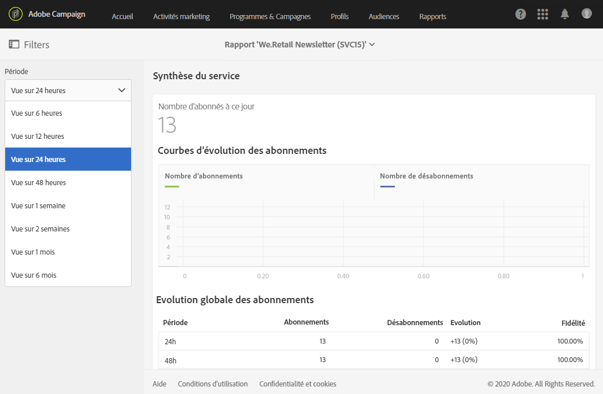

# Synthèse du service{#service-summary}

Le rapport **[!UICONTROL Synthèse du service]** présente en détail l’évolution des abonnements et des désabonnements de votre service.
Ce rapport n’est accessible qu’à partir de la page Service, par le biais du menu avancé **[!UICONTROL Profils &amp; audiences]** > **[!UICONTROL Services]**. Pour plus d’informations à ce propos, consultez [cette page](../../audiences/using/monitoring-subscriptions.md#service-reports).

La visualisation des **[!UICONTROL courbes d’évolution des abonnements]** montre le nombre d’abonnements et de désabonnements en fonction de la **[!UICONTROL période]** sélectionnée dans la barre déroulante.

L’**[!UICONTROL évolution globale des abonnements]** permet de voir l’évolution de vos abonnés sur différentes périodes.
