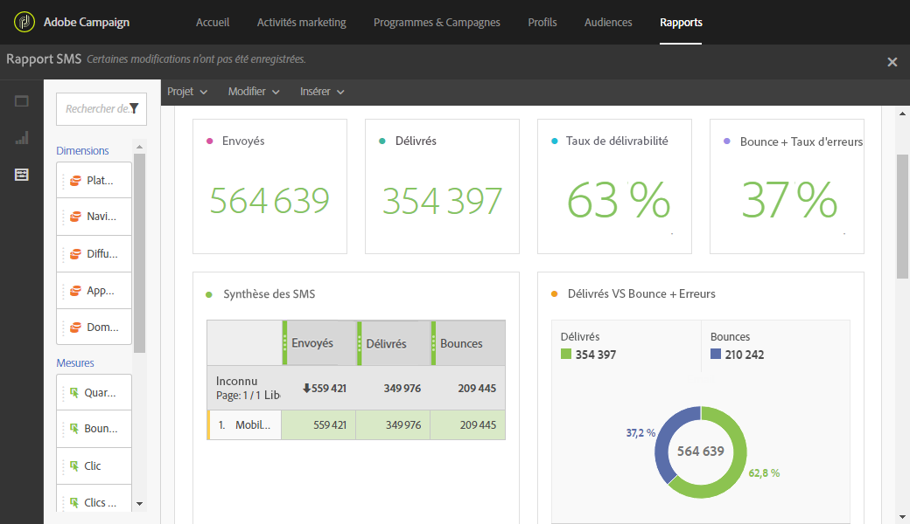

# Rapport SMS{#sms-report}

Le rapport** SMS** fournit des détails sur les remises SMS, telles que les taux de remise et de rebond.

La tableau **SMS summary**, les graphiques et les nombres de synthèse contiennent les données disponibles pour les diffusions SMS envoyées.

* **Traités/envoyés** : nombre de SMS envoyés.
* **Délivrés** : nombre de SMS délivrés.
* **Bounces + Erreurs** : nombre d'emails qui n'ont pas pu être livrés.

