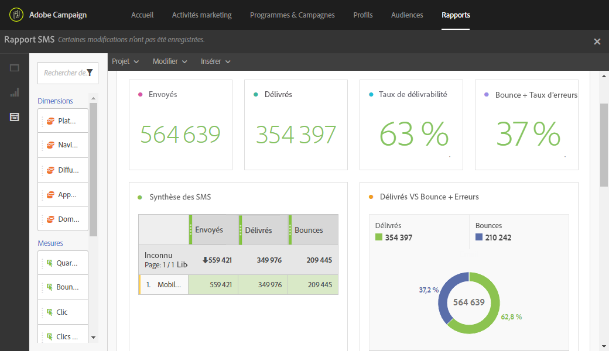

# Rapport SMS{#sms-report}

Le rapport **SMS** fournit des détails sur les diffusions SMS tels que les débits de diffusion et les taux de rebond.

La tableau **Synthèse des SMS**, les graphiques et les nombres de synthèse contiennent les données disponibles pour les diffusions SMS envoyées.

* **Traités/envoyés** : nombre de SMS envoyés.
* **Délivrés** : nombre de SMS délivrés.
* **Bounces + Erreurs** : nombre d&#39;emails qui n&#39;ont pas pu être livrés.
