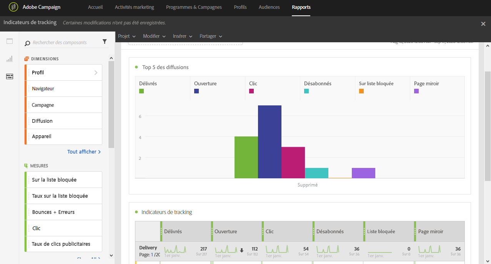

# Indicateurs de tracking{#tracking-indicators}

Le rapport **[!UICONTROL Indicateurs de tracking]contient les indicateurs clés de tracking du comportement une fois les emails reçus.**

>[!NOTE]
>
>Pour permettre l'accès à ces données, le tracking doit être activé lors la préparation de la diffusion.

Le tableau **[!UICONTROL Indicateurs de tracking]** et le graphique **Top 5 des diffusions** contiennent les données disponibles pour le tracking email, telles que :

* **[!UICONTROL Délivrés]** : nombre de messages envoyés avec succès. Les erreurs remontées (rebonds) sont prises en compte. Cependant, les plaintes (déclarations comme spam) et les messages d'absence de type « absent du bureau » ne sont pas pris en compte.
* **Ouverture** : nombre d'ouvertures d'un message dans une diffusion.
* **Clic** : nombre de clics sur un contenu dans une diffusion.
* **Désabonnés** : nombre de clics sur le lien de désinscription.
* **Indésirables** : nombre de destinataires ayant déclaré un email comme étant un spam.
* **Page miroir** : nombre de clics sur le lien de la page miroir.

